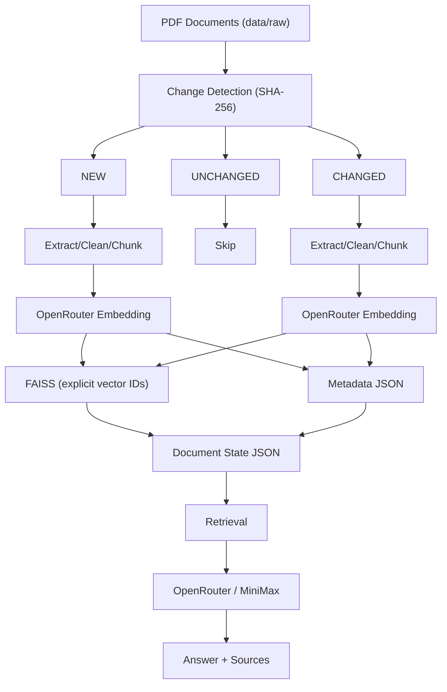

# RAG Indexing & Retrieval Pipeline

FAISS + UV + OpenRouter + MiniMax + Pure Python

A lightweight, local-first Retrieval-Augmented Generation (RAG) indexing and retrieval pipeline built in pure Python — no RAG framework.

## Status

Implemented. All MVP pipeline stages from [docs/TODO.md](docs/TODO.md) are complete: extraction, cleaning, chunking, embedding, FAISS indexing with incremental change detection, retrieval, and MiniMax answer generation — plus the `rag-indexer` CLI. See [docs/PROJECT.md](docs/PROJECT.md) for the design and [docs/TODO.md](docs/TODO.md) for the task list.

## What It Does

- Discovers PDF documents in `data/raw/` and extracts page-aware text
- Detects **NEW / UNCHANGED / CHANGED / DELETED** documents via SHA-256 hashing
- Cleans and normalizes extracted text
- Splits documents into character-based chunks with configurable size and overlap
- Embeds chunks through **OpenRouter** (configurable embedding model)
- Stores vectors in **FAISS** (`IndexIDMap2(IndexFlatIP)`, cosine similarity, explicit vector IDs) with metadata in JSON
- Performs true **incremental indexing** — only new or changed documents are re-embedded; unchanged and deleted documents trigger no embedding requests
- Preserves the last known-good indexed version if a changed document fails to process
- Runs semantic retrieval and answers questions using a **MiniMax generation model** through OpenRouter, with source and page citations

## Architecture



OpenRouter is the single model gateway. The embedding model and the MiniMax generation model are independent configuration values — both selectable, never hard-coded.

## Tech Stack

| Layer        | Technology                                            |
|--------------|-------------------------------------------------------|
| Language     | Python 3.12+                                          |
| Packaging    | UV                                                   |
| Vector store | FAISS CPU (`faiss-cpu`), NumPy                       |
| PDF parsing  | PyPDF                                               |
| Validation   | Pydantic + `pydantic-settings` (config)              |
| Model access | OpenRouter (OpenAI-compatible client, `openai`)       |
| Config       | `python-dotenv` (via `pydantic-settings`)             |

## Project Structure

```
01-rag-naive/
├── docs/
│   ├── PROJECT.md              # MVP design document
│   └── TODO.md                 # implementation task list
├── data/raw/                   # categorized PDF sources (billing/, mobile/, ...) to index
├── data/processed/             # reserved for future processed artifacts (gitignored)
├── indexes/                    # faiss.index, metadata.json, document_state.json, index_manifest.json
├── logs/                       # indexing.log
├── scripts/
│   └── generate_sample_pdfs.py # LLM-generated Aurora Mobile policy PDFs into data/raw
├── src/rag/                    # config, extract, clean, chunk, embed, state, index, retrieve, generate, main
├── tests/                      # pytest unit tests
├── .env.example                # configuration template (copy to .env)
├── .gitignore                  # ignores .env, indexes/, logs/, data/raw/, data/processed/
├── pyproject.toml
└── uv.lock
```

## Getting Started

```bash
cp .env.example .env                     # set OPENROUTER_API_KEY and OPENROUTER_MODEL
uv sync                                  # install dependencies into .venv
uv run python scripts/generate_sample_pdfs.py   # generate sample policy PDFs into data/raw (LLM, requires OPENROUTER_MODEL + API key)
uv run ruff check src tests              # lint
uv run pytest                            # run the test suite
```

Configuration comes from environment variables or `.env` (see `.env.example`). Sample values: `OPENROUTER_API_KEY` for the gateway, `OPENROUTER_EMBEDDING_MODEL` for retrieval, and `OPENROUTER_MODEL=minimax/minimax-m3` for both answer generation and sample-policy generation. Chunking (`CHUNK_SIZE`, `CHUNK_OVERLAP`) and `TOP_K` are configurable; all persisted paths default under `indexes/` and `logs/`.

## Sample Policies

`scripts/generate_sample_pdfs.py` curates an Aurora Mobile policy catalog (categories: billing, mobile, roaming, customer, compliance) and asks the LLM configured by `OPENROUTER_MODEL` to write each policy body, rendered as a branded PDF under `data/raw/<category>/`. The RAG indexer discovers these recursively. Useful flags:

```bash
uv run python scripts/generate_sample_pdfs.py --only roaming   # only docs matching "roaming"
uv run python scripts/generate_sample_pdfs.py --limit 4        # first N docs in catalog order
uv run python scripts/generate_sample_pdfs.py --out-dir DIR    # custom output directory (default data/raw)
uv run python scripts/generate_sample_pdfs.py --keep-md        # also keep the raw markdown beside each PDF
```

## CLI

The `rag-indexer` entrypoint (`src/rag/main.py`) provides four subcommands:

```bash
uv run python src/rag/main.py index              # incremental: index new/changed docs, remove deleted
uv run python src/rag/main.py reindex            # rebuild the index from scratch
uv run python src/rag/main.py search "question"  # top-k chunk retrieval, one JSON object per line
uv run python src/rag/main.py ask "question"     # generate an answer plus source JSON lines
```

`search` and `ask` accept `--top-k`. `index` logs staged progress (NEW/UNCHANGED/CHANGED/DELETED and per-document errors) to both the console and `logs/indexing.log`.

## CI/CD

A minimal GitHub Actions workflow (`.github/workflows/01-rag-naive-ci.yml`) runs on commits affecting `01-rag-naive/**`: installs UV + Python 3.12, syncs dependencies, lints with ruff (including `tests/`), and runs `pytest`.

## Roadmap

Hybrid search (FAISS + BM25), cross-encoder reranking, multi-format ingestion, FastAPI endpoints (`/index`, `/search`, `/ask`), evaluation, guardrails, telemetry, and tracing. See the "Future" sections of the design document.