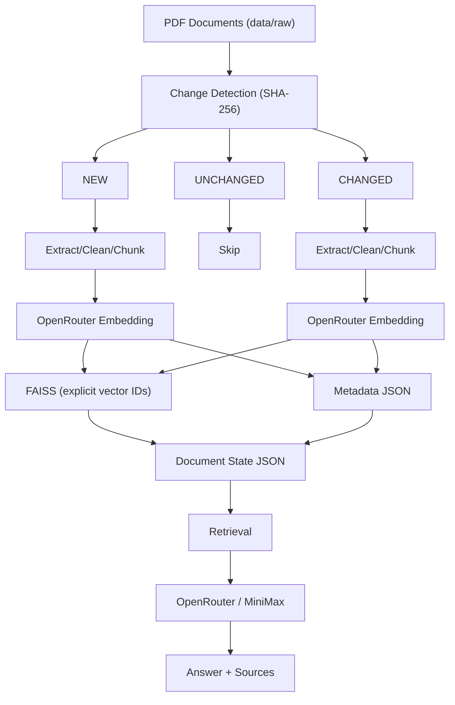

# RAG Indexing & Retrieval Pipeline

FAISS + UV + OpenRouter + MiniMax + Pure Python

A lightweight, local-first Retrieval-Augmented Generation (RAG) indexing and retrieval pipeline built in pure Python — no RAG framework.

## Status

Design phase. The full MVP design document is in [docs/PROJECT.md](docs/PROJECT.md). Code scaffolding is next.

## What It Does

- Discovers PDF documents in `data/raw/` and extracts page-aware text
- Detects **NEW / UNCHANGED / CHANGED / DELETED** documents via SHA-256 hashing
- Cleans and normalizes extracted text
- Splits documents into character-based chunks with configurable size and overlap
- Embeds chunks through **OpenRouter** (configurable embedding model)
- Stores vectors in **FAISS** (`IndexIDMap2(IndexFlatIP)`, cosine similarity, explicit vector IDs) with metadata in JSON
- Performs true **incremental indexing** — only new or changed documents are re-embedded; unchanged and deleted documents trigger no embedding requests
- Preserves the last known-good indexed version if a changed document fails to process
- Runs semantic retrieval and answers questions using a **MiniMax generation model** through OpenRouter, with source and page citations

## Architecture



OpenRouter is the single model gateway. The embedding model and the MiniMax generation model are independent configuration values — both selectable, never hard-coded.

## Tech Stack

| Layer        | Technology                                            |
|--------------|-------------------------------------------------------|
| Language     | Python 3.12+                                          |
| Packaging    | UV                                                   |
| Vector store | FAISS CPU (`faiss-cpu`), NumPy                       |
| PDF parsing  | PyPDF                                               |
| Model access | OpenRouter (OpenAI-compatible client, `openai`)       |
| Config       | `python-dotenv`                                       |

## Project Structure

```
01-rag-naive/
├── docs/
│   └── PROJECT.md          # MVP design document
├── data/raw/               # PDF documents to index
├── indexes/                # faiss.index, metadata.json, document_state.json, index_manifest.json
├── logs/                   # indexing.log
├── src/rag/                # config, extract, clean, chunk, embed, metadata, index, state, retrieve, generate, main
└── tests/                  # pytest unit tests
```

## Getting Started

```bash
uv sync                                # install dependencies into .venv
uv run python scripts/generate_sample_pdfs.py   # seed data/raw with sample PDFs
uv run ruff check src scripts          # lint
export OPENROUTER_API_KEY=...          # or set it in .env
uv run python src/rag/main.py          # run the pipeline (once implemented)
```

## CI/CD

A minimal GitHub Actions workflow (`.github/workflows/01-rag-naive-ci.yml`) runs on commits affecting `01-rag-naive/**`: installs UV + Python 3.12, syncs dependencies, lints with ruff, and runs `pytest`.

## Roadmap

Hybrid search (FAISS + BM25), cross-encoder reranking, multi-format ingestion, FastAPI endpoints (`/index`, `/search`, `/ask`), evaluation, guardrails, telemetry, and tracing. See the "Future" sections of the design document.