# RAG Indexing & Retrieval Pipeline

FAISS + UV + OpenRouter + MiniMax + Pure Python

Version: 2.1
Status: MVP Design Document

## 1. Overview

This project implements a simple Retrieval-Augmented Generation (RAG) indexing and retrieval pipeline using:

Python 3.12+

UV for dependency management

FAISS for vector search

OpenRouter for model access

MiniMax for embeddings and/or generation, depending on the selected OpenRouter model

PDF document ingestion

JSON metadata and document-state storage

Pure Python application code without a RAG framework

The goal is to build a lightweight, local-first RAG system that can later be extended with FastAPI, hybrid search, reranking, evaluation, guardrails, telemetry, tracing, and production deployment.

The MVP uses OpenRouter as the model gateway. The embedding model and generation model are configured independently so the indexing pipeline and answer-generation pipeline can evolve separately.

## 2. Goals

The system must:

Discover PDF documents

Detect new, changed, unchanged, and deleted documents

Extract PDF text while preserving page boundaries

Clean and normalize extracted text

Split documents into searchable chunks

Generate embeddings through OpenRouter

Store embeddings in FAISS

Store chunk metadata separately

Store document hashes and vector mappings

Support semantic search

Support incremental indexing

Re-embed only new or changed documents

Remove vectors belonging to changed or deleted documents

Keep FAISS IDs synchronized with metadata

Log indexing and retrieval operations

Preserve the previous indexed version when a changed document fails during processing

Provide retrieved context to a MiniMax generation model through OpenRouter

The overall RAG flow is:

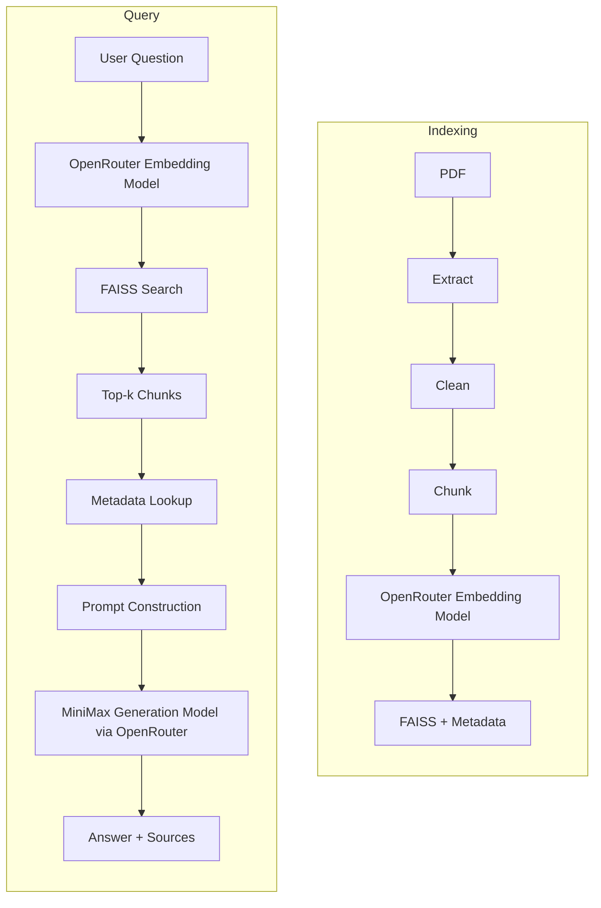

## 3. Technology Stack

### Core

Python 3.12+

UV

FAISS CPU

NumPy

PyPDF

python-dotenv

Pydantic (models, validation, and configuration via `pydantic-settings`)

### AI Gateway

OpenRouter

OpenRouter provides a unified OpenAI-compatible API for the models used by the application.

### Embeddings

The embedding model is configured through OpenRouter.

Example configuration:

```
OPENROUTER_EMBEDDING_MODEL=<embedding-model-id>
```

Important:

The embedding model must be an embedding-capable model. A chat/generation model such as a MiniMax chat model must not be assumed to produce embeddings unless the selected OpenRouter model explicitly supports embeddings.

### Generation

MiniMax is used as the generation model through OpenRouter.

Example:

```
OPENROUTER_MODEL=<minimax-model-id>
```

The exact MiniMax model ID should be configurable rather than hard-coded into the architecture.

### Storage

FAISS index

JSON chunk metadata

JSON document state

JSON index manifest

No database is required for the MVP.

## 4. Project Structure

```
rag-indexer/

├── pyproject.toml
├── uv.lock
├── .env
├── .gitignore
│
├── data/
│   └── raw/
│       ├── billing_policy.pdf
│       ├── roaming_policy.pdf
│       └── ...
│
├── indexes/
│   ├── faiss.index
│   ├── metadata.json
│   ├── document_state.json
│   └── index_manifest.json
│
├── logs/
│   └── indexing.log
│
├── src/
│   └── rag/
│       ├── __init__.py
│       ├── config.py
│       ├── extract.py
│       ├── clean.py
│       ├── chunk.py
│       ├── embed.py
│       ├── metadata.py
│       ├── index.py
│       ├── state.py
│       ├── retrieve.py
│       ├── generate.py
│       └── main.py
│
└── tests/
    ├── test_clean.py
    ├── test_chunk.py
    ├── test_state.py
    ├── test_index.py
    ├── test_retrieve.py
    └── test_generate.py
```

There is intentionally no processed/ directory in the MVP. Extracted text and chunks can remain in memory until they are persisted as metadata.

## 5. Dependency Management

### Initialize

```
uv init rag-indexer
cd rag-indexer
```

### Install Dependencies

```
uv add pypdf
uv add faiss-cpu
uv add numpy
uv add openai
uv add python-dotenv
uv add pydantic
uv add pydantic-settings
```

The openai package is used as the Python client because OpenRouter exposes an OpenAI-compatible API.

Shared data models, JSON persistence, and configuration use Pydantic. `pydantic-settings` loads environment variables (including `.env`) into a typed `Settings` model.

### Run

```
uv run python src/rag/main.py
```

## 6. OpenRouter Configuration

OpenRouter is the single model gateway for the MVP.

### Environment

```
OPENROUTER_API_KEY=

OPENROUTER_BASE_URL=https://openrouter.ai/api/v1

OPENROUTER_EMBEDDING_MODEL=<embedding-model-id>

OPENROUTER_MODEL=<minimax-model-id>
```

The application should create the OpenAI-compatible client using:

```python
from openai import OpenAI

client = OpenAI(
    base_url=OPENROUTER_BASE_URL,
    api_key=OPENROUTER_API_KEY,
)
```

The embedding service uses:

```
client.embeddings.create(...)
```

The generation service uses:

```
client.chat.completions.create(...)
```

The exact MiniMax model ID is a configuration value.

The MVP must not assume that every MiniMax model supports embeddings. Embeddings and generation are separate model capabilities.

## 7. Indexing Pipeline

The indexing workflow consists of seven logical stages:

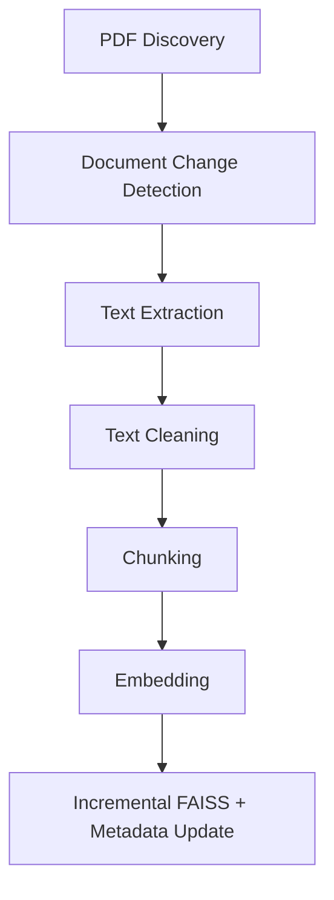

Possible document states:

```
NEW
UNCHANGED
CHANGED
DELETED
```

The behavior is:

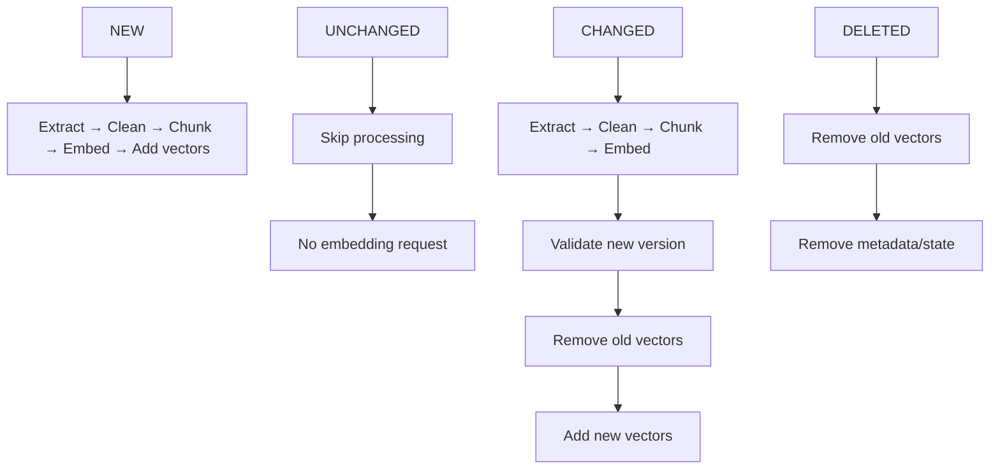

## 8. Document Discovery and Change Detection

### Purpose

Determine what changed in data/raw/ since the previous indexing run.

Each PDF is identified by its relative path.

A SHA-256 hash is calculated from the document contents.

Example:

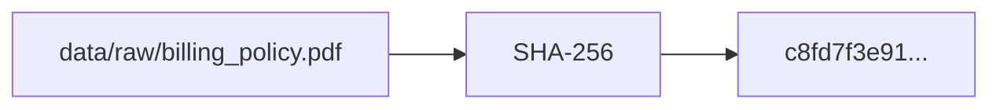

Previous hashes are stored in:

```
indexes/document_state.json
```

### Change Detection Rules

```
PDF not in previous state
    → NEW

PDF exists and hash is identical
    → UNCHANGED

PDF exists and hash is different
    → CHANGED

Document exists in previous state
but no longer exists on disk
    → DELETED
```

This prevents unnecessary embedding requests for unchanged documents.

## 9. Extraction Layer

### Purpose

Read PDFs and extract text while preserving page boundaries.

### Input

```
billing_policy.pdf
```

### Output

```
{
    "document_id": "billing_policy.pdf",
    "pages": [
        {
            "page_number": 1,
            "text": "Customer refund requests..."
        },
        {
            "page_number": 2,
            "text": "Refund requests are accepted..."
        }
    ]
}
```

### Responsibilities

Open PDF

Read pages

Extract text

Preserve page numbers

Return page-level text

### Non-Responsibilities

Cleaning

Chunking

Embedding

Persistence

### Extraction Failure

If extraction fails:

```
Log error
Mark current operation as failed
Do not modify existing indexed vectors
Continue with other documents
```

For a changed document, the previous successful indexed version remains available.

## 10. Cleaning Layer

### Purpose

Normalize extracted text before chunking.

PDF extraction can produce:

```
Customer

refund requests
```

or:

```
Customer        refund requests
```

Normalize to:

```
Customer refund requests
```

### Cleaning Rules

Normalize Line Endings

Convert:

```
\r\n
\r
```

to:

```
\n
```

Remove Null Characters

Remove:

```
\x00
```

Normalize Excess Whitespace

Example:

```
Hello       World
```

becomes:

```
Hello World
```

Preserve Meaningful Paragraph Boundaries

Cleaning must not unnecessarily destroy paragraph structure.

Trim

Remove leading and trailing whitespace.

## 11. Chunking Layer

### Purpose

Split large documents into smaller searchable units.

Focused chunks make semantic retrieval more precise than embedding an entire document.

### MVP Strategy

Version 1 uses character-based chunking.

### Configuration

```
CHUNK_SIZE = 800
CHUNK_OVERLAP = 150
```

Example:

```
Chunk 1 → characters 0-800
Chunk 2 → characters 650-1450
Chunk 3 → characters 1300-2100
```

### Overlap

Overlap preserves context across chunk boundaries.

Example:

```
Chunk A:
The customer may request a refund

Chunk B:
request a refund within 30 days
```

### Page Metadata

Every chunk must retain source page information.

Example:

```
{
  "chunk_index": 14,
  "page_start": 42,
  "page_end": 43,
  "text": "Refund requests are accepted..."
}
```

### Chunk Identity

A logical chunk ID is separate from its FAISS vector ID.

Example:

```
document_id:
billing_policy.pdf

chunk_id:
billing_policy.pdf::chunk::14
```

The chunk ID is deterministic within the document version.

The FAISS vector ID is a separate globally unique integer.

## 12. Metadata Layer

Metadata is stored separately from FAISS.

Each indexed chunk contains:

```
{
  "vector_id": 1025,
  "chunk_id": "billing_policy.pdf::chunk::14",
  "document_id": "billing_policy.pdf",
  "source": "billing_policy.pdf",
  "chunk_index": 14,
  "page_start": 42,
  "page_end": 43,
  "text": "Customer may request..."
}
```

Metadata is used to:

```
Display citations

Display source documents

Display page numbers

Reconstruct context

Build prompts

Map FAISS results to text

Debug retrieval
```

## 13. Vector ID Strategy

FAISS search must return explicit vector IDs that can be mapped to metadata.

The architecture is:

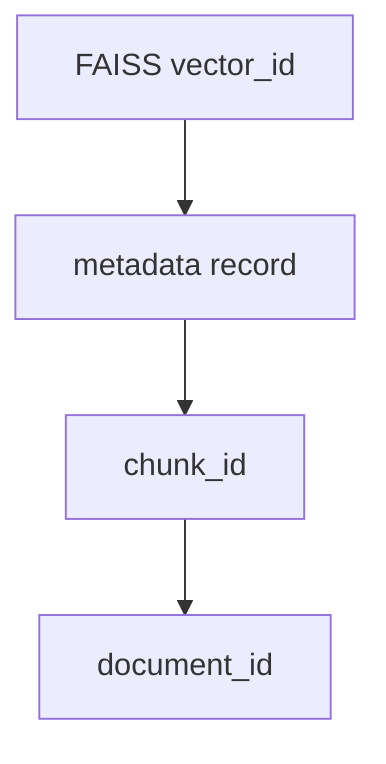

Example:

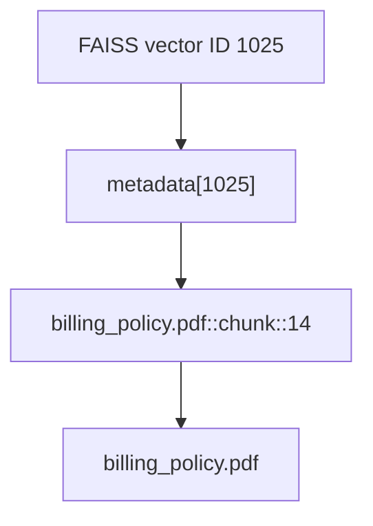

The system must not depend on the implicit vector position.

Use:

```python
base_index = faiss.IndexFlatIP(dimension)
index = faiss.IndexIDMap2(base_index)
```

Vectors are inserted with:

```
index.add_with_ids(vectors, vector_ids)
```

This enables explicit add and delete operations.

## 14. FAISS Vector Store

### Initial Index

The MVP uses:

```python
faiss.IndexIDMap2(
    faiss.IndexFlatIP(dimension)
)
```

### Why

No training required

Exact similarity search

Simple implementation

Easy to understand

Explicit vector IDs

Supports vector removal

Suitable for the learning MVP

The index can later be replaced with an approximate nearest-neighbor index when scale requires it.

## 15. Cosine Similarity

The system uses cosine similarity.

Normalize document vectors before insertion:

```python
faiss.normalize_L2(vectors)
```

Normalize query vectors before search:

```python
faiss.normalize_L2(query_vector)
```

With normalized vectors, inner product is equivalent to cosine similarity.

The index therefore uses:

```
IndexFlatIP
```

## 16. Embedding Layer

### Purpose

Convert searchable chunks into embedding vectors through OpenRouter.

Example:

```
Refund policy
```

becomes:

```
[
    0.281,
   -0.112,
    0.554,
    ...
]
```

The embedding request is sent to:


### Embedding Rules

```
NEW document
    → generate embeddings

UNCHANGED document
    → no embedding request

CHANGED document
    → generate new embeddings

DELETED document
    → no embedding request
```

Only successfully generated embeddings can enter FAISS.

## 17. Embedding Model and Index Compatibility

The embedding model is part of the index identity.

The manifest records:

```
{
  "embedding_model": "<embedding-model-id>",
  "embedding_dimension": 1536
}
```

If the embedding model changes, the existing vectors must not be mixed with vectors from the new model.

Therefore:

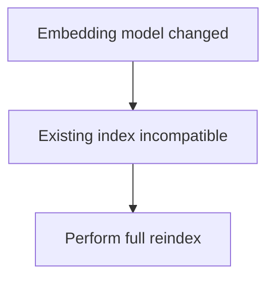

A full reindex means:

```
Delete/recreate FAISS index
Delete/recreate metadata
Recalculate document hashes
Re-embed all documents
```

This is different from normal incremental indexing.

Normal document changes do not require a full index rebuild.

## 18. Embedding Dimension

FAISS requires one fixed vector dimension.

The dimension is obtained from the embedding response.

Example:

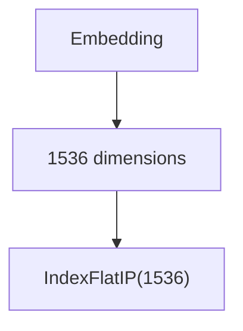

Every subsequent embedding must have the same dimension.

If:

```
embedding dimension != index dimension
```

then:

```
Log critical error
Do not add vector
Do not remove existing version
Fail the affected operation
```

## 19. Incremental Indexing

The MVP implements true incremental indexing.

It does not rebuild the entire FAISS index when a single document changes.

Example:

```
100 PDFs indexed

1 PDF changes

99 PDFs
    → no extraction
    → no chunking
    → no embedding

1 PDF
    → re-extract
    → re-chunk
    → re-embed
    → replace its vectors
```

This minimizes embedding API calls and keeps updates efficient.

## 20. Incremental Update Workflow

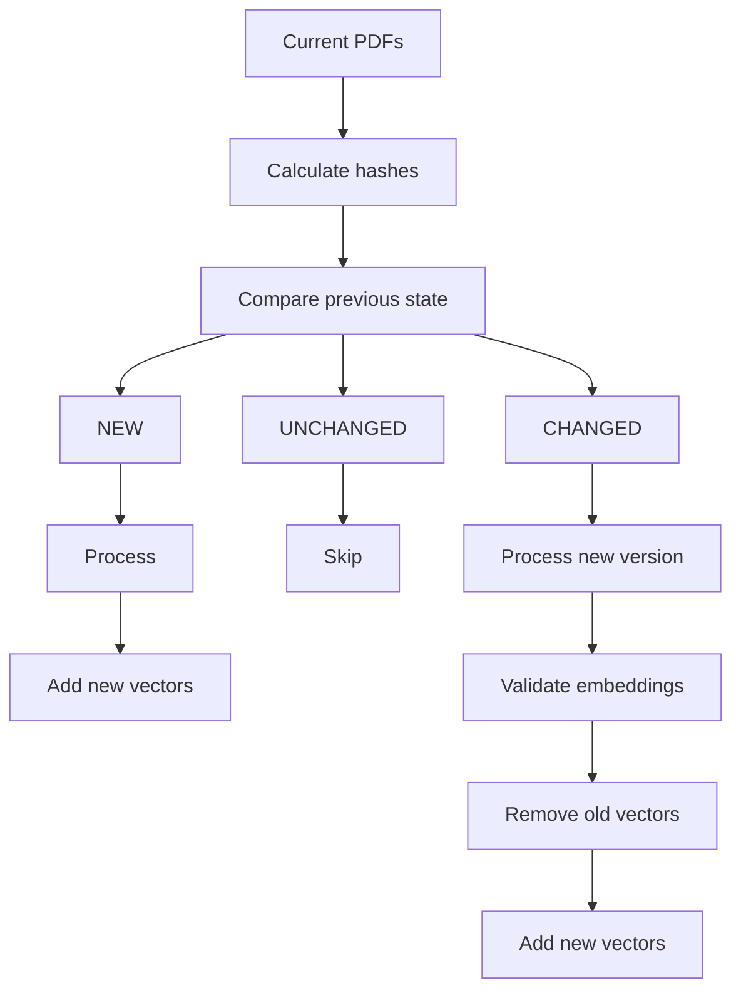

Deleted documents:

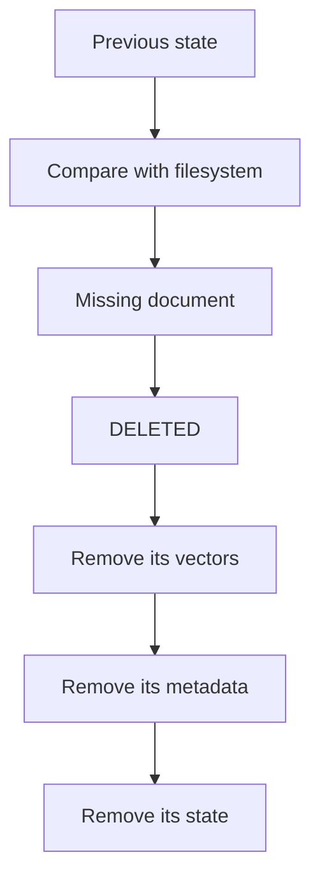

## 21. Safe Changed-Document Update

A changed document must not lose its last known-good indexed version because a new indexing operation fails.

For a changed document:

```
1. Detect changed hash
2. Extract new PDF
3. Clean new text
4. Chunk new text
5. Generate new embeddings
6. Validate every new embedding
7. Allocate new vector IDs
8. Add new vectors
9. Persist new metadata/state
10. Remove old vectors
11. Remove old metadata
12. Commit new document state
```

The implementation should use a safer transactional approach where possible.

The key rule is:

```
Do not remove the old vectors before the new version
has been successfully processed and validated.
```

If the new version fails:

```
Old vectors remain searchable
Old metadata remains valid
Old document state remains valid
Error is logged
```

A production implementation can use a stronger transaction/recovery mechanism. The MVP must at minimum prevent an unsuccessful update from leaving the document unsearchable.

## 22. Adding a New Document

For a new document:

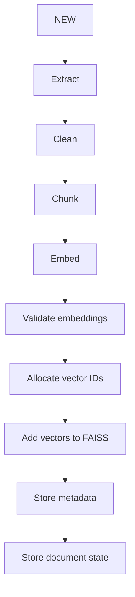

Example:

```
{
  "billing_policy.pdf": {
    "hash": "c8fd7f3e91...",
    "vector_ids": [1000, 1001, 1002],
    "chunk_count": 3
  }
}
```

If embedding fails, the document is not marked as successfully indexed.

## 23. Deleting a Document

If a previously indexed document no longer exists:

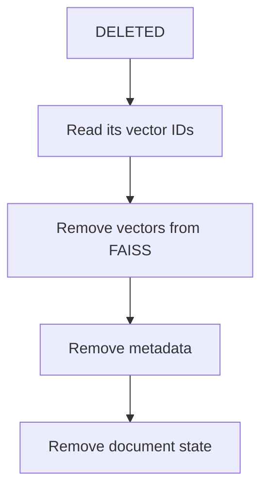

Conceptually:

```
index.remove_ids(vector_ids)
```

The vector IDs stored in document state are therefore required for deletion.

## 24. Vector ID Allocation

Vector IDs are globally unique integers.

Example:

```
1000
1001
1002
1003
...
```

The next available ID is stored in:

```
indexes/index_manifest.json
```

Example:

```
{
  "next_vector_id": 1004
}
```

Removed vector IDs do not need to be reused.

This avoids ID collisions and simplifies incremental updates.

## 25. Metadata Storage

File:

```
indexes/metadata.json
```

Example:

```
{
  "1000": {
    "vector_id": 1000,
    "chunk_id": "billing_policy.pdf::chunk::0",
    "document_id": "billing_policy.pdf",
    "source": "billing_policy.pdf",
    "chunk_index": 0,
    "page_start": 1,
    "page_end": 1,
    "text": "Refund requests..."
  },
  "1001": {
    "vector_id": 1001,
    "chunk_id": "billing_policy.pdf::chunk::1",
    "document_id": "billing_policy.pdf",
    "source": "billing_policy.pdf",
    "chunk_index": 1,
    "page_start": 2,
    "page_end": 2,
    "text": "Customers may request..."
  }
}
```

The JSON key is the FAISS vector ID represented as a string.

## 26. Document State Storage

File:

```
indexes/document_state.json
```

Example:

```
{
  "billing_policy.pdf": {
    "hash": "c8fd7f3e91...",
    "vector_ids": [1000, 1001],
    "chunk_count": 2
  },
  "roaming_policy.pdf": {
    "hash": "a81bc73e22...",
    "vector_ids": [1002, 1003, 1004],
    "chunk_count": 3
  }
}
```

This state identifies:

```
The indexed document version

The vectors belonging to that document

The number of indexed chunks
```

## 27. Index Manifest

File:

```
indexes/index_manifest.json
```

Example:

```
{
  "version": 1,
  "embedding_model": "<embedding-model-id>",
  "embedding_dimension": 1536,
  "similarity": "cosine",
  "index_type": "IndexIDMap2(IndexFlatIP)",
  "next_vector_id": 1005
}
```

The manifest protects against incompatible index configuration.

Critical incompatibilities include:

```
Different embedding model

Different embedding dimension

Unsupported index type

Invalid manifest version
```

If the embedding model changes, perform a full reindex.

## 28. Index Consistency

The following invariants must always hold:

```
Every FAISS vector ID
    ↓
has exactly one metadata record

Every document-state vector ID
    ↓
exists in FAISS and metadata

Every metadata vector ID
    ↓
belongs to exactly one document

Every indexed document
    ↓
has a corresponding document-state record
```

Example:

```
FAISS
  1000
  1001
  1002

Metadata
  1000 → billing chunk 0
  1001 → billing chunk 1
  1002 → roaming chunk 0

Document State
  billing → [1000, 1001]
  roaming → [1002]
```

This mapping is critical.

## 29. Persistence and Recovery

FAISS, metadata, state, and manifest are separate files.

The application must avoid exposing partially written files.

Use temporary files:

```
faiss.index.tmp
metadata.json.tmp
document_state.json.tmp
index_manifest.json.tmp
```

After successful writes, atomically replace the previous files where supported.

Before mutating the index, validate that:

```
FAISS IDs
      ↕
Metadata IDs
      ↕
Document-state vector IDs
```

are consistent.

If validation fails:

```
Log critical error
Do not perform incremental mutations
Require recovery/full rebuild
```

## 30. Retrieval Pipeline

The retrieval system uses the same embedding model used during indexing.

Workflow:

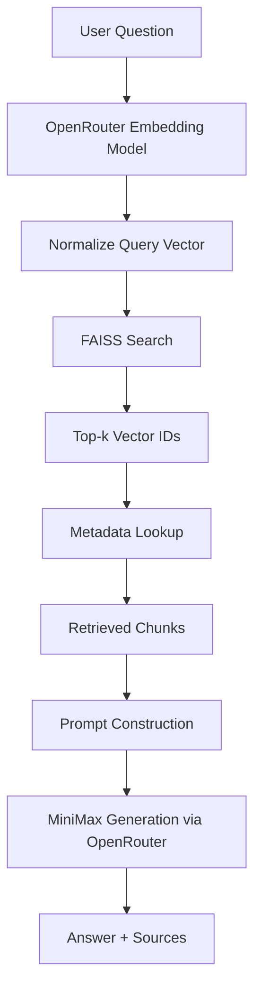

Default:

```
TOP_K = 5
```

The query embedding model must match the document embedding model.

## 31. Example Retrieval

Question:

```
Can a customer request a refund after 30 days?
```

Generate the query embedding through OpenRouter.

Normalize it.

Search FAISS:

```
Top Results

1025
1042
1007
1332
1091
```

Retrieve metadata:

```
{
  "vector_id": 1025,
  "document_id": "billing_policy.pdf",
  "chunk_index": 18,
  "page_start": 12,
  "page_end": 12,
  "text": "Refund requests are accepted within 30 days..."
}
```

The selected chunks become context for the MiniMax generation model.

## 32. Generation Layer

### Purpose

Generate the final answer using retrieved context.

The generation model is MiniMax accessed through OpenRouter.

Conceptual request:

```python
client.chat.completions.create(
    model=OPENROUTER_MODEL,
    messages=[
        {
            "role": "system",
            "content": SYSTEM_PROMPT,
        },
        {
            "role": "user",
            "content": USER_PROMPT,
        },
    ],
)
```

The prompt should instruct the model to:

```
Answer using retrieved context

Avoid inventing unsupported facts

Clearly state when the context does not contain the answer

Preserve important policy conditions

Return source references where applicable
```

The generation layer must not perform retrieval itself. Retrieval and generation remain separate responsibilities.

## 33. RAG Prompt Context

The retrieved chunks are converted into structured context.

Example:

```
SOURCE: billing_policy.pdf
PAGE: 12

Refund requests are accepted within 30 days...

SOURCE: billing_policy.pdf
PAGE: 13

Exceptions may apply to specific account types...
```

The MiniMax model receives this context as part of the prompt.

The application should preserve the source and page information so the final response can provide citations.

## 34. Retrieval Result Model

The retrieval layer should return structured results.

Conceptually:

```
{
    "vector_id": 1025,
    "score": 0.87,
    "document_id": "billing_policy.pdf",
    "chunk_id": "billing_policy.pdf::chunk::18",
    "source": "billing_policy.pdf",
    "page_start": 12,
    "page_end": 12,
    "text": "Refund requests are accepted within 30 days..."
}
```

The score should be preserved for:

```
Threshold filtering

Ranking

Debugging

Evaluation

Telemetry
```

## 35. Configuration

Centralized configuration lives in:

```
src/rag/config.py
```

Example:

```
OPENROUTER_BASE_URL = "https://openrouter.ai/api/v1"

OPENROUTER_EMBEDDING_MODEL = "<embedding-model-id>"
OPENROUTER_MODEL = "<minimax-model-id>"

CHUNK_SIZE = 800
CHUNK_OVERLAP = 150

TOP_K = 5

DATA_DIR = "data/raw"

INDEX_PATH = "indexes/faiss.index"
METADATA_PATH = "indexes/metadata.json"
DOCUMENT_STATE_PATH = "indexes/document_state.json"
MANIFEST_PATH = "indexes/index_manifest.json"

LOG_PATH = "logs/indexing.log"
```

The implementation loads these values through a Pydantic `Settings` model (`pydantic-settings`), which reads them from environment variables and `.env`. Model fields allow environment overrides while keeping project-root-anchored path defaults.

Secrets must remain in environment variables.

## 36. Logging

Log file:

```
logs/indexing.log
```

Example:

```
INFO Discovered 10 PDF documents
INFO NEW billing_policy.pdf
INFO Extracted 42 pages
INFO Created 68 chunks
INFO Generated 68 embeddings
INFO Added 68 vectors
INFO Indexed billing_policy.pdf

INFO UNCHANGED roaming_policy.pdf
INFO No processing required

INFO CHANGED kyc_policy.pdf
INFO Extracted new version
INFO Created 42 chunks
INFO Generated 42 embeddings
INFO Added new vectors
INFO Removed old vectors
INFO Updated kyc_policy.pdf

INFO DELETED old_policy.pdf
INFO Removed 15 vectors
INFO Removed metadata
INFO Removed document state

INFO Indexing completed
```

Errors:

```
ERROR PDF extraction failed
ERROR Embedding request failed
ERROR Vector dimension mismatch
ERROR FAISS update failed
ERROR Metadata persistence failed
ERROR Index consistency validation failed
```

## 37. Error Handling

The system should continue processing whenever possible.

### PDF Failure

```
Log error
Do not modify existing indexed version
Continue with next document
```

### Embedding Failure

For a new document:

```
Retry
Log failure
Do not add incomplete vectors
Do not mark document as indexed
Continue with other documents
```

For a changed document:

```
Retry
Log failure
Keep previous indexed version
Do not remove old vectors
```

### FAISS Failure

```
Log critical error
Stop affected operation
Validate index consistency
Do not claim the update succeeded
```

### Metadata Failure

```
Log critical error
Do not mark operation complete
Use temporary/backup files for recovery
Validate consistency
```

## 38. Idempotency

Running the indexing command repeatedly without document changes must not create new embeddings or vectors.

Example:

```
Run 1:
10 PDFs
→ 10 documents indexed

Run 2:
10 PDFs
→ 0 new embeddings
→ 0 vector changes

Run 3:
10 PDFs
→ 0 new embeddings
→ 0 vector changes
```

This is a core incremental-indexing requirement.

## 39. Changed Document Example

Initial:

```
billing_policy.pdf
hash = AAA

vectors:
1000
1001
1002
```

Document changes:

```
billing_policy.pdf
hash = BBB
```

The pipeline:

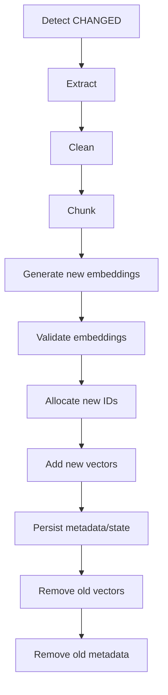

Other documents are not re-embedded.

## 40. Deleted Document Example

Initial:

```
billing_policy.pdf
roaming_policy.pdf
kyc_policy.pdf
```

The user deletes:

```
kyc_policy.pdf
```

Next run:

```
Current filesystem:
billing_policy.pdf
roaming_policy.pdf

Previous state:
billing_policy.pdf
roaming_policy.pdf
kyc_policy.pdf
```

The system detects:

```
kyc_policy.pdf → DELETED
```

Then:

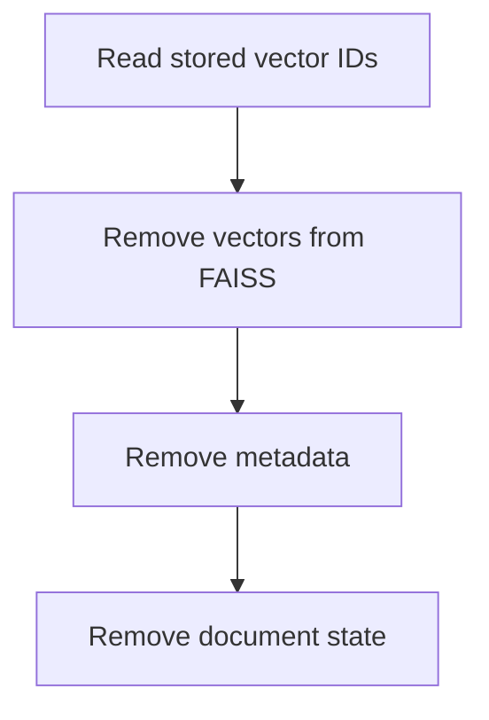

No embedding request is made.

## 41. Full Reindex

A full reindex is required when the index configuration becomes incompatible.

Examples:

```
Embedding model changed
Embedding dimension changed
Index format changed
Index files are corrupted
Consistency validation fails
```

Full reindex workflow:

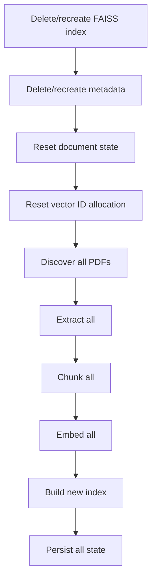

This is intentionally different from normal incremental document updates.

## 42. Future Section-Based Chunking

The MVP uses character-based chunking.

Future versions can use structure-aware chunking:

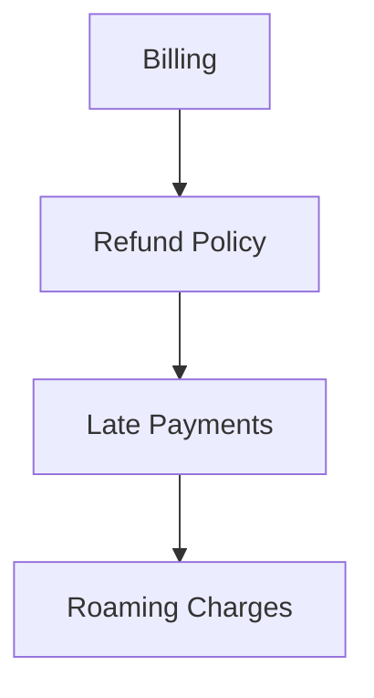

Large sections should still be split using maximum chunk size and overlap.

Future strategy:

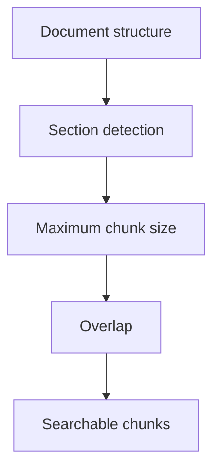

## 43. Hybrid Search

Future retrieval can combine:

```
FAISS semantic search
        +
BM25 keyword search
```

Benefits:

```
Better semantic matching

Better exact keyword matching

Better handling of product codes

Better handling of policy identifiers

Better handling of names and numbers
```

Example:

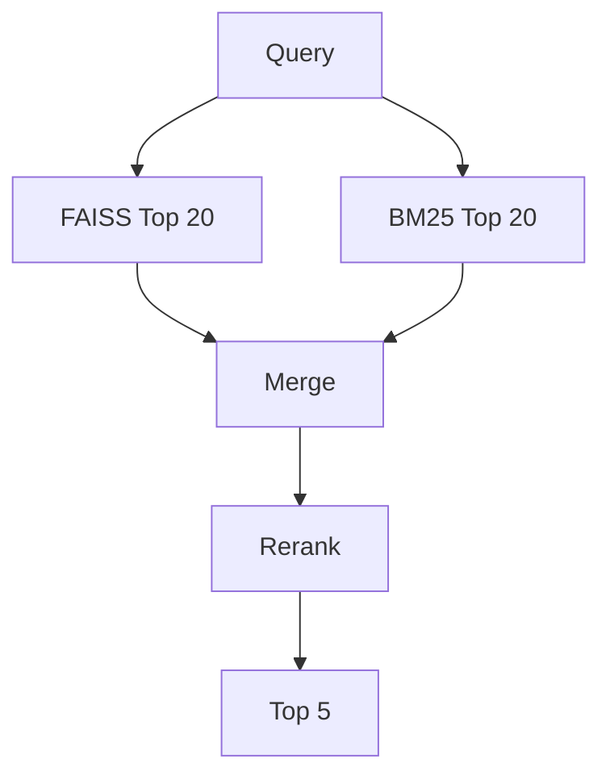

## 44. Reranking

Future pipeline:

```mermaid
flowchart TB
    A[User Query] --> B[FAISS Top 20] --> C[Candidate chunks] --> D[Cross-encoder reranker] --> E[Best 5]
```

Reranking can improve precision by evaluating query-document relevance more deeply than vector similarity alone.

## 45. Multi-format Support

Future document types:

```
PDF
DOCX
TXT
HTML
Markdown
```

The extraction layer should expose a common representation:

```mermaid
flowchart TB
    A[Document Source] --> B[Extracted Pages/Sections] --> C[Cleaning] --> D[Chunking]
```

Document-specific parsing should remain separate from RAG logic.

## 46. Async Processing

Current MVP:

```
Documents processed sequentially
```

Future:

```mermaid
flowchart TB
    A[Multiple documents] --> B[Concurrent extraction] --> C[Batch embedding] --> D[Controlled index updates]
```

Potential implementation:

```
asyncio
```

Concurrency should be introduced only after the synchronous pipeline is correct and tested.

## 47. FastAPI Integration

Future endpoints:

```
POST /index
POST /search
POST /ask
```

Responsibilities:

```mermaid
flowchart LR
    A[POST /index] --> B[Trigger incremental indexing]
    C[POST /search] --> D[Perform semantic retrieval]
    E[POST /ask] --> F[Retrieve context + generate MiniMax answer]
```

The API layer should call existing services rather than contain indexing logic.

## 48. Testing Strategy

The MVP should test the core invariants.

### Cleaning Tests

Verify:

```
Line ending normalization

Null removal

Whitespace normalization

Trimming
```

### Chunking Tests

Verify:

```
Chunk size

Overlap

Empty text

Page metadata

Chunk ordering
```

### Change Detection Tests

Verify:

```
NEW
UNCHANGED
CHANGED
DELETED
```

### Embedding Tests

Verify:

```
OpenRouter request construction

Model configuration

Embedding response parsing

Dimension validation

Failure handling
```

### FAISS Tests

Verify:

```
Add vectors

Search vectors

Remove vectors

Explicit IDs

Dimension validation
```

### Incremental Tests

Verify:

```
Initial indexing
      ↓
No-change run
      ↓
0 new embeddings

Change one document
      ↓
Only that document re-embedded

Delete one document
      ↓
Only that document's vectors removed
```

### Consistency Tests

Verify:

```
FAISS IDs == metadata IDs

document vector IDs
    exist in FAISS

document vector IDs
    exist in metadata
```

## 49. MVP Deliverables

Version 1 must produce:

```
indexes/faiss.index

indexes/metadata.json

indexes/document_state.json

indexes/index_manifest.json

logs/indexing.log
```

And support:

```
✓ PDF discovery
✓ PDF ingestion
✓ Page-aware text extraction
✓ Text cleaning
✓ Character-based chunking
✓ OpenRouter embeddings
✓ FAISS indexing
✓ Explicit vector IDs
✓ Metadata persistence
✓ Semantic retrieval
✓ New document indexing
✓ Unchanged document detection
✓ Changed document replacement
✓ Deleted document removal
✓ Incremental indexing
✓ Index consistency validation
✓ MiniMax generation through OpenRouter
✓ Source/page-aware RAG context
✓ Logging
✓ Basic automated tests
```

## 50. Success Criteria

The project is successful when:

```
A PDF can be indexed end-to-end.

Embeddings are generated through OpenRouter.

Embeddings are stored in FAISS.

FAISS results map reliably to metadata.

Retrieved chunks include source and page information.

A MiniMax model can generate an answer using retrieved context through OpenRouter.

Unchanged documents generate no new embedding requests.

Changed documents are re-embedded without re-embedding unchanged documents.

Deleted documents have their vectors and metadata removed.

Failed updates preserve the previous indexed version.

Embedding dimensions remain consistent.

The system detects index/configuration incompatibilities.

Repeated indexing runs are idempotent.

Similarity searches return relevant chunks.

The system can handle several tens of thousands of chunks without changing the basic architecture.
```

## 51. Architecture Summary

The final MVP architecture is:

```mermaid
flowchart TB
    PDF["PDF Documents (data/raw)"] --> CD["Change Detection (SHA-256)"]
    CD --> NEW[NEW]
    CD --> UNCH[UNCHANGED]
    CD --> CHG[CHANGED]

    NEW --> EC1[Extract/Clean/Chunk] --> EM1[OpenRouter Embedding]
    UNCH --> SKIP[Skip]
    CHG --> EC2[Extract/Clean/Chunk] --> EM2[OpenRouter Embedding]

    EM1 --> F["FAISS (explicit vector IDs)"]
    EM1 --> M["Metadata JSON"]
    EM2 --> F
    EM2 --> M

    F --> DS["Document State JSON"]
    M --> DS
    DS --> R[Retrieval]
    R --> G[OpenRouter / MiniMax]
    G --> A["Answer + Sources"]
```

The most important architectural rule is:

```mermaid
flowchart LR
    OR[OpenRouter] --> EMB[Embedding Model → used for indexing + query embedding]
    OR --> MM[MiniMax Model → used for answer generation]
```

The embedding model and generation model are separate configuration values.

## 52. Design Principles

The MVP follows these principles:

```
Pure Python first — understand every component before introducing a RAG framework.

Incremental indexing — unchanged documents are not re-embedded.

Explicit vector identity — FAISS IDs are never confused with chunk IDs.

Safe updates — a failed document update does not destroy its previous indexed version.

Source traceability — chunks retain document and page information.

Provider separation — OpenRouter is the gateway; embedding and generation models are independent.

Model compatibility — embedding model changes require a full reindex.

Simple storage — FAISS + JSON are sufficient for the MVP.

Observable behavior — indexing, retrieval, errors, and scores are logged.

Progressive architecture — hybrid search, reranking, APIs, evaluation, guardrails, telemetry, tracing, and production infrastructure come later.
```