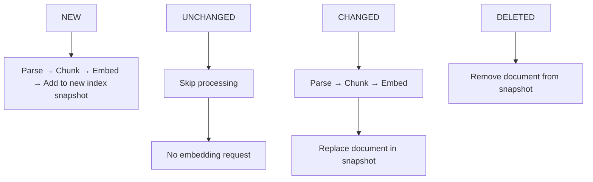
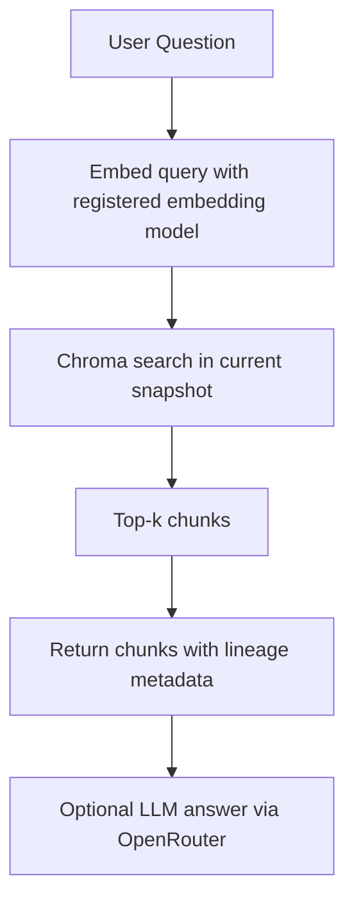

# RAG DataOps Pipeline

LlamaIndex + ChromaDB + UV + OpenRouter + Pydantic

Version: 0.1
Status: Design (MVP scaffolding committed)

## 1. Overview

This project implements a DataOps-oriented Retrieval-Augmented Generation (RAG) pipeline. It builds on the lessons of the sibling `01-rag-naive` project (a pure-Python FAISS MVP) but replaces the hand-written pipeline with **LlamaIndex** and uses **ChromaDB** as the single vector store.

The core difference from a naive RAG system is the emphasis on **operational concerns**:

- **Document hashing** → deterministic change detection and idempotent indexing
- **Document metadata** → lineage and provenance (where a chunk came from, which version, when, via which source connector)
- **Index versioning** → reproducibility (an index can be rebuilt identically from recorded configuration) and rollback (a previous index snapshot can be restored)

The system ingests documents from heterogeneous sources, tracks every document version and change, records lineage, and manages versioned vector indexes that can be reproduced and rolled back.

## 2. Goals

The system must:

- Ingest documents from multiple source types: **PDF, DOCX, Confluence, SharePoint, websites, and databases**
- Detect new, changed, unchanged, and deleted documents via content hashing
- Track document versions, changes, metadata, and lineage
- Split documents into searchable chunks with provenance metadata
- Generate embeddings through a configurable embedding model
- Store vectors and chunk metadata in **ChromaDB**
- Manage vector indexes and their versions
- Track chunks, vector store version, embedding model, and embedding dimension
- Support rollback to previous index versions
- Store embedding metadata so any index can be reliably reproduced
- Provide retrieval with measurable quality (metrics)
- Log indexing and retrieval operations

### RAGOps Maturity Phases

The pipeline is delivered in three phases:

| Phase | Capability | What you learn |
|-------|-----------|---------------|
| RAGOps 1 | Document hashing | Change detection, idempotency |
| RAGOps 2 | Document metadata | Lineage and provenance |
| RAGOps 3 | Index versioning | Reproducibility + rollback |

Each phase is independently verifiable and is a prerequisite for the next.

## 3. Technology Stack

### Core

- Python 3.12+
- UV (dependency management)
- Pydantic + `pydantic-settings` (models, validation, configuration)

### Framework

- **LlamaIndex core** — document loading, chunking (NodeParser), embedding, index construction, retrieval
- **LlamaIndex vector-store integration for Chroma** — `ChromaVectorStore`

### Vector Store

- **ChromaDB** (single vector store)

ChromaDB is the **only** vector store. All vectors and per-chunk metadata live inside ChromaDB collections. There is no FAISS index and no JSON file store for vectors or chunk metadata.

### AI Gateway

- **OpenRouter** — unified OpenAI-compatible gateway for embedding and generation models

### Ingestion Libraries

- `pypdf` — PDF parsing
- `python-docx` — DOCX parsing
- `beautifulsoup4` — HTML parsing (websites, Confluence/SharePoint HTML exports)
- LlamaIndex readers — web pages, files
- Database ingests use read-only queries executed through a connector (local development MVP targets SQLite; production targets are registered as connector profiles)

## 4. Project Structure

```
02-rag-dataops/
├── pyproject.toml
├── uv.lock
├── .env.example
├── .gitignore
│
├── data/
│   ├── raw/                    # filesystem documents to index (discovered recursively)
│   └── processed/              # reserved for processed artifacts (gitignored)
│
├── indexes/
│   ├── chroma/                 # ChromaDB PersistentClient directory (vectors + chunk metadata)
│   ├── index_registry.json     # the version catalog: every index version + "current" pointer
│   └── document_catalog.json   # document hashes, versions, metadata, and lineage
│
├── logs/
│   └── rag-dataops.log
│
├── docs/
│   ├── PROJECT.md              # this design document
│   └── decisions/              # ADRs (architecture decision records)
│
├── scripts/
│   └── generate_sample_docs.py # regenerate sample source documents into data/raw
│
├── src/
│   └── dataops/
│       ├── __init__.py
│       ├── config.py           # Settings (pydantic-settings)
│       ├── main.py             # CLI entrypoint: index, version, rollback, search, metrics
│       │
│       ├── ingestion/
│       │   ├── __init__.py
│       │   ├── loader.py       # source detection + document discovery across connectors
│       │   ├── parser.py       # format-to-text parsers (PDF, DOCX, HTML, TXT, DB rows)
│       │   └── hashing.py      # SHA-256 hashing + change detection (NEW/UNCHANGED/CHANGED/DELETED)
│       │
│       ├── chunking/
│       │   └── chunker.py      # LlamaIndex NodeParser wrapper with provenance metadata
│       │
│       ├── embeddings/
│       │   └── embedder.py     # embedding model wrapper (model id, dimension, OpenRouter client)
│       │
│       ├── indexing/
│       │   ├── __init__.py
│       │   ├── builder.py      # build a new index snapshot into a versioned Chroma collection
│       │   ├── registry.py     # index registry: catalog versions, config, stats, "current" pointer
│       │   └── versioning.py   # snapshot lifecycle + rollback to a previous index version
│       │
│       └── retrieval/
│           ├── __init__.py
│           ├── retriever.py    # embed query + Chroma search via LlamaIndex
│           └── metrics.py      # RetrievalResult, MRR, Recall@k, precision@k
│
└── tests/
    ├── conftest.py
    ├── factories.py            # document + PDF builders
    ├── test_config.py
    ├── test_hashing.py
    ├── test_parser.py
    ├── test_loader.py
    ├── test_chunker.py
    ├── test_embedder.py
    ├── test_builder.py
    ├── test_registry.py
    ├── test_versioning.py
    ├── test_retriever.py
    ├── test_metrics.py
    └── test_main.py
```

Versioned Chroma snapshots live under `indexes/chroma/versions/<version>/`. The registry live in `indexes/index_registry.json`. Document provenance lives in `indexes/document_catalog.json`.

## 5. Data Sources and Ingestion

### Supported Source Types

| Source | Connector | Notes |
|--------|-----------|-------|
| PDF | `pypdf` parser | filesystem discovery, recursive |
| DOCX | `python-docx` parser | filesystem discovery, recursive |
| Websites | LlamaIndex web reader | URL list as a source profile |
| Confluence | HTML export / web reader | via exported HTML or reader connector |
| SharePoint | file download / web reader | via exported files or reader connector |
| Databases | read-only query connector | rows projected to text documents (MVP: SQLite) |

### Source Abstraction

Every source is normalized into the same internal document representation before parsing:

```
{source document}
  ├── document_id          # stable identity, e.g. refund-policy.pdf or billing/row-42
  ├── source               # source profile name (filesystem, confluence, sharepoint, web, database)
  ├── format               # pdf | docx | html | txt | database_row
  ├── text                 # extracted/parsed text
  ├── metadata             # source-specific attributes (author, url, table, row keys, ...)
  └── collected_at         # timestamp when the connector read it
```

### Loader Responsibilities

- Discover documents per source profile
- Route each document to the matching parser
- Return normalized documents with stable `document_id`s
- Pass through source metadata for lineage capture

### Parser Responsibilities

- Parse one format into normalized text
- Preserve structure where meaningful (headings, paragraphs, table rows)
- Never own hashing, chunking, embedding, or persistence

### Database Connector

The database connector projects query results into documents: each row (or row group) becomes a document whose `document_id` is derived from table + primary key and whose text is a formatted projection of the row. Primary keys and table names are recorded in metadata so lineage remains intact.

## 6. Document Hashing and Change Detection

### Purpose

Determine what changed in the source data since the last indexing run.

- Each document is identified by a stable `document_id` (relative path, URL, or row key)
- A **SHA-256** hash is calculated from the document content (file bytes or parsed text)
- Previous hashes are stored in `indexes/document_catalog.json`

### Change Detection Rules

```
document not in catalog                → NEW
document exists with identical hash   → UNCHANGED
document exists with different hash   → CHANGED
catalog entry with no current source  → DELETED
```

The state machine is identical to the proven `01-rag-naive` design:



### Idempotency

Running the indexing command repeatedly with no document changes must not generate new embeddings or change vectors. This is the core RAGOps 1 requirement and is enforced by hashing.

## 7. Document Versioning

Every document carries a version.

- A document's version is derived from its hash history (e.g. `v4`)
- When a document changes, it gets a new version
- The catalog records the version and its hash

Example catalog entry:

```json
{
  "document": "refund-policy.pdf",
  "version": "v4",
  "last_modified": "2026-09-01"
}
```

The version history is retained so the lineage of any chunk can be traced across index snapshots.

## 8. Document Metadata and Lineage

### Responsibilities

Data Operations tracks five responsibilities:

- **Document ingestion** — connectors normalize heterogeneous sources
- **Document versioning** — hash-derived versions per document
- **Change detection** — NEW / UNCHANGED / CHANGED / DELETED
- **Metadata extraction** — source attributes captured at ingestion time
- **Lineage tracking** — every chunk records which document, which version, which source connector, and which index version produced it

### Provenance Fields

Each chunk stored in ChromaDB carries lineage metadata:

```
document_id      # which document
version          # which version of that document (v4)
source           # which connector (filesystem, confluence, sharepoint, web, database)
format           # pdf, docx, html, txt, database_row
chunk_index      # ordinal within the document
block_start      # character offset in the source text
block_end        # character offset in the source text
index_version    # which index snapshot contains this chunk
chunk_hash       # deterministic hash of chunk text (reproducibility)
```

### Lineage Example

A chunk answer from `refund-policy.pdf` in index version `v7` traces back through:

```
chunk → refund-policy.pdf::v4::chunk::12
      → source: filesystem, format: pdf
      → document version: v4, last_modified: 2026-09-01
      → index snapshot: v7
      → embedding model: openai/text-embedding-3-small, dim: 1536
```

## 9. Chunking

### What

LlamaIndex's `NodeParser` is used to split documents into chunks (nodes).

### Configuration

```
CHUNK_SIZE = 800
CHUNK_OVERLAP = 150
```

### Metadata

Every chunk node is stamped with the provenance fields from Section 8 before it is persisted, so retrieval always returns lineage, not just text.

### Chunk Identity

- A **chunk_id** is deterministic within a document version: `{document_id}::{version}::chunk::{index}`
- ChromaDB handles storage of `document`, `embedding`, `metadata` per chunk
- The chunk hash is stored in metadata so the same chunk can be recognized across index snapshots

## 10. Embedding Operations

### Purpose

Track the embedding model and dimension so every index can be reliably reproduced.

### Tracked Values

- **Embedding model** — the model id used to embed chunks and queries
- **Embedding dimension** — the fixed vector dimension, recorded on first embedding
- **Embedding provider** — the gateway configuration (e.g. OpenRouter base URL)

### Rules

```
Model changes                  → existing snapshot incompatible → full reindex
Dimension mismatch             → log critical, do not add vector, do not persist snapshot
```

### Reproducibility

The registry records, per index version:

```
embedding_model
embedding_dimension
embedding_provider (base URL)
```

Because the embedding model, dimension, and chunking settings are recorded with every snapshot, the exact index can be rebuilt from the same documents — this is the RAGOps 3 reproducibility guarantee.

## 11. Index Operations

### Questions the Index Registry Answers

- **Which chunks are indexed?** → recorded chunk count + chunk_ids per document
- **Which embeddings were used?** → embedding model + provider recorded in the version config
- **What dimension?** → embedding dimension recorded in the version config
- **Which vector store version?** → every version is a distinct Chroma snapshot with a version id

### Index Registry

The registry (`indexes/index_registry.json`) is the source of truth for index versions:

```json
{
  "current_version": "v7",
  "versions": {
    "v7": {
      "created_at": "2026-09-01T10:00:00Z",
      "embedding_model": "openai/text-embedding-3-small",
      "embedding_dimension": 1536,
      "embedding_provider": "https://openrouter.ai/api/v1",
      "chunk_size": 800,
      "chunk_overlap": 150,
      "collection_name": "docs_v7",
      "chunk_count": 4832,
      "document_count": 18,
      "stats": { "source_pdf": 14, "source_docx": 2, "source_web": 2 }
    }
  }
}
```

Every index build creates a new snapshot **and a new version record**. The registry never mutates an existing version record — version history is append-only (except for the `current_version` pointer).

### Tracked Properties Per Version

- Vector store version (collection name + path)
- Chunk count and document count
- Embedding model, provider, and dimension
- Chunking configuration

## 12. Index Versioning

### Full Snapshots per Version

Each index version stores **its own vectors and metadata** in a dedicated Chroma snapshot:

```
indexes/chroma/versions/v7/
```

Rollback is therefore a physical restore, not a metadata-only bookkeeping exercise. The decision is recorded in ADR-002.

### Version Lifecycle


### Rollback

```
indexes/chroma/versions/<old-version>/   # still intact
```

Rolling back means pointing `current_version` back to a stored snapshot and switching retrieval to that snapshot's collection:


## 13. Document State and Catalog

`indexes/document_catalog.json` stores per-document state:

```json
{
  "refund-policy.pdf": {
    "version": "v4",
    "hash": "c8fd7f3e91...",
    "last_modified": "2026-09-01",
    "source": "filesystem",
    "format": "pdf",
    "chunk_ids": ["refund-policy.pdf::v4::chunk::0", "..."]
  }
}
```

This catalog drives:

- Change detection (Section 6)
- Document versioning (Section 7)
- Lineage lookup (Section 8)

## 14. Retrieval

### What

LlamaIndex retriever against the current versioned Chroma collection.

### Workflow



The query embedding model must match the registered snapshot embedding model.

## 15. Retrieval Metrics

### Purpose

Measure retrieval quality so index changes are evidence-based.

### Implemented Metrics

- **Recall@k** — how many relevant chunks are retrieved
- **MRR** — mean reciprocal rank of the first relevant result
- **Precision@k** — fraction of retrieved chunks that are relevant

### Output

`metrics.py` exposes a `RetrievalResult` model and pure functions that compute the metrics from a ranking versus the set of relevant chunk ids.

## 16. Configuration

Centralized configuration in `src/dataops/config.py` via Pydantic `Settings`:

```
OPENROUTER_API_KEY
OPENROUTER_BASE_URL
OPENROUTER_EMBEDDING_MODEL
OPENROUTER_MODEL

CHROMA_DIR          = indexes/chroma
INDEX_REGISTRY     = indexes/index_registry.json
DOCUMENT_CATALOG   = indexes/document_catalog.json

DATA_DIR           = data/raw
LOG_PATH           = logs/rag-dataops.log

CHUNK_SIZE         = 800
CHUNK_OVERLAP      = 150
TOP_K              = 5
```

Secrets remain in the environment.

## 17. Logging

Basic structured logging to `logs/rag-dataops.log` and the console:

```
INFO Discovered 12 documents
INFO NEW refund-policy.pdf v4
INFO Parsed 12 documents
INFO Created 283 chunks
INFO Built index snapshot v7 (283 chunks, 12 documents)
INFO registration: embedding_model=openai/text-embedding-3-small dimension=1536
INFO Rolled back to index version v5
```

Errors:

```
ERROR PDF parsing failed: ...
ERROR Embedding request failed
ERROR Dimension mismatch: expected 1536 got 768
ERROR Snapshot build failed; registry not mutated
ERROR Rollback failed: version v5 collection missing
```

## 18. Error Handling and Safety

- The system continues processing when possible (per-document failures are logged and skipped)
- A failed snapshot build must **not** mutate the registry or the `current_version` pointer
- A failed document parse/embed does not change the previously indexed version of that document
- Rollback requires the target snapshot to exist on disk; otherwise it fails loudly
- Idempotency: repeated index runs with no changes produce no new embeddings and no new snapshots

## 19. CLI

The `rag-dataops` CLI (`src/dataops/main.py`):

```
rag-dataops index                     # discover, hash, change-detect, build snapshot, bump version
rag-dataops rollback <version>        # point current_version back to a stored snapshot
rag-dataops versions                  # list index versions + configuration
rag-dataops catalog                   # show document catalog (versions, hashes, lineage)
rag-dataops search "<query>"          # top-k chunks with lineage metadata
rag-dataops metrics <qrels.json>      # compute retrieval metrics against relevance files
```

A Streamlit dashboard is planned on top of this CLI to visualize the catalog, index versions, and rollback (see Section 21).

## 20. Testing Strategy

- **Hashing**: NEW / UNCHANGED / CHANGED / DELETED detection; idempotency of repeat runs
- **Parsers**: PDF, DOCX, HTML, TXT parsing into normalized documents
- **Chunker**: chunk size, overlap, provenance metadata, chunk identity
- **Embedding**: model registration, dimension capture, dimension validation
- **Builder**: snapshot build, version bump, chunk/document counts
- **Registry**: version catalog read/write, immutability of existing version records
- **Versioning**: snapshot isolation, rollback restores the correct collection, failed rollout leaves state intact
- **Metrics**: MRR, Recall@k, Precision@k on known rankings
- **CLI**: subcommand dispatch

## 21. Roadmap

- **Streamlit dashboard** — visualize document catalog, lineage, index versions, and execute rollback
- **Phase RAGOps 2 hardening** — richer metadata extraction and lineage UIs
- **Phase RAGOps 3 hardening** — snapshot retention policy (number of snapshots kept) and async snapshot build
- **Hybrid search** (semantic + keyword), reranking, evaluation harness, guardrails
- **FastAPI endpoints** wrapping the same services
- **Production connectors** for Confluence / SharePoint / databases beyond the local MVP

## 22. Design Principles

```
Hash first — every index decision rests on deterministic content hashes.

ChromaDB only — the vector store is the single home for vectors and chunk metadata;
  JSON is reserved for the registry and document catalog only.

Snapshots per version — rollback is a physical restore, not bookkeeping.

Append-only versions — existing version records are never mutated.

Lineage always — every chunk knows its document, version, source, and index snapshot.

Reproducible indexes — model, dimension, provider, and chunking config are recorded
  per snapshot so exact rebuilds are possible.

Idempotent indexing — no changes in, no new embeddings or snapshots out.

Observable operations — indexing, versions, rollback, errors, and metrics are logged.

Progressive delivery — RAGOps 1 (hashing) → RAGOps 2 (metadata/lineage) →
  RAGOps 3 (versioning) delivered in order.
```