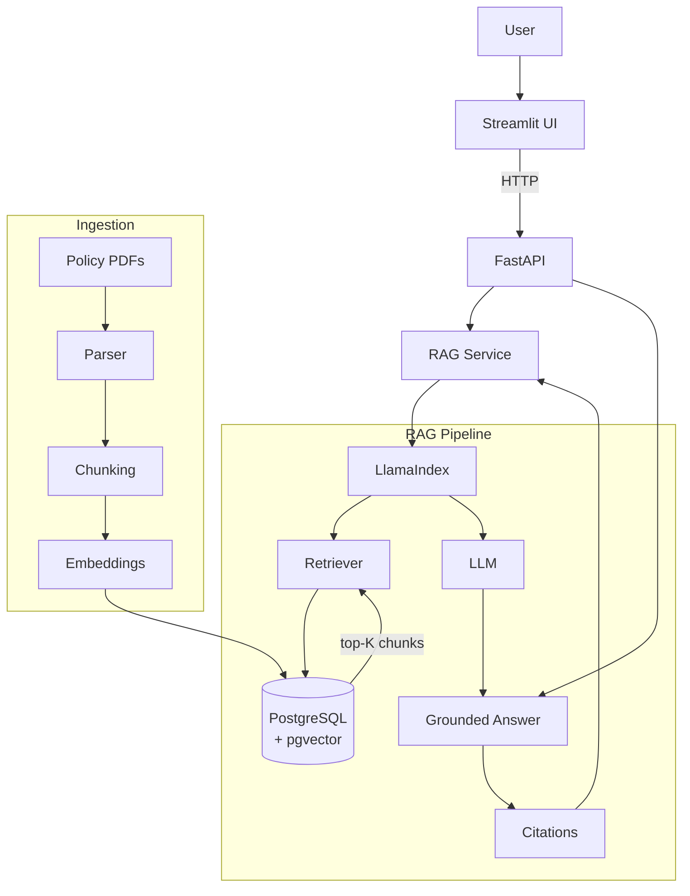

# Telecom Policy RAG

Retrieval-Augmented Generation (RAG) system that answers telecom policy and procedure questions using **approved policy documents** as the source of truth. The LLM explains the retrieved evidence — it never invents company policy.

**Stack:** Python 3.13 · LlamaIndex · PostgreSQL + pgvector · FastAPI · Streamlit · uv

---

## Status

| Area | State |
| ---- | ----- |
| Project specs (`docs/`) | Done — brief, requirements, architecture, RAG design, execution plan, DB schema, operations/runbook, security, evaluation |
| LLM integration | Done — OpenRouter via `config/llm_config.yaml` + `src/llm/llm_client.py` |
| Knowledge-base generator | Done — `scripts/generate_docs.py` produces 28 branded telecom policy PDFs under `data/documents/` |
| Core RAG pipeline (LlamaIndex) | Planned — see `docs/plan.md` (Phase 0+) |
| Tracing / ops schema | Designed — `docs/database-schema.md`, `docs/operations.md` |
| API · UI · Evaluation · Security · CI/CD | Planned |

## Architecture



Dependencies flow inward: **UI → API → RAG Service → LlamaIndex → Retrieval/Index → Database**. The Streamlit app must never call PostgreSQL directly.

## Repository Layout

Target layout (tracked in `docs/architecture.md` §37):

```text
telecom-rag/
│
├── src/
│   ├── __init__.py
│   │
│   ├── config/
│   │   ├── __init__.py
│   │   └── settings.py
│   │
│   ├── models/
│   │   ├── __init__.py
│   │   ├── policy_document.py
│   │   ├── policy_version.py
│   │   ├── policy_chunk.py
│   │   ├── rag_request.py
│   │   ├── rag_response.py
│   │   ├── retrieval_result.py
│   │   └── ingestion_run.py
│   │
│   ├── llm/
│   │   ├── __init__.py
│   │   ├── llm_client.py
│   │   ├── embedding_client.py
│   │   └── prompt_manager.py
│   │
│   ├── documents/
│   │   ├── __init__.py
│   │   ├── document_loader.py
│   │   ├── pdf_loader.py
│   │   ├── document_extractor.py
│   │   ├── document_chunker.py
│   │   └── hash_service.py
│   │
│   ├── database/
│   │   ├── __init__.py
│   │   ├── database_client.py
│   │   ├── policy_repository.py
│   │   ├── chunk_repository.py
│   │   ├── ingestion_repository.py
│   │   ├── retrieval_repository.py
│   │   └── user_repository.py
│   │
│   ├── indexing/
│   │   ├── __init__.py
│   │   ├── indexing_service.py
│   │   ├── version_service.py
│   │   └── activation_service.py
│   │
│   ├── rag/
│   │   ├── __init__.py
│   │   ├── rag_service.py
│   │   ├── retrieval_service.py
│   │   ├── context_builder.py
│   │   └── citation_service.py
│   │
│   ├── guardrails/
│   │   ├── __init__.py
│   │   ├── input_guard.py
│   │   ├── retrieval_guard.py
│   │   ├── grounding_guard.py
│   │   └── output_guard.py
│   │
│   ├── memory/
│   │   ├── __init__.py
│   │   └── conversation_memory.py
│   │
│   ├── evaluation/
│   │   ├── __init__.py
│   │   ├── evaluation_service.py
│   │   ├── retrieval_evaluator.py
│   │   └── answer_evaluator.py
│   │
│   ├── tracing/
│   │   ├── __init__.py
│   │   ├── trace_service.py
│   │   ├── request_tracer.py
│   │   └── retrieval_tracer.py
│   │
│   ├── operations/
│   │   ├── __init__.py
│   │   ├── indexing_operations.py
│   │   ├── verification_service.py
│   │   ├── repair_service.py
│   │   ├── rollback_service.py
│   │   ├── cleanup_service.py
│   │   └── health_service.py
│   │
│   ├── api/
│   │   ├── __init__.py
│   │   ├── routes/
│   │   │   ├── __init__.py
│   │   │   ├── rag.py
│   │   │   ├── documents.py
│   │   │   ├── indexing.py
│   │   │   ├── operations.py
│   │   │   └── health.py
│   │   │
│   │   └── schemas/
│   │       ├── __init__.py
│   │       ├── rag.py
│   │       ├── documents.py
│   │       └── operations.py
│   │
│   ├── cli/
│   │   ├── __init__.py
│   │   ├── main.py
│   │   ├── indexing_commands.py
│   │   └── operations_commands.py
│   │
│   └── utils/
│       ├── __init__.py
│       ├── logger.py
│       └── config_loader.py
│
├── data/
│   ├── documents/
│   │   ├── billing/
│   │   ├── mobile/
│   │   ├── roaming/
│   │   ├── customer/
│   │   └── compliance/
│   │
│   └── validation/
│       └── eval_questions.json
│
├── database/
│   └── migrations/
│       ├── 001_initial_schema.sql
│       ├── 002_tracing.sql
│       └── 003_indexes.sql
│
├── tests/
│   ├── unit/
│   │   ├── test_config_loader.py
│   │   ├── test_prompt_manager.py
│   │   ├── test_llm_client.py
│   │   ├── test_embeddings.py
│   │   ├── test_document_loader.py
│   │   ├── test_document_chunker.py
│   │   ├── test_retrieval.py
│   │   ├── test_guardrails.py
│   │   ├── test_memory.py
│   │   └── test_evaluation.py
│   │
│   └── integration/
│       ├── test_llm_integration.py
│       ├── test_database.py
│       ├── test_indexing.py
│       └── test_rag.py
│
├── docs/
│   ├── requirements.md
│   ├── architecture.md
│   ├── rag-design.md
│   ├── database-schema.md
│   ├── security.md
│   │
│   └── operations/
│       ├── indexing.md
│       ├── troubleshooting.md
│       ├── degradation.md
│       ├── rollback.md
│       └── runbook.md
│
├── scripts/
│   ├── index_documents.py
│   ├── verify_index.py
│   └── evaluate_rag.py
│
├── app/
│   └── streamlit_app.py
│
├── .env
├── .env.example
├── .gitignore
├── pyproject.toml
├── README.md
└── uv.lock
```

Currently implemented: `config/llm_config.yaml` + `config/prompts.yaml`, `src/llm/`, `src/utils/`, `scripts/generate_docs.py`, the generated PDFs under `data/documents/`, and the `docs/` specifications. The FastAPI application lives under `src/api/`, the Streamlit UI under `app/streamlit_app.py`.

## Documentation

| Document | Purpose |
| -------- | ------- |
| `docs/brief.md` | Project brief, business context, objectives, MVP scope |
| `docs/requirements.md` | Requirements specification (functional + non-functional) |
| `docs/architecture.md` | Technical architecture, components, data flows |
| `docs/rag-design.md` | Detailed RAG pipeline design (ingestion, retrieval, generation, citations) |
| `docs/database-schema.md` | PostgreSQL schema: knowledge data vs. request/retrieval/LLM tracing |
| `docs/plan.md` | Execution plan, phases, milestones, learning checkpoints |
| `docs/operations.md` | RAG operations/runbook: indexing lifecycle, activation, degradation, troubleshooting |
| `docs/operations/` | Planned sub-docs: `indexing.md`, `troubleshooting.md`, `degradation.md`, `rollback.md`, `runbook.md` |
| `docs/security.md` | Security requirements, threat model, guardrails |
| `docs/evaluation.md` | Evaluation dataset and metrics (retrieval, groundedness, correctness) |

## Quick Start

```bash
# 1. Copy the environment template and add your OpenRouter key
cp .env.example .env

# 2. Create the environment and install dependencies
uv venv
.venv/bin/python -m pip install httpx python-dotenv pyyaml reportlab

# 3. Generate the knowledge-base PDFs (28 branded telecom policy documents)
.venv/bin/python scripts/generate_docs.py

# Generate only a subset / a single document
.venv/bin/python scripts/generate_docs.py --limit 2
.venv/bin/python scripts/generate_docs.py --only refund-policy
```

Output: branded A4 PDFs under `data/documents/<category>/`, with 8 long documents exceeding 10 pages (built section-by-section so they are realistic RAG ingestion sources). Token usage and page counts are logged per document.

> Note: `uv add 04-rag-telco-v1` currently fails due a source-layout mismatch (`Expected a Python module at src/04_rag_telco_v1/__init__.py`), so dependencies are installed with `uv pip install`.

## Core Principles

1. **Retrieve first, generate second** — the LLM never guesses policy.
2. **The application controls the sources** — versions, effective dates, and guardrails are enforced outside the LLM.
3. **Fail safely** — insufficient evidence returns a no-answer message, never a fabricated policy.
4. **Evaluate before optimizing** — no hybrid search/reranking until the baseline is measured.

## Roadmap

Execution is staged in `docs/plan.md`:

- **Milestone 0** — Foundation (Python · uv · domain models)
- **Milestone 1** — RAG core (ingest → chunk → embed → pgvector → retrieve → LLM)
- **Milestone 2** — Usable app (FastAPI + Streamlit + sources)
- **Milestone 3** — Reliable RAG (evaluation, guardrails, versioning)
- **Milestone 4** — Observable RAG (logging, metrics, tracing, `docs/database-schema.md`)
- **Milestone 5** — Operable + production RAG (index lifecycle & runbook per `docs/operations.md`, security, CI/CD)

Each stage ends with a learning checkpoint — verify you can explain the layer before moving on.

## Author

M.Mezni