# Telecom Policy RAG — Architecture

## 1. Purpose

This document describes the technical architecture of the Telecom Policy RAG application.

The system uses **LlamaIndex** as the RAG framework and **PostgreSQL + pgvector** as the persistent vector store.

The architecture is designed to support the following evolution:

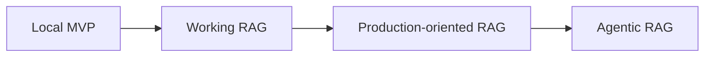

The initial implementation focuses on a reliable policy-question-answering system.

---

## 2. Architecture Principles

The system follows these principles.

### 2.1 Policies are the source of truth

The LLM must not be considered the source of telecom policy information.

The source of truth is the approved policy repository.

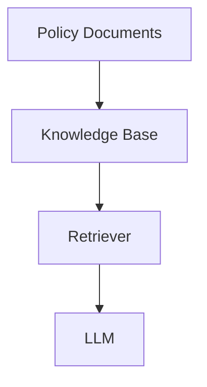

---

### 2.2 Retrieval before generation

The LLM should receive relevant policy information before generating an answer.

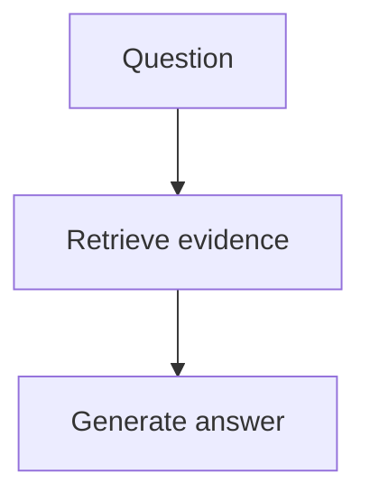

Not:

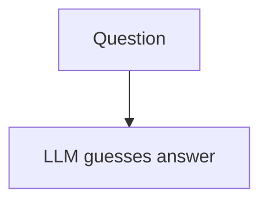

---

### 2.3 Citations are mandatory

Every policy answer should contain enough source information to identify where the answer came from.

Example:

```text
Document: Refund Policy
Version: 3.2
Section: 4.2
Page: 8
```

---

### 2.4 Current policies take precedence

The system must understand:

* Policy version
* Effective date
* Expiration date
* Active/inactive status

Obsolete policies should not normally participate in retrieval.

---

### 2.5 Fail safely

If the system cannot find sufficient evidence, it should not invent an answer.

```text
I could not find sufficient information in the
available approved policies to answer this question.
```

---

## 3. High-Level Architecture

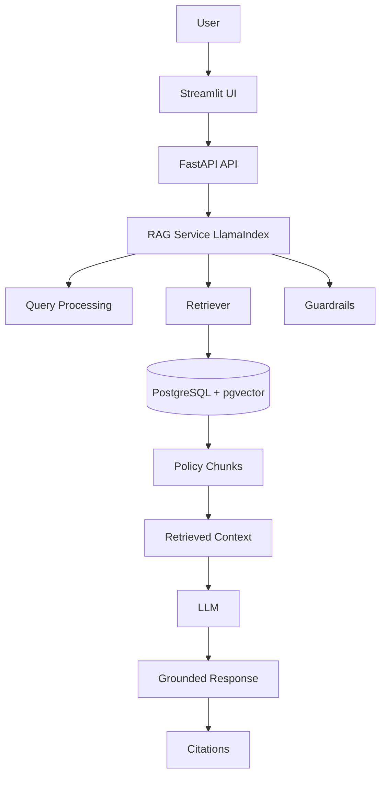

---

## 4. Technology Stack

| Component        | Technology                                         |
| ---------------- | -------------------------------------------------- |
| Language         | Python 3.12+                                       |
| Package Manager  | uv                                                 |
| RAG Framework    | LlamaIndex                                         |
| API              | FastAPI                                            |
| UI               | Streamlit                                          |
| Validation       | Pydantic                                           |
| PDF Processing   | PyMuPDF                                            |
| Database         | PostgreSQL                                         |
| Vector Search    | pgvector                                           |
| LLM              | OpenAI / Azure OpenAI / OpenRouter                 |
| Embeddings       | OpenAI / Azure OpenAI / compatible embedding model |
| Testing          | pytest                                             |
| Logging          | Python logging                                     |
| Tracing          | OpenTelemetry                                      |
| Containerization | Docker                                             |
| CI/CD            | GitHub Actions                                     |

---

## 5. Application Components

The application is divided into several logical components.

```text
src/
│
├── config/       # Settings (pydantic-settings)
│
├── models/       # Domain models (Pydantic)
│
├── llm/          # LLM client + embeddings + prompts
│
├── documents/    # Load, extract, chunk, hash
│
├── database/     # Client + repositories
│
├── indexing/     # Index, version, activation
│
├── rag/          # RAG service, retrieval, context, citations
│
├── guardrails/   # Input / retrieval / grounding / output
│
├── memory/       # Conversation memory
│
├── evaluation/   # Retrieval + answer evaluation
│
├── tracing/      # Request + retrieval tracing
│
├── operations/   # Index/verify/repair/rollback/cleanup/health
│
├── api/          # FastAPI routes + schemas
│
├── cli/          # CLI commands
│
└── utils/        # Logger + config loader
```

Each component has one primary responsibility.

---

## 6. Ingestion Layer

The ingestion layer converts source documents into LlamaIndex documents/nodes that can be indexed.

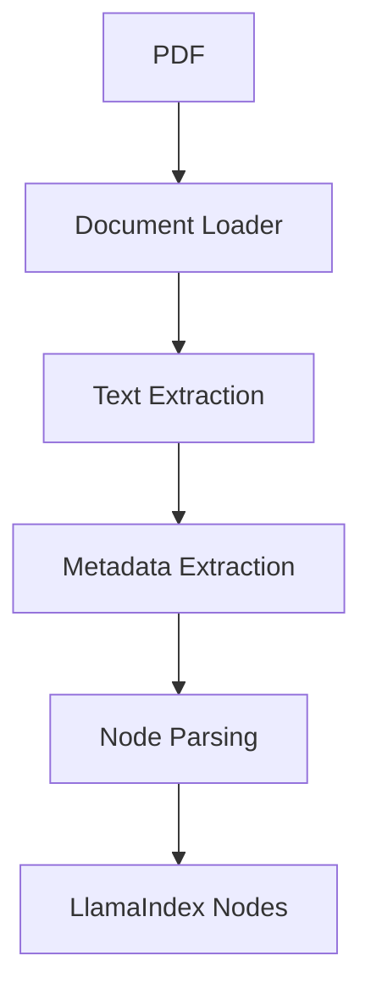

### Responsibilities

The ingestion layer handles:

* PDF loading
* Text extraction
* Page identification
* Section identification
* Metadata
* Document validation
* Chunking

---

## 7. Document Sources

Initial supported sources:

```text
data/documents/
│
├── billing/
├── mobile/
├── roaming/
├── customer/
└── compliance/
```

Example:

```text
data/documents/mobile/mobile-cancellation-policy.pdf
```

---

## 8. Document Metadata

Each document should have metadata.

Example:

```python
{
    "document_id": "mobile-cancellation-001",
    "document_name": "Mobile Cancellation Policy",
    "document_type": "policy",
    "category": "mobile",
    "version": "3.2",
    "effective_date": "2026-06-01",
    "expiration_date": None,
    "status": "active",
    "owner": "Customer Operations"
}
```

Chunk-level metadata should additionally include:

```python
{
    "page": 12,
    "section": "4.2",
    "section_title": "Cancellation Eligibility"
}
```

---

## 9. LlamaIndex Document Model

The ingestion process should transform the source document into LlamaIndex objects.

Conceptually:

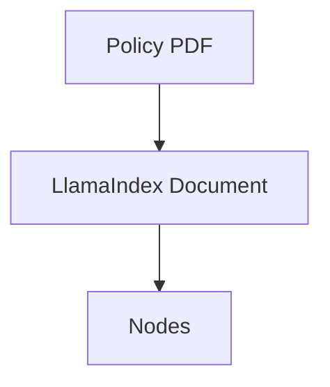

A node represents a retrievable piece of the original document.

Example:

```text
Node
├── text
├── document_id
├── page
├── section
├── version
├── effective_date
└── category
```

---

## 10. Chunking Strategy

Chunking is one of the most important RAG decisions.

The system should avoid arbitrary chunks whenever possible.

Instead, preserve policy structure.

Example source:

```text
4. Refunds

4.1 Eligibility

Customers may request a refund when...

4.2 Refund Amount

The refund amount is calculated...

4.3 Processing Time

Refunds are processed within...
```

Preferred chunks:

```text
Chunk A
Section: 4.1
Title: Eligibility
Text: ...

Chunk B
Section: 4.2
Title: Refund Amount
Text: ...

Chunk C
Section: 4.3
Title: Processing Time
Text: ...
```

The first implementation can use a LlamaIndex node parser such as `SentenceSplitter`.

Later, implement a policy-aware chunker.

---

## 11. Indexing Pipeline

The indexing pipeline is:

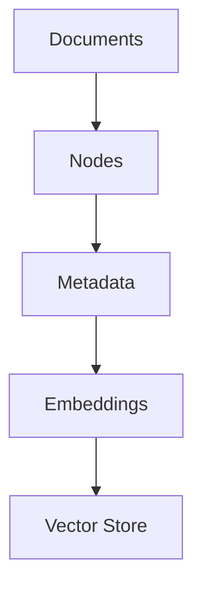

More specifically:

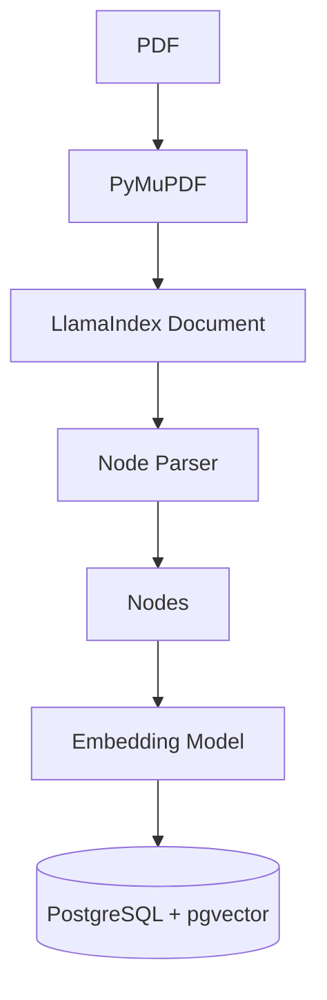

---

## 12. Embedding Layer

An embedding model converts text into vectors.

Example:

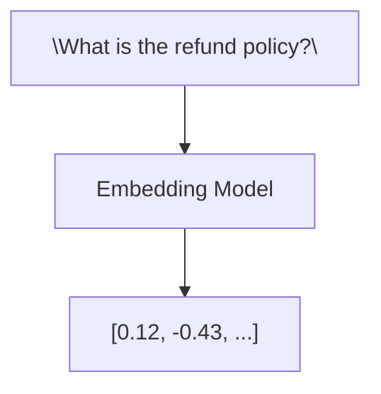

Each policy node receives an embedding.

The user query is also converted into an embedding.

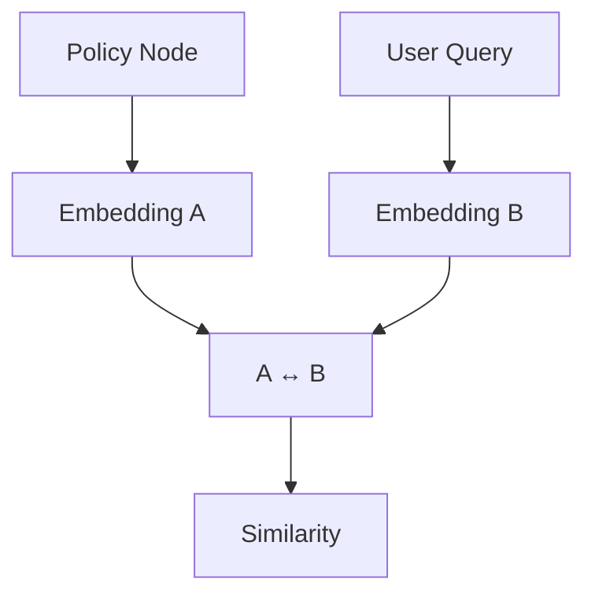

---

## 13. Vector Store

The initial vector database is:

```text
PostgreSQL
+
pgvector
```

This provides:

* Persistent storage
* Metadata storage
* Vector similarity search
* SQL filtering
* Existing PostgreSQL ecosystem
* Easier operational model than introducing another database

---

## 14. Logical Database Model

The database should conceptually contain:

```text
documents
    │
    ├── document_versions
    │
    └── chunks
             │
             └── embedding
```

Example:

```text
documents
────────────────────────────
id
document_id
name
category
type
owner
created_at
```

```text
document_versions
────────────────────────────
id
document_id
version
effective_date
expiration_date
status
created_at
```

```text
chunks
────────────────────────────
id
document_version_id
page
section
section_title
text
embedding
metadata
created_at
```

---

## 15. Retrieval Architecture

The first retrieval implementation is semantic vector retrieval.

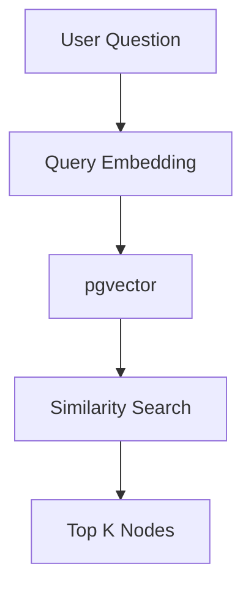

Example:

```text
Question:
"What is the cancellation period?"

             ↓

Retrieved Nodes:

1. Mobile Cancellation Policy
   Section 4.2
   Score: 0.92

2. Customer Contract Policy
   Section 5.1
   Score: 0.87

3. Cancellation FAQ
   Section 2
   Score: 0.81
```

---

## 16. Metadata Filtering

Vector similarity alone is not enough for telecom policies.

The retriever should eventually support filters such as:

```text
status = active
```

```text
effective_date <= today
```

```text
category = mobile
```

```text
customer_type = consumer
```

Example:

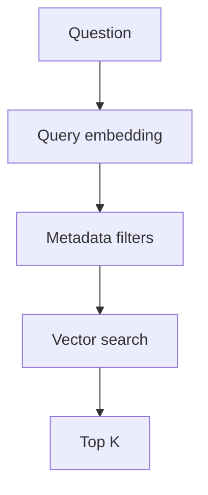

---

## 17. Policy Version Selection

Suppose the database contains:

```text
Refund Policy v1.0
Refund Policy v2.0
Refund Policy v3.0
```

and:

```text
v1.0 → expired
v2.0 → expired
v3.0 → active
```

The retriever should use:

```text
v3.0
```

rather than allowing all versions to compete in vector search.

---

## 18. Query Engine

LlamaIndex will orchestrate the retrieval and generation flow.

Conceptually:

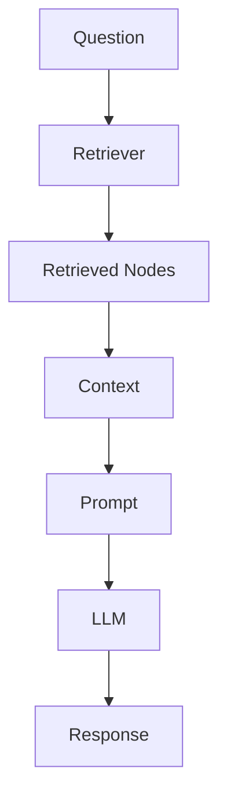

The initial implementation can use a LlamaIndex query engine backed by the PostgreSQL/pgvector index.

---

## 19. Prompt Architecture

The prompt should explicitly establish grounding.

Conceptual system prompt:

```text
You are a Telecom Policy Assistant.

Your role is to answer questions using only
approved policy information provided as context.

Rules:

1. Use only the supplied policy context.
2. Do not invent company policies.
3. Do not infer unsupported requirements.
4. If the context is insufficient, say so.
5. Prefer the current approved policy.
6. Cite the source document.
7. Include section and page information when available.
```

---

## 20. Context Construction

The LLM receives something similar to:

```text
SYSTEM INSTRUCTIONS

You are a Telecom Policy Assistant...

POLICY CONTEXT

[Document: Mobile Cancellation Policy]
[Version: 3.2]
[Section: 4.2]
[Page: 12]

Customers may cancel...

---

[Document: Customer Contract Policy]
[Version: 5.1]
[Section: 7.1]
[Page: 18]

...

USER QUESTION

What is the cancellation policy?
```

---

## 21. Response Model

The application should use a structured response.

Example:

```python
class Source(BaseModel):
    document_name: str
    version: str
    section: str | None
    page: int | None


class RAGResponse(BaseModel):
    answer: str
    sources: list[Source]
    confidence: str
```

Possible confidence values:

```text
high
medium
low
insufficient
```

Confidence should not be interpreted as a mathematical probability unless the system explicitly defines and calibrates it.

---

## 22. Citation Architecture

Sources should originate from retrieved nodes.

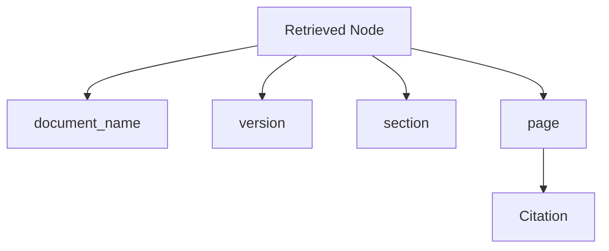

The LLM should not be responsible for inventing citation metadata.

The application should construct citations from the retrieved source metadata.

---

## 23. Guardrails Architecture

Guardrails are applied around retrieval and generation.

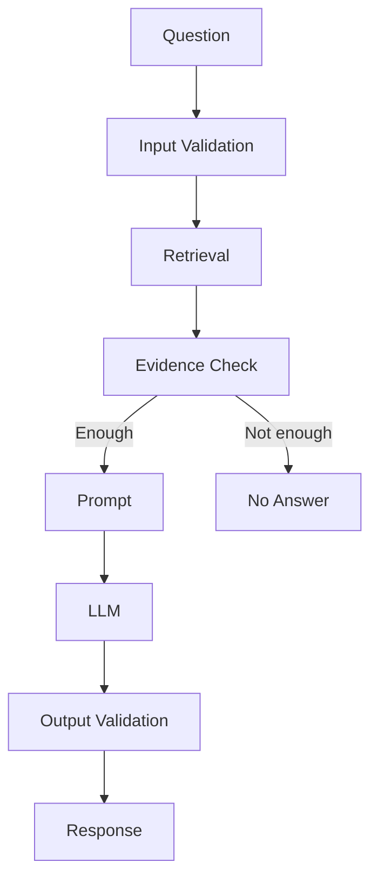

---

## 24. Evidence Threshold

The system should establish a minimum retrieval quality threshold.

Conceptually:

```python
if best_score < MIN_RELEVANCE_SCORE:
    return insufficient_evidence()
```

The threshold should be determined through evaluation rather than chosen arbitrarily.

---

## 25. Conflicting Policies

A future retrieval stage should identify conflicts.

Example:

```text
Policy A:
Refund period = 30 days

Policy B:
Refund period = 14 days
```

The system should not silently select one.

Potential response:

```text
The available approved policies contain conflicting
information regarding the refund period. This case
requires policy review.
```

Conflict detection should consider:

* Policy version
* Effective dates
* Policy scope
* Product
* Customer type
* Region
* Policy priority

---

## 26. RAG Service

The RAG service provides the main application-level interface.

Conceptual API:

```python
class RAGService:

    def query(self, question: str) -> RAGResponse:
        ...
```

Responsibilities:

1. Validate question.
2. Retrieve relevant nodes.
3. Validate evidence.
4. Build context.
5. Execute LlamaIndex query.
6. Validate response.
7. Build citations.
8. Return structured response.

---

## 27. FastAPI Layer

FastAPI exposes the RAG service.

Example endpoint:

```text
POST /api/v1/rag/query
```

Request:

```json
{
    "question": "What is the cancellation policy?"
}
```

Response:

```json
{
    "answer": "...",
    "sources": [
        {
            "document_name": "Mobile Cancellation Policy",
            "version": "3.2",
            "section": "4.2",
            "page": 12
        }
    ],
    "confidence": "high"
}
```

FastAPI should not contain RAG logic.

The architecture should be:

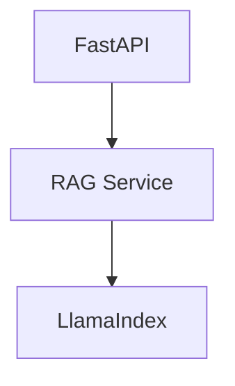

---

## 28. Streamlit Layer

Streamlit provides the initial user interface.

```text
┌──────────────────────────────────────┐
│         Telecom Policy AI            │
├──────────────────────────────────────┤
│                                      │
│ Ask a question                       │
│                                      │
│ [ What is the refund policy?       ] │
│                                      │
│              [Ask]                   │
│                                      │
├──────────────────────────────────────┤
│ Answer                               │
│                                      │
│ ...                                  │
│                                      │
│ Sources                              │
│                                      │
│ Refund Policy — v3.2                │
│ Section 4.2 — Page 8                │
└──────────────────────────────────────┘
```

Streamlit should communicate with the FastAPI API rather than directly implementing the RAG pipeline.

---

## 29. Evaluation Architecture

Evaluation is separate from the production query path.

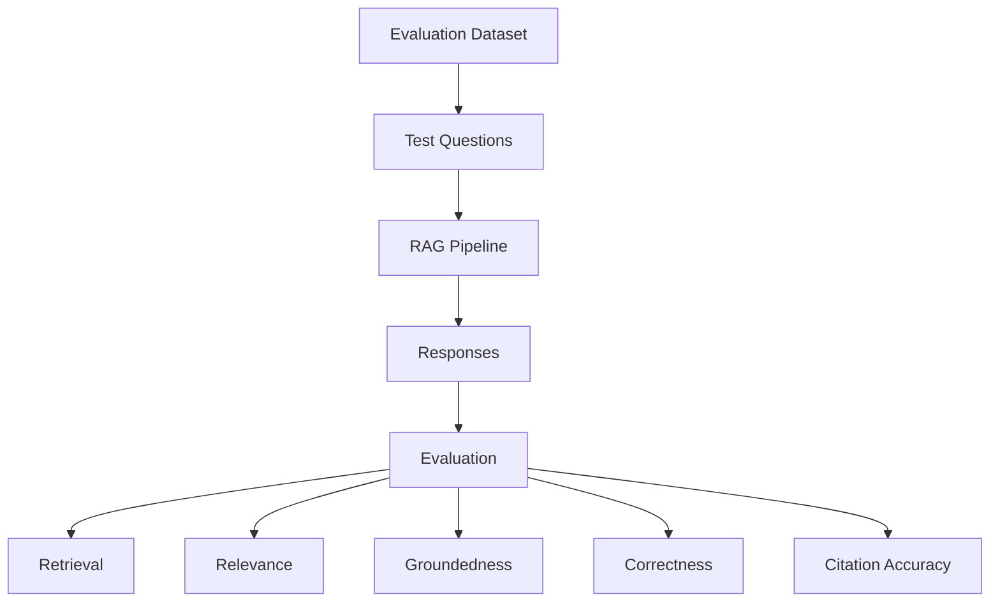

---

## 30. Evaluation Dataset

Example:

```json
{
    "question": "What documents are required for SIM replacement?",
    "expected_document": "sim-replacement-policy.pdf",
    "expected_section": "3.2",
    "expected_answer": "..."
}
```

Initial dataset:

```text
50 questions
```

Later:

```text
100+
```

Questions should cover:

* Easy retrieval
* Similar policies
* Ambiguous questions
* Out-of-scope questions
* Outdated policy scenarios
* Conflicting policies
* Multi-section answers

---

## 31. Observability Architecture

The system should eventually produce a trace for every query.

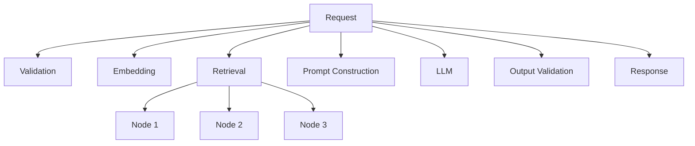

Record:

```text
request_id
timestamp
question
retrieved_nodes
retrieval_scores
model
latency
token usage
answer
sources
errors
```

---

## 32. OpenTelemetry

OpenTelemetry can eventually provide distributed tracing.

Example:

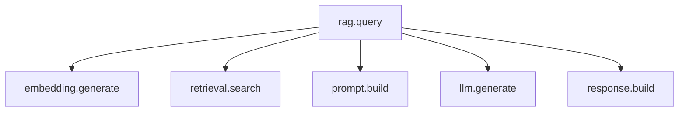

This allows developers to identify where latency or failures occur.

---

## 33. Logging

Use structured application logging.

Example:

```text
INFO request_id=123
question="What is the refund policy?"

INFO request_id=123
retrieved_chunks=5

INFO request_id=123
top_score=0.91

INFO request_id=123
model="..."

INFO request_id=123
latency_ms=1820
```

Avoid logging sensitive customer information.

---

## 34. Security Boundaries

The architecture should separate:

```mermaid
flowchart TD
    A1["User"] --> A2["Authentication"] --> A3["Authorization"] --> A4["API"]
    A4 --> A5["RAG"] --> A6["Knowledge Base"]
```

Future requirements:

* Authentication
* Role-based access control
* Document-level permissions
* Audit logging
* Secrets management
* Encryption
* PII protection

The initial MVP should use synthetic or non-sensitive data.

---

## 35. Data Flow — Ingestion

Complete ingestion flow:

```mermaid
flowchart TD
    A1["Policy PDF"] --> A2["PyMuPDF"] --> A3["Extract Pages"] --> A4["Extract Metadata"]
    A4 --> A5["LlamaIndex Document"] --> A6["Node Parser"] --> A7["Nodes"]
    A7 --> A8["Embeddings"] --> A9[("PostgreSQL + pgvector")]
```

---

## 36. Data Flow — Query

Complete query flow:

```mermaid
flowchart LR
    A1["User Question"] --> A2["Streamlit"] --> A3["FastAPI"] --> A4["Pydantic Validation"]
    A4 --> A5["RAG Service"] --> A6["LlamaIndex"] --> A7["Query Embedding"]
    A7 --> A8[("PostgreSQL + pgvector")] --> A9["Relevant Nodes"] --> A10["Evidence Validation"]
    A10 --> A11["Context Construction"] --> A12["Prompt"] --> A13["LLM"] --> A14["Response Validation"]
    A14 --> A15["Citation Construction"] --> A16["RAGResponse"] --> A17["FastAPI"] --> A18["Streamlit"]
```

---

## 37. Project Directory

```text
telecom-rag/
│
├── src/
│   ├── __init__.py
│   │
│   ├── config/
│   │   ├── __init__.py
│   │   └── settings.py
│   │
│   ├── models/
│   │   ├── __init__.py
│   │   ├── policy_document.py
│   │   ├── policy_version.py
│   │   ├── policy_chunk.py
│   │   ├── rag_request.py
│   │   ├── rag_response.py
│   │   ├── retrieval_result.py
│   │   └── ingestion_run.py
│   │
│   ├── llm/
│   │   ├── __init__.py
│   │   ├── llm_client.py
│   │   ├── embedding_client.py
│   │   └── prompt_manager.py
│   │
│   ├── documents/
│   │   ├── __init__.py
│   │   ├── document_loader.py
│   │   ├── pdf_loader.py
│   │   ├── document_extractor.py
│   │   ├── document_chunker.py
│   │   └── hash_service.py
│   │
│   ├── database/
│   │   ├── __init__.py
│   │   ├── database_client.py
│   │   ├── policy_repository.py
│   │   ├── chunk_repository.py
│   │   ├── ingestion_repository.py
│   │   ├── retrieval_repository.py
│   │   └── user_repository.py
│   │
│   ├── indexing/
│   │   ├── __init__.py
│   │   ├── indexing_service.py
│   │   ├── version_service.py
│   │   └── activation_service.py
│   │
│   ├── rag/
│   │   ├── __init__.py
│   │   ├── rag_service.py
│   │   ├── retrieval_service.py
│   │   ├── context_builder.py
│   │   └── citation_service.py
│   │
│   ├── guardrails/
│   │   ├── __init__.py
│   │   ├── input_guard.py
│   │   ├── retrieval_guard.py
│   │   ├── grounding_guard.py
│   │   └── output_guard.py
│   │
│   ├── memory/
│   │   ├── __init__.py
│   │   └── conversation_memory.py
│   │
│   ├── evaluation/
│   │   ├── __init__.py
│   │   ├── evaluation_service.py
│   │   ├── retrieval_evaluator.py
│   │   └── answer_evaluator.py
│   │
│   ├── tracing/
│   │   ├── __init__.py
│   │   ├── trace_service.py
│   │   ├── request_tracer.py
│   │   └── retrieval_tracer.py
│   │
│   ├── operations/
│   │   ├── __init__.py
│   │   ├── indexing_operations.py
│   │   ├── verification_service.py
│   │   ├── repair_service.py
│   │   ├── rollback_service.py
│   │   ├── cleanup_service.py
│   │   └── health_service.py
│   │
│   ├── api/
│   │   ├── __init__.py
│   │   ├── routes/
│   │   │   ├── __init__.py
│   │   │   ├── rag.py
│   │   │   ├── documents.py
│   │   │   ├── indexing.py
│   │   │   ├── operations.py
│   │   │   └── health.py
│   │   │
│   │   └── schemas/
│   │       ├── __init__.py
│   │       ├── rag.py
│   │       ├── documents.py
│   │       └── operations.py
│   │
│   ├── cli/
│   │   ├── __init__.py
│   │   ├── main.py
│   │   ├── indexing_commands.py
│   │   └── operations_commands.py
│   │
│   └── utils/
│       ├── __init__.py
│       ├── logger.py
│       └── config_loader.py
│
├── data/
│   ├── documents/
│   │   ├── billing/
│   │   ├── mobile/
│   │   ├── roaming/
│   │   ├── customer/
│   │   └── compliance/
│   │
│   └── validation/
│       └── eval_questions.json
│
├── database/
│   └── migrations/
│       ├── 001_initial_schema.sql
│       ├── 002_tracing.sql
│       └── 003_indexes.sql
│
├── tests/
│   ├── unit/
│   │   ├── test_config_loader.py
│   │   ├── test_prompt_manager.py
│   │   ├── test_llm_client.py
│   │   ├── test_embeddings.py
│   │   ├── test_document_loader.py
│   │   ├── test_document_chunker.py
│   │   ├── test_retrieval.py
│   │   ├── test_guardrails.py
│   │   ├── test_memory.py
│   │   └── test_evaluation.py
│   │
│   └── integration/
│       ├── test_llm_integration.py
│       ├── test_database.py
│       ├── test_indexing.py
│       └── test_rag.py
│
├── docs/
│   ├── requirements.md
│   ├── architecture.md
│   ├── rag-design.md
│   ├── database-schema.md
│   ├── security.md
│   │
│   └── operations/
│       ├── indexing.md
│       ├── troubleshooting.md
│       ├── degradation.md
│       ├── rollback.md
│       └── runbook.md
│
├── scripts/
│   ├── index_documents.py
│   ├── verify_index.py
│   └── evaluate_rag.py
│
├── app/
│   └── streamlit_app.py
│
├── .env
├── .env.example
├── .gitignore
├── pyproject.toml
├── README.md
└── uv.lock
```

---

## 38. Dependency Direction

Keep dependencies flowing inward.

```mermaid
flowchart TD
    A1["UI"] --> A2["API"] --> A3["RAG Service"] --> A4["LlamaIndex"]
    A4 --> A5["Retrieval / Index"] --> A6["Database"]
```

The UI should not directly access PostgreSQL.

For example:

```text
❌ Streamlit → PostgreSQL

✅ Streamlit → FastAPI → RAG → PostgreSQL
```

---

## 39. Configuration

Configuration should be provided through environment variables.

Example:

```text
LLM_PROVIDER=
LLM_MODEL=

EMBEDDING_PROVIDER=
EMBEDDING_MODEL=

DATABASE_URL=

PGVECTOR_TABLE=

TOP_K=
SIMILARITY_THRESHOLD=
```

Secrets must not be committed to Git.

Use:

```text
.env
```

locally and environment/secret management in production.

---

## 40. Docker Architecture

The initial Docker environment can contain:

```mermaid
flowchart TD
    subgraph D1["Docker Compose"]
        A1["FastAPI"]
        A2["Streamlit"]
        A3[("PostgreSQL + pgvector")]
    end
```

The LLM provider can remain an external service initially.

---

## 41. CI/CD Architecture

GitHub Actions should eventually execute:

```mermaid
flowchart TD
    A1["Git Push"] --> A2["Lint"] --> A3["Unit Tests"] --> A4["Integration Tests"]
    A4 --> A5["RAG Evaluation"] --> A6["Build Docker Image"] --> A7["Deploy"]
```

A future CI pipeline should be able to fail if important RAG evaluation metrics regress.

---

## 42. Production Architecture

The eventual architecture can evolve into:

```mermaid
flowchart TD
    A1["Internet / Corporate Network"] --> A2["Load Balancer"] --> A3["API Gateway"] --> A4["FastAPI"]
    A4 --> A5["RAG Service"]
    A4 --> A6["Auth/RBAC"]
    A5 --> A7["LlamaIndex"]
    A7 --> A8["Retriever"]
    A7 --> A9["Guardrails"]
    A7 --> A10["LLM"]
    A8 --> A11[("PostgreSQL + pgvector")]
    A11 --> A12["Policy Knowledge Base"]
    subgraph O1["Observability"]
        B1["OpenTelemetry"]
        B2["Metrics"]
        B3["Logs"]
        B4["Traces"]
    end
```

---

## 43. Agentic RAG — Future Architecture

Agents should be introduced only after the core RAG is stable.

Future architecture:

```mermaid
flowchart TD
    A1["User"] --> A2["Agent"]
    A2 --> A3["Policy RAG"]
    A2 --> A4["Billing Tool"]
    A2 --> A5["Account Tool"]
    A3 --> A6["Retriever"] --> A7["Policy Knowledge"] --> A8["Guardrails"] --> A9["Response"]
```

The agent may eventually decide:

```mermaid
flowchart TD
    A1["\"What should I do?\""] --> A2["Policy question?"]
    A2 -->|"Yes"| A3["Policy RAG"]
```

or:

```mermaid
flowchart TD
    A1["Customer-specific information?"] --> A2["Account Tool"]
```

This is a future capability and is not part of the first MVP.

---

## 44. Architecture Evolution

The project should evolve incrementally.

### Version 1

```text
LlamaIndex
+
Local documents
+
Vector search
+
LLM
```

### Version 2

```text
LlamaIndex
+
PostgreSQL
+
pgvector
+
Metadata
+
Citations
```

### Version 3

```text
Hybrid retrieval
+
Reranking
+
Guardrails
+
Evaluation
```

### Version 4

```text
FastAPI
+
Streamlit
+
Logging
+
Tracing
```

### Version 5

```text
Docker
+
CI/CD
+
Authentication
+
Security
+
Monitoring
```

### Version 6

```text
Agentic RAG
+
Tools
+
Routing
+
Memory
```

---

## 45. Non-Functional Requirements

The system should eventually satisfy:

### Accuracy

Answers should be grounded in approved policies.

### Reliability

The system should fail safely when evidence is unavailable.

### Traceability

Every answer should be traceable to source documents.

### Performance

Retrieval and generation latency should be measured and monitored.

### Security

Sensitive information must be protected.

### Maintainability

RAG components should be independently testable.

### Scalability

The architecture should support increasing numbers of documents and queries.

### Observability

Developers should be able to diagnose retrieval and generation problems.

---

## 46. Initial MVP Architecture

Do not implement the entire production architecture immediately.

Start here:

```mermaid
flowchart TD
    A1["Streamlit"] --> A2["FastAPI"] --> A3["LlamaIndex"] --> A4["Vector Retriever"]
    A4 --> A5[("PostgreSQL + pgvector")] --> A6["Policy Documents"] --> A7["LLM"]
    A7 --> A8["Answer + Sources"]
```

The first goal is simply:

> Given a telecom policy question, retrieve the correct policy content and generate a grounded answer with a source citation.

Everything else should be added incrementally.

---

## 47. First Implementation Milestone

The first working milestone is:

```mermaid
flowchart TD
    A1["5 policy PDFs"] --> A2["LlamaIndex ingestion"] --> A3["Chunking"] --> A4["Embeddings"]
    A4 --> A5[("PostgreSQL + pgvector")] --> A6["Retriever"] --> A7["LLM"] --> A8["Answer"]
    A8 --> A9["Source citation"]
```

Success criteria:

```text
✓ Documents indexed
✓ Query retrieves relevant chunks
✓ Answer uses retrieved context
✓ Source is displayed
✓ Page/section is displayed
✓ Unknown questions do not produce invented policies
```

---

## 48. Architecture Learning Goal

The purpose of this architecture is not simply to create a chatbot.

The project should teach the complete RAG lifecycle:

```mermaid
flowchart LR
    A1["DESIGN"] --> A2["INGESTION"] --> A3["CHUNKING"] --> A4["EMBEDDINGS"]
    A4 --> A5["VECTOR STORE"] --> A6["RETRIEVAL"] --> A7["GENERATION"]
    A7 --> A8["GROUNDING"] --> A9["GUARDRAILS"] --> A10["EVALUATION"]
    A10 --> A11["OBSERVABILITY"] --> A12["API"] --> A13["UI"] --> A14["DEPLOYMENT"]
    A14 --> A15["PRODUCTION"]
```

The learner should understand each layer before moving to the next one.

---

## 49. Final Architecture Principle

The core architecture can be summarized as:

```mermaid
flowchart TD
    A1["Telecom Policies"] --> A2["Ingestion"] --> A3["LlamaIndex Documents/Nodes"]
    A3 --> A4["Embeddings"] --> A5[("PostgreSQL + pgvector")] --> A6["Retrieval"]
    A6 --> A7["Relevant Policy Context"] --> A8["Prompt"] --> A9["LLM"]
    A9 --> A10["Grounded Response"] --> A11["Answer + Source"]
```

**Core rule:**

> Retrieve first, generate second, verify the evidence, and always preserve the source of the policy information.