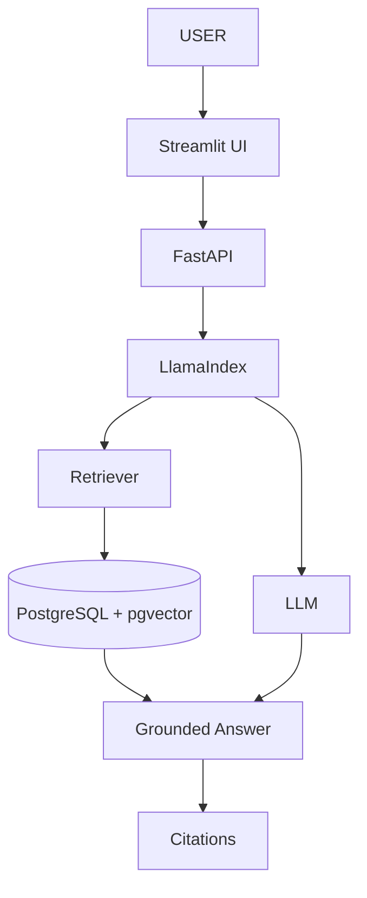
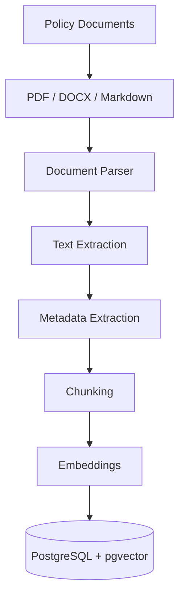
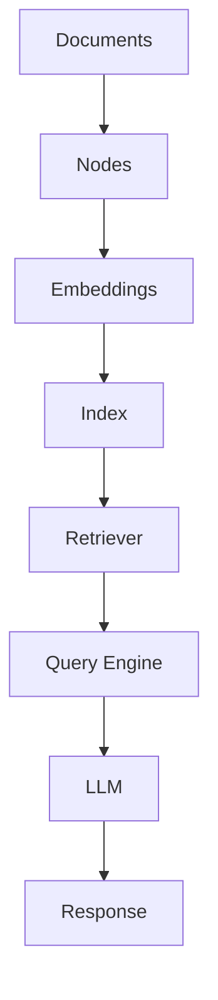
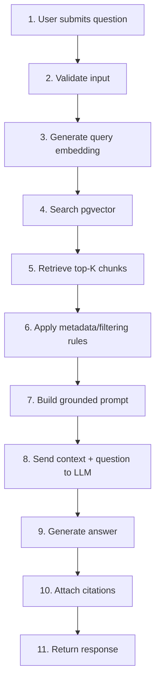
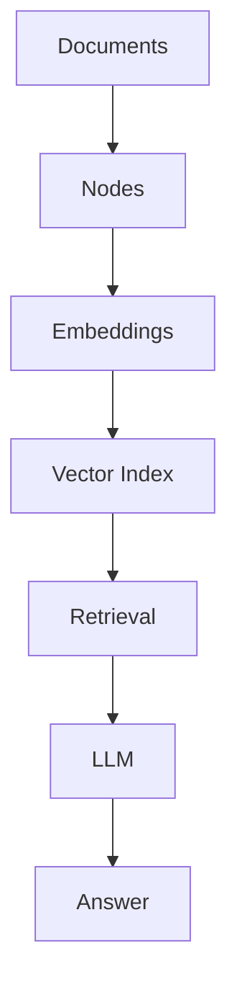
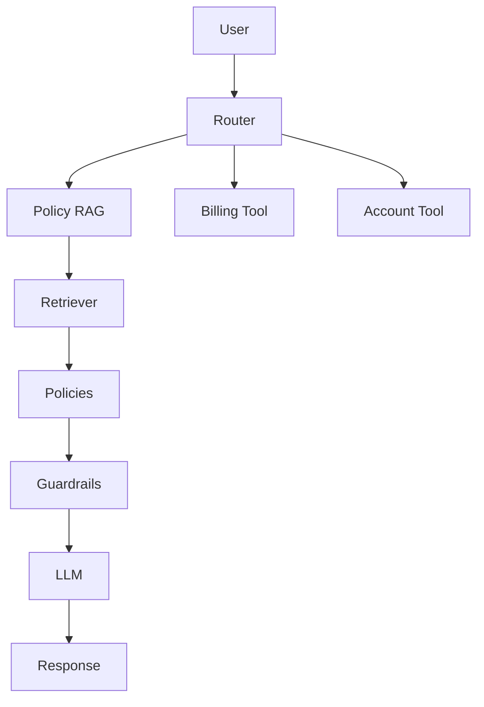

# Telecom Policy RAG

## 1. Project Overview

### Project Name

**Telecom Policy RAG**

### Project Type

Retrieval-Augmented Generation (RAG) application for a telecom company.

### Primary Goal

Build an AI assistant that can answer telecom policy and procedure questions using approved company documents as its source of truth.

The system should retrieve relevant information from telecom policy documents and use an LLM to generate a grounded answer with source citations.

The project will use **Python + LlamaIndex + PostgreSQL/pgvector** and will progressively evolve from a local MVP into a production-oriented AI application.

---

## 2. Business Context

A telecom company's customer operations teams need to handle questions related to:

* Mobile plans
* Billing
* Refunds
* Contract cancellation
* SIM replacement
* Number portability
* Roaming
* Customer verification
* Complaints
* Account services
* Payment procedures
* Service activation
* Service suspension
* Escalation procedures

Today, employees may need to search multiple documents and knowledge repositories to find the correct policy.

This can lead to:

* Slow response times
* Inconsistent answers
* Difficulty finding the latest policy
* Incorrect interpretation of policies
* Lack of traceability
* Compliance risk
* Increased workload for support teams

The objective of this project is to create an AI assistant that makes approved policy information easier to find while keeping the answer grounded in the official documentation.

---

## 3. Problem Statement

### Problem

Customer-service employees need fast and accurate answers to telecom policy questions, but relevant information may be distributed across many documents, versions, sections, and procedures.

### Proposed Solution

Build a RAG system that:

1. Ingests approved telecom policy documents.
2. Extracts and processes their content.
3. Splits documents into meaningful chunks.
4. Generates embeddings for those chunks.
5. Stores the chunks and embeddings in PostgreSQL with pgvector.
6. Retrieves the most relevant policy sections for a user question.
7. Provides the retrieved context to an LLM through LlamaIndex.
8. Generates a grounded answer.
9. Provides citations to the original policy document.
10. Refuses to answer when sufficient evidence cannot be found.

---

## 4. Project Objectives

## Primary Objectives

The system should:

* Answer policy-related questions.
* Use company policy documents as the knowledge source.
* Retrieve relevant policy sections.
* Generate grounded answers.
* Provide document and page/section citations.
* Respect policy versions and effective dates.
* Avoid unsupported answers.
* Detect insufficient evidence.
* Provide a foundation for evaluation and observability.

## Learning Objectives

This project is also an AI engineering learning project.

The implementation should teach:

* RAG architecture
* LlamaIndex
* Document ingestion
* Document parsing
* Chunking
* Embeddings
* Vector databases
* Semantic search
* Metadata filtering
* Prompt engineering
* Grounding
* Citations
* Guardrails
* RAG evaluation
* LLM observability
* Tracing
* API development
* UI development
* Docker
* CI/CD
* Production architecture

---

## 5. Target Users

The initial target users are internal telecom customer-service employees.

Examples:

* Customer service agents
* Technical support agents
* Billing support agents
* Operations teams
* Policy/compliance teams

The initial MVP should focus on **internal policy assistance**, not autonomous customer actions.

---

## 6. Example Questions

The system should eventually support questions such as:

```text
What is the policy for cancelling a mobile contract?

How long does a customer have to request a refund?

What documents are required for SIM replacement?

What is the procedure for a billing dispute?

What is the international roaming policy?

When can a customer request number portability?

What is the escalation procedure for a disputed charge?

Does this policy apply to prepaid customers?

What is the current policy for service suspension?
```

---

## 7. Example Response

### User

```text
What is the refund policy for an incorrect billing charge?
```

### Assistant

```text
Customers may request a refund for an incorrect billing
charge when the eligibility conditions defined in the
Refund Policy are satisfied.

The policy specifies the applicable conditions and
processing procedure in Section 4.2.

Source:
Refund Policy
Version: 3.2
Section: 4.2
Page: 8
```

The exact answer must always be generated from the retrieved policy context.

---

## 8. Core RAG Principle

The system must follow this principle:

> The policy documents are the source of truth. The LLM is responsible for generating an answer from the retrieved evidence, not for inventing company policy.

The system must not present unsupported information as company policy.

If the retrieved information is insufficient, the assistant should respond with an appropriate uncertainty message instead of guessing.

Example:

```text
I could not find sufficient information in the
available approved policies to answer this question.
```

---

## 9. High-Level Architecture



---

## 10. Document Ingestion Architecture



Each chunk should retain useful metadata.

Example:

```json
{
  "document_id": "refund-policy-001",
  "document_name": "Refund Policy",
  "document_type": "policy",
  "category": "billing",
  "version": "3.2",
  "effective_date": "2026-06-01",
  "section": "4.2",
  "page": 8,
  "text": "..."
}
```

---

## 11. Technology Stack

## Programming Language

```text
Python 3.12+
```

## Package Management

```text
uv
```

## RAG Framework

```text
LlamaIndex
```

## LLM

Initially use one provider, with the architecture allowing the provider to be changed later.

Possible providers:

* OpenAI
* Azure OpenAI
* OpenRouter

## Embeddings

Use an embedding model compatible with the selected LLM/provider strategy.

## Vector Database

```text
PostgreSQL
+
pgvector
```

## API

```text
FastAPI
```

## Data Validation

```text
Pydantic
```

## Initial UI

```text
Streamlit
```

## Document Processing

```text
PyMuPDF
```

## Testing

```text
pytest
```

## Observability

```text
Python logging
OpenTelemetry
```

## Containerization

```text
Docker
```

## CI/CD

```text
GitHub Actions
```

---

## 12. LlamaIndex Responsibilities

LlamaIndex will be used as the primary RAG framework.

The project will use LlamaIndex to learn and implement:



The implementation should avoid hiding the RAG concepts behind excessive abstractions.

The learner should understand what each LlamaIndex component does.

---

## 13. Initial Scope

The first MVP should contain:

* 5–10 telecom policy documents.
* PDF ingestion.
* Text extraction.
* Metadata.
* Chunking.
* Embeddings.
* PostgreSQL + pgvector.
* Semantic retrieval.
* LlamaIndex query engine.
* LLM-generated answers.
* Source citations.
* Basic Streamlit interface.
* Basic logging.

The MVP should **not** initially include:

* Autonomous agents
* Complex workflows
* Multiple-agent orchestration
* Customer account actions
* Automatic policy modification
* Production authentication
* Large-scale distributed infrastructure

These will be introduced later.

---

## 14. RAG Query Flow

When a user asks a question:



---

## 15. Metadata Requirements

Policy metadata is critical.

Each document should ideally contain:

```text
document_id
document_name
document_type
category
version
effective_date
expiration_date
status
owner
page
section
source
```

Example:

```text
Document:
Mobile Cancellation Policy

Category:
Mobile

Version:
3.2

Effective Date:
2026-06-01

Status:
ACTIVE

Section:
4.2

Page:
12
```

---

## 16. Policy Versioning

The RAG must prefer the current approved policy.

Example:

```text
Refund Policy v2.0
    │
    └── obsolete

Refund Policy v3.0
    │
    └── active
```

The retrieval layer should prevent obsolete documents from being selected when a current policy exists.

Future versions may introduce:

* Effective dates
* Expiration dates
* Approval status
* Policy ownership
* Version relationships
* Document lifecycle management

---

## 17. Guardrails

The assistant should implement several guardrails.

## No Evidence

If relevant evidence cannot be found:

```text
I could not find sufficient information in the
available approved policies.
```

## No Hallucination

The assistant must not invent:

* Prices
* Fees
* Contract terms
* Eligibility rules
* Deadlines
* Procedures
* Exceptions

## Policy Scope

The system should consider:

* Customer type
* Product
* Region
* Policy category
* Policy status
* Policy version

## Conflicting Policies

If two active sources contain conflicting requirements, the system should not silently choose one.

Instead:

```text
The available policy documents contain conflicting
information. This case requires review.
```

---

## 18. Evaluation

The project must include a dedicated evaluation dataset.

Example:

```json
{
  "question": "What is the refund period?",
  "expected_document": "refund-policy.pdf",
  "expected_section": "4.1",
  "expected_answer": "..."
}
```

Evaluation should measure:

### Retrieval

Did the system retrieve the correct policy?

### Relevance

Are the retrieved chunks relevant to the question?

### Groundedness

Is the generated answer supported by the retrieved context?

### Correctness

Does the answer correctly answer the question?

### Citation Accuracy

Does the cited source actually support the answer?

---

## 19. Observability

Every RAG request should eventually generate telemetry.

Example:

```text
Request ID
Timestamp
User question

Retrieved documents
Retrieved chunks
Similarity scores

Embedding latency
Retrieval latency
LLM latency

Model
Input tokens
Output tokens

Final answer
Sources
Errors
```

This allows developers to understand why a RAG answer was good or bad.

---

## 20. Security and Compliance

Because telecom policies may eventually be combined with customer information, security must be considered from the beginning.

Future requirements include:

* Authentication
* Authorization
* Role-based access
* PII protection
* Audit logging
* Secure document storage
* Access-controlled retrieval
* Secrets management
* Encryption
* Data retention
* Prompt/data security

The initial MVP should use **synthetic or non-sensitive policy documents**.

---

## 21. Development Phases

## Phase 1 — RAG Fundamentals

Build:



Deliverable:

```text
Basic working RAG
```

---

## Phase 2 — Telecom Policy Ingestion

Add:

* Realistic policy structure
* PDF parsing
* Metadata
* Sections
* Pages
* Versions

Deliverable:

```text
Policy ingestion pipeline
```

---

## Phase 3 — PostgreSQL + pgvector

Add persistent vector storage.

Deliverable:

```text
Persistent policy knowledge base
```

---

## Phase 4 — Retrieval Engineering

Learn:

* Top-K
* Similarity thresholds
* Metadata filtering
* Hybrid search
* Reranking

Deliverable:

```text
High-quality retrieval pipeline
```

---

## Phase 5 — Prompt Engineering

Implement:

* System prompts
* Context formatting
* Grounding instructions
* Structured responses
* Citation instructions

Deliverable:

```text
Grounded policy assistant
```

---

## Phase 6 — Guardrails

Implement:

* No-answer behavior
* Conflicting policy detection
* Policy version filtering
* Scope validation

Deliverable:

```text
Safe policy assistant
```

---

## Phase 7 — Evaluation

Create:

```text
50–100 policy questions
```

Measure:

* Retrieval accuracy
* Answer correctness
* Groundedness
* Citation accuracy

Deliverable:

```text
RAG evaluation suite
```

---

## Phase 8 — Observability and Tracing

Add:

* Structured logging
* Request IDs
* Retrieval traces
* LLM metrics
* Latency
* OpenTelemetry

Deliverable:

```text
Observable RAG system
```

---

## Phase 9 — API and UI

Build:

```text
FastAPI
+
Streamlit
```

Deliverable:

```text
Usable internal RAG application
```

---

## Phase 10 — Productionization

Add:

* Docker
* CI/CD
* Authentication
* Security
* Configuration management
* Monitoring
* Deployment

Deliverable:

```text
Production-ready architecture
```

---

## 22. Future Agentic Architecture

After the core RAG works, the system can evolve into an agentic architecture.

Example:



The agent should only be introduced after the basic RAG is understood and evaluated.

---

## 23. Success Criteria

The project is successful when:

1. Policy documents can be ingested automatically.
2. Documents are stored with useful metadata.
3. Relevant policy chunks can be retrieved.
4. The LLM generates answers based on retrieved evidence.
5. Answers include reliable citations.
6. Unsupported questions produce an appropriate no-answer response.
7. Obsolete policies are excluded.
8. Retrieval and generation can be evaluated.
9. Requests can be traced and monitored.
10. The system can be exposed through an API and UI.
11. The application can eventually be containerized and deployed.

---

## 24. Final Target

The final system should provide an internal telecom policy assistant that looks conceptually like:

```text
┌──────────────────────────────────────────────┐
│              TELECOM POLICY AI               │
├──────────────────────────────────────────────┤
│                                              │
│  Ask a policy question...                    │
│                                              │
│  "What is the cancellation policy for        │
│   postpaid mobile customers?"                │
│                                              │
├──────────────────────────────────────────────┤
│                                              │
│  ANSWER                                      │
│                                              │
│  [Grounded answer generated from policy]     │
│                                              │
├──────────────────────────────────────────────┤
│                                              │
│  SOURCES                                     │
│                                              │
│  📄 Mobile Cancellation Policy               │
│     Version 3.2                              │
│     Section 4.2                              │
│     Page 12                                  │
│                                              │
└──────────────────────────────────────────────┘
```

The long-term objective is not simply to build a chatbot.

The objective is to learn how to design, implement, evaluate, observe, secure, and deploy a **production-oriented RAG system using LlamaIndex**.