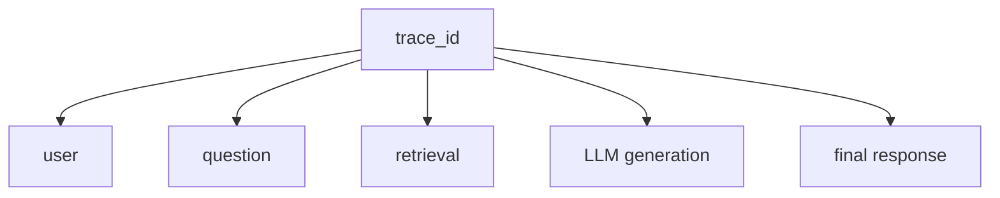
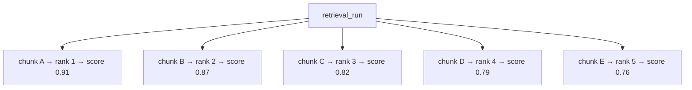
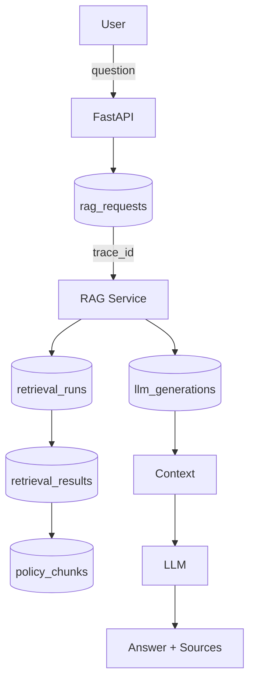
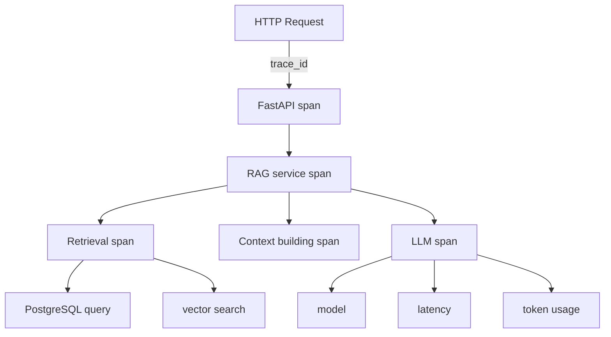

# Database Schema — RAG Tracing & Knowledge

## Telecom Policy RAG System

**Version:** 1.0
**Status:** Draft
**Project:** Telecom Policy RAG
**Primary Framework:** LlamaIndex
**Language:** Python

---

# 1. Purpose

This document defines the database schema for the RAG system, separating two separate concerns:

**User/request tracing** — who made the request and what happened during that request.

**Retrieval tracing** — which chunks were retrieved, with scores and metadata, and how they affected the final answer.

Operation tracing must **not** be stored inside `policy_chunks`. Keep operational tracing separate from knowledge data.

Recommended schema:

```text
rag
├── policy_documents
├── policy_versions
├── policy_chunks
├── ingestion_runs
│
├── users
├── rag_requests
├── retrieval_runs
├── retrieval_results
└── llm_generations
```

---

# 2. Users

For tracing, only an application-level user identifier is needed.

```sql
CREATE TABLE rag.users (
    id UUID PRIMARY KEY DEFAULT gen_random_uuid(),

    external_user_id VARCHAR(255) UNIQUE NOT NULL,

    username VARCHAR(255),
    role VARCHAR(50),

    created_at TIMESTAMPTZ NOT NULL DEFAULT NOW(),
    last_seen_at TIMESTAMPTZ
);
```

Example:

```text
external_user_id = "agent-12345"
role             = "AGENT"
```

Avoid storing unnecessary personal information.

---

# 3. RAG Requests

This is the top-level trace for each user question.

```sql
CREATE TABLE rag.rag_requests (
    id UUID PRIMARY KEY DEFAULT gen_random_uuid(),

    trace_id UUID NOT NULL UNIQUE,

    user_id UUID REFERENCES rag.users(id),

    question TEXT NOT NULL,

    status VARCHAR(30) NOT NULL DEFAULT 'STARTED',

    rag_version VARCHAR(50),

    llm_model VARCHAR(255),
    embedding_model VARCHAR(255),

    started_at TIMESTAMPTZ NOT NULL DEFAULT NOW(),
    completed_at TIMESTAMPTZ,

    latency_ms INTEGER,

    error_code VARCHAR(100),
    error_message TEXT,

    metadata JSONB NOT NULL DEFAULT '{}'::jsonb
);
```

This gives you:



Example:

```text
trace_id: 8f1...
user:     agent-12345
question: "What is the roaming policy for Europe?"
```

---

# 4. Retrieval Runs

A request can potentially have multiple retrieval operations, especially later when hybrid search or reranking is added.

```sql
CREATE TABLE rag.retrieval_runs (
    id UUID PRIMARY KEY DEFAULT gen_random_uuid(),

    request_id UUID NOT NULL
        REFERENCES rag.rag_requests(id)
        ON DELETE CASCADE,

    query TEXT NOT NULL,

    retrieval_method VARCHAR(50) NOT NULL,

    top_k INTEGER NOT NULL,

    similarity_threshold DOUBLE PRECISION,

    filters JSONB NOT NULL DEFAULT '{}'::jsonb,

    started_at TIMESTAMPTZ NOT NULL DEFAULT NOW(),
    completed_at TIMESTAMPTZ,

    latency_ms INTEGER,

    result_count INTEGER,

    metadata JSONB NOT NULL DEFAULT '{}'::jsonb
);
```

Initially:

```text
retrieval_method = "vector"
top_k = 5
```

Later options:

```text
vector
keyword
hybrid
reranked
```

---

# 5. Retrieval Results

This is the important table for understanding exactly what the RAG system retrieved.

```sql
CREATE TABLE rag.retrieval_results (
    id UUID PRIMARY KEY DEFAULT gen_random_uuid(),

    retrieval_run_id UUID NOT NULL
        REFERENCES rag.retrieval_runs(id)
        ON DELETE CASCADE,

    chunk_id UUID NOT NULL
        REFERENCES rag.policy_chunks(id),

    rank INTEGER NOT NULL,

    similarity_score DOUBLE PRECISION,

    rerank_score DOUBLE PRECISION,

    selected_for_context BOOLEAN NOT NULL DEFAULT TRUE,

    metadata JSONB NOT NULL DEFAULT '{}'::jsonb,

    created_at TIMESTAMPTZ NOT NULL DEFAULT NOW(),

    UNIQUE (retrieval_run_id, chunk_id)
);
```

So if retrieval returns 5 chunks:



This is extremely useful for RAG evaluation.

---

# 6. LLM Generation

Trace the generation separately.

```sql
CREATE TABLE rag.llm_generations (
    id UUID PRIMARY KEY DEFAULT gen_random_uuid(),

    request_id UUID NOT NULL
        REFERENCES rag.rag_requests(id)
        ON DELETE CASCADE,

    model VARCHAR(255) NOT NULL,

    prompt_version VARCHAR(50),

    input_tokens INTEGER,
    output_tokens INTEGER,
    total_tokens INTEGER,

    started_at TIMESTAMPTZ NOT NULL DEFAULT NOW(),
    completed_at TIMESTAMPTZ,

    latency_ms INTEGER,

    finish_reason VARCHAR(50),

    grounded BOOLEAN,

    metadata JSONB NOT NULL DEFAULT '{}'::jsonb
);
```

---

# 7. Complete Flow

The resulting architecture is:



---

# 8. Example Trace

Suppose the user asks:

> "What is the roaming data allowance in France?"

You could trace it as:

```text
Trace
──────────────────────────────────────
trace_id: 7c9e...

User
  external_user_id: agent-001
  role: AGENT

Request
  question: "What is the roaming data allowance in France?"
  rag_version: "1.0"
  status: COMPLETED
  latency: 842 ms

Retrieval
  method: vector
  top_k: 5
  results: 5

Results
  #1 policy_chunk=abc
      score=0.92
      page=14
      selected=true

  #2 policy_chunk=def
      score=0.88
      page=15
      selected=true

  #3 policy_chunk=ghi
      score=0.81
      page=8
      selected=true

LLM
  model=...
  prompt_version=1.2
  input_tokens=...
  output_tokens=...
  grounded=true

Response
  sources=[abc, def]
```

---

# 9. OpenTelemetry

Do not rely only on database tables for tracing.

Use:

* PostgreSQL → audit / history / business data
* OpenTelemetry → runtime tracing / observability

For example:



This lets you investigate:

> Why did this RAG request take 4 seconds?

```text
RAG request                     4.02s
│
├── validation                   5ms
├── retrieval                  180ms
│   └── pgvector query         165ms
├── context building            8ms
└── LLM generation           3.82s
```

---

# 10. Data Ownership

Do not confuse these two:

| Data                           | Where                        |
| ------------------------------ | ---------------------------- |
| User identity                  | `rag.users`                  |
| Request history                | `rag.rag_requests`           |
| Retrieved chunks               | `rag.retrieval_results`      |
| Retrieval scores               | `rag.retrieval_results`      |
| LLM execution metadata         | `rag.llm_generations`        |
| Distributed/runtime traces     | OpenTelemetry                |
| Actual policy knowledge        | `rag.policy_chunks`          |
| Evaluation results             | Later evaluation tables      |