# Operations — RAG Operations & Runbook

## Telecom Policy RAG System

**Version:** 1.0
**Status:** Draft
**Project:** Telecom Policy RAG
**Primary Framework:** LlamaIndex
**Language:** Python

---

# 1. Purpose

This document defines the **RAG Operations / Runbook** layer: what happens when documents change, how indexing is operated safely, how to recover from failures, and how to detect retrieval degradation.

Operations are part of the architecture rather than treating ingestion as a one-time script.

---

# 2. Operational Lifecycle

The platform should work like this:

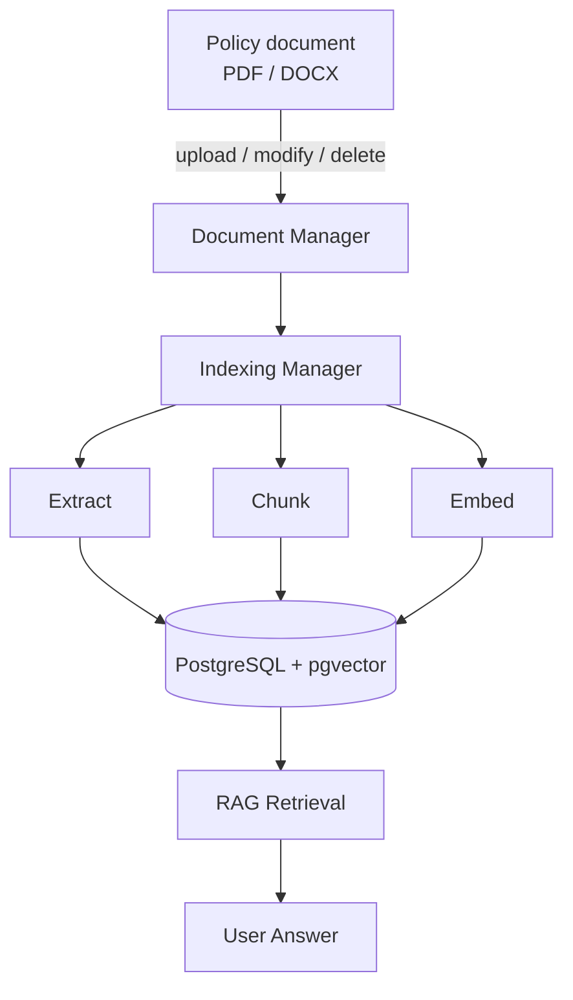

**Key principle:** never modify vector data manually as part of normal operations. Operate the index through controlled indexing jobs.

---

# 3. Document States

Extend the policy lifecycle with an **index lifecycle**.

A document can be:

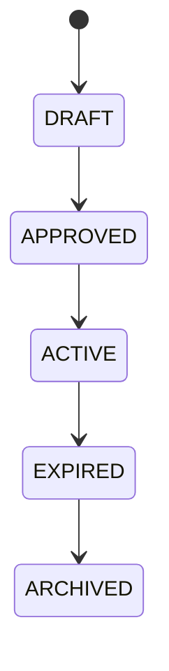

Independently, its indexing state can be:

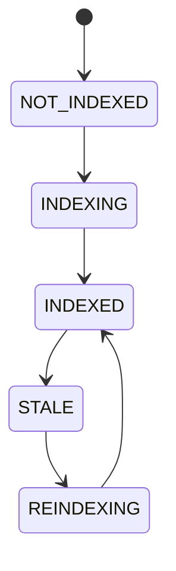

This distinction is important.

For example:

```text
Policy version: ACTIVE
Index status:   STALE
```

means the policy is valid, but the vector index does not correspond to the current document.

---

# 4. What Happens When a Document Is Modified?

Suppose `roaming-policy-v3.pdf` is modified.

Do **not** update individual embeddings in place.

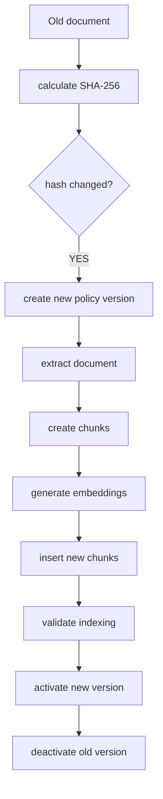

Example:

```text
v3
ACTIVE
indexed
```

becomes:

```text
v3
EXPIRED
```

and:

```text
v4
ACTIVE
indexed
```

This gives versioned knowledge, rather than overwriting history.

---

# 5. Never Overwrite the Old Policy

This is particularly important for a policy RAG.

January 2026:

```text
Roaming allowance = 10 GB
```

March 2026:

```text
Roaming allowance = 15 GB
```

You want:

```text
policy_versions

document        version     status
────────────────────────────────────
roaming         v1          ARCHIVED
roaming         v2          EXPIRED
roaming         v3          ACTIVE
```

And:

```text
policy_chunks

v1 → old chunks
v2 → old chunks
v3 → current chunks
```

Your retrieval query should normally search:

```text
WHERE version.status = 'ACTIVE'
```

rather than deleting historical data.

---

# 6. What Happens When a Document Is Deleted?

There are two different meanings of "delete."

**Case A — Remove from active knowledge** (usually what you want).

```text
Policy v3
ACTIVE
```

becomes:

```text
Policy v3
ARCHIVED
```

The chunks remain in the database for traceability, but retrieval excludes them:

```text
WHERE v.status = 'ACTIVE'
```

This is safer than physically deleting them.

**Case B — Permanent deletion** (legal/privacy/security reasons).

The whole tree should be deleted transactionally:

```sql
BEGIN;

DELETE FROM rag.policy_chunks
WHERE version_id IN (
    SELECT id
    FROM rag.policy_versions
    WHERE document_id = :document_id
);

DELETE FROM rag.policy_versions
WHERE document_id = :document_id;

DELETE FROM rag.policy_documents
WHERE id = :document_id;

COMMIT;
```

Make permanent deletion an **admin operation**, not something the normal ingestion pipeline automatically does.

---

# 7. Detecting Modifications

The existing `source_hash` is very useful.

Calculate:

```text
SHA-256(file)
```

Example:

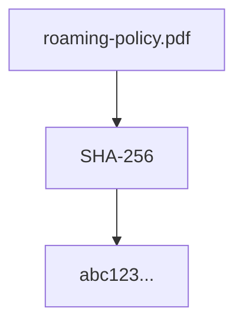

On the next ingestion:

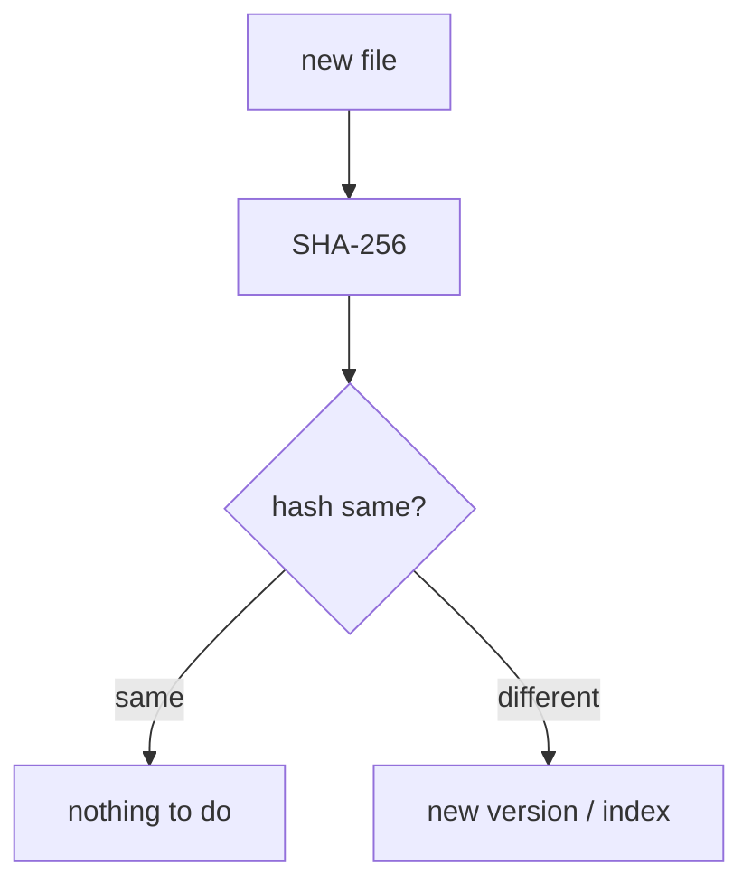

This gives idempotent ingestion.

---

# 8. Indexing Should Be an Operation

Don't make your only interface `python scripts/index_documents.py`.

Create an indexing CLI:

```bash
uv run python -m app.operations.index status
uv run python -m app.operations.index document \
    --document-id <id>
uv run python -m app.operations.index all
uv run python -m app.operations.index stale
uv run python -m app.operations.index reindex \
    --document-id <id>
uv run python -m app.operations.index rebuild \
    --document-id <id>
```

---

# 9. Recommended Operations

| Operation  | Purpose                             |
| ---------- | ----------------------------------- |
| scan       | Detect new/changed documents        |
| index      | Index a document                    |
| index-all  | Index all pending documents         |
| reindex    | Recreate index for a version        |
| reindex-all| Rebuild everything                  |
| activate   | Make a version active               |
| deactivate | Remove version from retrieval       |
| archive    | Archive old version                 |
| delete     | Permanently remove                  |
| status     | Show indexing health                |
| verify     | Validate indexed document           |
| repair     | Repair inconsistent indexing        |
| cleanup    | Remove orphaned data                |

---

# 10. Indexing Job Tracking

The `ingestion_runs` table becomes central to operations.

Example:

```text
ingestion_runs

run_id:       123
document:     roaming-policy
version:      v4

status:       COMPLETED

started:      10:30:01
completed:    10:30:12

pages:        32
chunks:       187
embeddings:   187

error:        NULL
```

Possible statuses:

```text
PENDING
RUNNING
COMPLETED
FAILED
CANCELLED
```

Each stage is recorded:

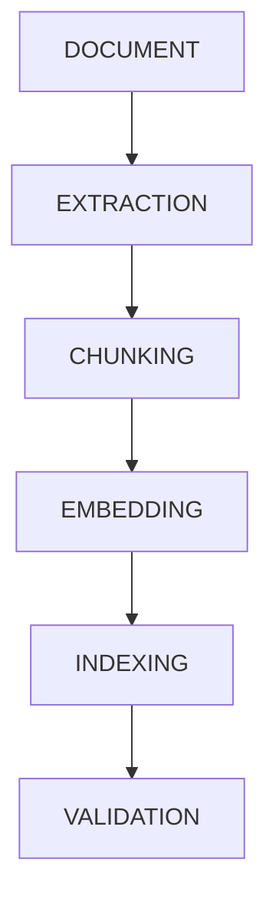

---

# 11. Failed Indexing

Suppose embedding fails:

```text
PDF
 ↓
extraction       ✓
chunking         ✓
embedding        ✗
```

The system must **not** activate the new policy version.

Instead:

```text
version = v4
status = APPROVED

index status = FAILED
```

while `v3 ACTIVE` remains available.

**Operational rule:** never replace a healthy active index with an incomplete index.

---

# 12. Atomic Activation

One of the most important production concepts.

Suppose `v3 = ACTIVE`, `v4 = INDEXING`. Indexing of `v4` completes.

First validate:

```text
chunks > 0
embeddings > 0
metadata valid
pages valid
retrieval works
```

Then:

```sql
BEGIN TRANSACTION

v3 → EXPIRED
v4 → ACTIVE

COMMIT
```

If indexing fails:

```text
v3 → remains ACTIVE
v4 → FAILED
```

Users never see the broken version.

---

# 13. Verification After Indexing

Don't assume `embedding succeeded` means `RAG works`.

Run an indexing verification:

```text
verify(document_id)
```

checks:

```text
✓ document exists
✓ version exists
✓ source hash correct
✓ chunks exist
✓ page numbers exist
✓ embeddings exist
✓ embedding dimensions correct
✓ metadata exists
✓ active version exists
✓ vector search works
```

CLI:

```bash
uv run python -m app.operations.index verify \
    --document-id abc
```

---

# 14. Retrieval Troubleshooting

Operational workflow for: *"The RAG answer is wrong."*

Don't immediately blame the LLM. Trace the request:

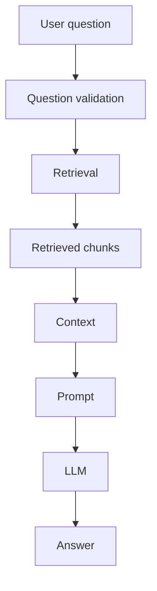

**Step 1 — Did retrieval find the right document?**

Look at `retrieval_results`:

```text
document
version
page
rank
similarity_score
```

**Step 2 — Was the correct version retrieved?**

Check `ACTIVE` versus `EXPIRED` / `ARCHIVED`.

**Step 3 — Was the relevant chunk retrieved?**

If not: **retrieval problem**.

If yes: **generation / grounding problem**.

**Step 4 — Did the LLM use the evidence?**

If the correct chunk was retrieved but the answer ignores it: **prompt / generation / grounding problem**.

This separation is essential for troubleshooting.

---

# 15. Retrieval Degradation

Evaluation + tracing is where degradation detection becomes valuable.

Track metrics:

```text
Retrieval
────────────────────────────
Recall@5
Recall@10
MRR
NDCG
similarity score
no-result rate
```

```text
Generation
────────────────────────────
grounded answer rate
citation accuracy
no-answer accuracy
hallucination rate
```

```text
Platform
────────────────────────────
request latency
retrieval latency
LLM latency
error rate
indexing failures
index freshness
```

---

# 16. Detecting Index Degradation

Imagine a new embedding model is deployed.

Before:

```text
Recall@5 = 91%
```

After:

```text
Recall@5 = 73%
```

That is degradation — do not roll it out automatically.

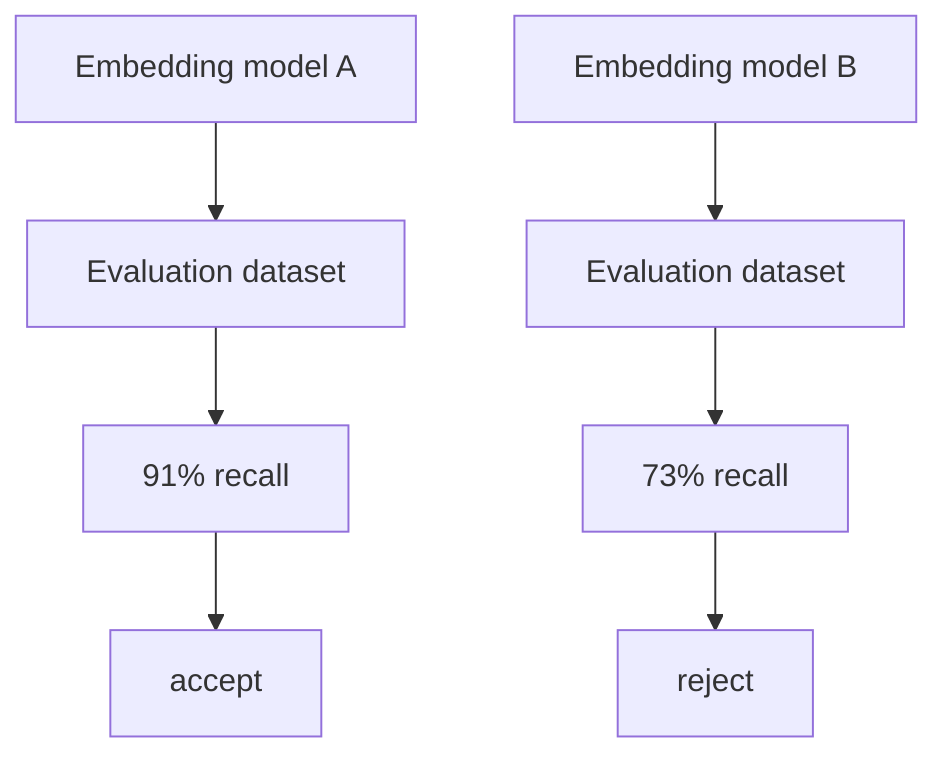

---

# 17. RAG Health Dashboard

A Streamlit operations page could eventually show:

```text
╔══════════════════════════════════════════╗
║             RAG OPERATIONS               ║
╠══════════════════════════════════════════╣
║ Documents              128               ║
║ Active versions        121               ║
║ Stale documents          3               ║
║ Failed indexes           2               ║
║ Last successful index   10:32            ║
╠══════════════════════════════════════════╣
║ RETRIEVAL                               ║
║ Recall@5               91.2%             ║
║ Avg retrieval           82ms             ║
║ No-result rate          3.1%             ║
╠══════════════════════════════════════════╣
║ GENERATION                              ║
║ Grounded answers       94.7%             ║
║ Citation accuracy      97.1%             ║
║ Avg LLM latency         1.8s             ║
╠══════════════════════════════════════════╣
║ HEALTH                                  ║
║ API                     ✓                ║
║ PostgreSQL              ✓                ║
║ pgvector                ✓                ║
║ LLM                     ✓                ║
║ Embeddings              ✓                ║
╚══════════════════════════════════════════╝
```

---

# 18. Troubleshooting Runbook

Create `docs/operations/runbook.md` with procedures like:

```text
Problem: document isn't appearing in RAG
1. Check document exists
2. Check policy version
3. Check status
4. Check ingestion_runs
5. Check chunks
6. Check embeddings
7. Run verification
8. Run retrieval test

Problem: old policy is being retrieved
1. Inspect retrieval_results
2. Check policy_versions.status
3. Check effective_date
4. Check retrieval filter
5. Check active_policy_chunks
6. Verify index

Problem: no relevant results
1. Check query
2. Check embedding model
3. Check similarity scores
4. Check top_k
5. Check metadata filters
6. Check chunk quality
7. Run evaluation

Problem: correct chunks but wrong answer
1. Inspect retrieved context
2. Inspect prompt
3. Inspect LLM trace
4. Check grounding validation
5. Check citation generation
6. Add evaluation case
```

---

# 19. Production Incident Flow

The operating model should become:

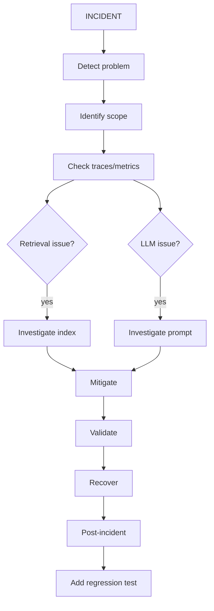

---

# 20. Rollback

Design for rollback.

Suppose `v3 ACTIVE`, then `v4 ACTIVE` is deployed and retrieval quality is bad.

You should be able to:

```bash
uv run python -m app.operations.index activate \
    --version v3
```

Result:

```text
v3 → ACTIVE
v4 → EXPIRED
```

No need to regenerate v3 embeddings because they are still stored.

This is another reason versioning is superior to overwriting chunks.

---

# 21. Recommended Project Structure

```text
telecom-rag/
│
├── src/
│   ├── __init__.py
│   │
│   ├── config/
│   │   ├── __init__.py
│   │   └── settings.py
│   │
│   ├── models/
│   │   ├── __init__.py
│   │   ├── policy_document.py
│   │   ├── policy_version.py
│   │   ├── policy_chunk.py
│   │   ├── rag_request.py
│   │   ├── rag_response.py
│   │   ├── retrieval_result.py
│   │   └── ingestion_run.py
│   │
│   ├── llm/
│   │   ├── __init__.py
│   │   ├── llm_client.py
│   │   ├── embedding_client.py
│   │   └── prompt_manager.py
│   │
│   ├── documents/
│   │   ├── __init__.py
│   │   ├── document_loader.py
│   │   ├── pdf_loader.py
│   │   ├── document_extractor.py
│   │   ├── document_chunker.py
│   │   └── hash_service.py
│   │
│   ├── database/
│   │   ├── __init__.py
│   │   ├── database_client.py
│   │   ├── policy_repository.py
│   │   ├── chunk_repository.py
│   │   ├── ingestion_repository.py
│   │   ├── retrieval_repository.py
│   │   └── user_repository.py
│   │
│   ├── indexing/
│   │   ├── __init__.py
│   │   ├── indexing_service.py
│   │   ├── version_service.py
│   │   └── activation_service.py
│   │
│   ├── rag/
│   │   ├── __init__.py
│   │   ├── rag_service.py
│   │   ├── retrieval_service.py
│   │   ├── context_builder.py
│   │   └── citation_service.py
│   │
│   ├── guardrails/
│   │   ├── __init__.py
│   │   ├── input_guard.py
│   │   ├── retrieval_guard.py
│   │   ├── grounding_guard.py
│   │   └── output_guard.py
│   │
│   ├── memory/
│   │   ├── __init__.py
│   │   └── conversation_memory.py
│   │
│   ├── evaluation/
│   │   ├── __init__.py
│   │   ├── evaluation_service.py
│   │   ├── retrieval_evaluator.py
│   │   └── answer_evaluator.py
│   │
│   ├── tracing/
│   │   ├── __init__.py
│   │   ├── trace_service.py
│   │   ├── request_tracer.py
│   │   └── retrieval_tracer.py
│   │
│   ├── operations/
│   │   ├── __init__.py
│   │   ├── indexing_operations.py
│   │   ├── verification_service.py
│   │   ├── repair_service.py
│   │   ├── rollback_service.py
│   │   ├── cleanup_service.py
│   │   └── health_service.py
│   │
│   ├── api/
│   │   ├── __init__.py
│   │   ├── routes/
│   │   │   ├── __init__.py
│   │   │   ├── rag.py
│   │   │   ├── documents.py
│   │   │   ├── indexing.py
│   │   │   ├── operations.py
│   │   │   └── health.py
│   │   │
│   │   └── schemas/
│   │       ├── __init__.py
│   │       ├── rag.py
│   │       ├── documents.py
│   │       └── operations.py
│   │
│   ├── cli/
│   │   ├── __init__.py
│   │   ├── main.py
│   │   ├── indexing_commands.py
│   │   └── operations_commands.py
│   │
│   └── utils/
│       ├── __init__.py
│       ├── logger.py
│       └── config_loader.py
│
├── data/
│   ├── documents/
│   │   ├── billing/
│   │   ├── mobile/
│   │   ├── roaming/
│   │   ├── customer/
│   │   └── compliance/
│   │
│   └── validation/
│       └── eval_questions.json
│
├── database/
│   └── migrations/
│       ├── 001_initial_schema.sql
│       ├── 002_tracing.sql
│       └── 003_indexes.sql
│
├── tests/
│   ├── unit/
│   │   ├── test_config_loader.py
│   │   ├── test_prompt_manager.py
│   │   ├── test_llm_client.py
│   │   ├── test_embeddings.py
│   │   ├── test_document_loader.py
│   │   ├── test_document_chunker.py
│   │   ├── test_retrieval.py
│   │   ├── test_guardrails.py
│   │   ├── test_memory.py
│   │   └── test_evaluation.py
│   │
│   └── integration/
│       ├── test_llm_integration.py
│       ├── test_database.py
│       ├── test_indexing.py
│       └── test_rag.py
│
├── docs/
│   ├── requirements.md
│   ├── architecture.md
│   ├── rag-design.md
│   ├── database-schema.md
│   ├── security.md
│   │
│   └── operations/
│       ├── indexing.md
│       ├── troubleshooting.md
│       ├── degradation.md
│       ├── rollback.md
│       └── runbook.md
│
├── scripts/
│   ├── index_documents.py
│   ├── verify_index.py
│   └── evaluate_rag.py
│
├── app/
│   └── streamlit_app.py
│
├── .env
├── .env.example
├── .gitignore
├── pyproject.toml
├── README.md
└── uv.lock
```

---

# 22. Operational Architecture

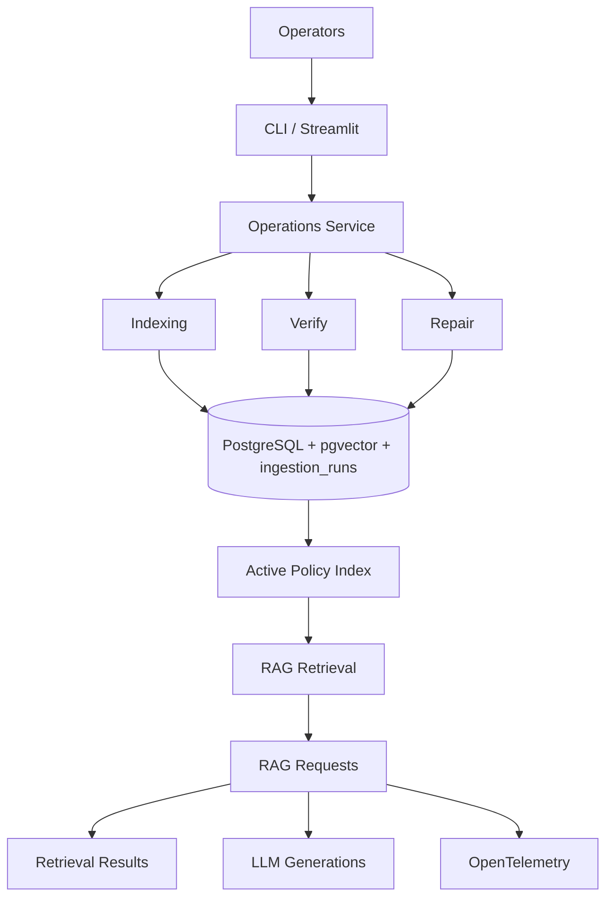

---

# 23. Most Important Operational Rules

1. Never overwrite an active policy version.
2. Use SHA-256 to detect document changes.
3. Create a new version when a policy changes.
4. Index the new version before activating it.
5. Only activate after verification succeeds.
6. Keep the previous active version for rollback.
7. Prefer archive/deactivate over physical deletion.
8. Trace every RAG request with a `trace_id`.
9. Store every retrieval result and score for evaluation/debugging.
10. Separate retrieval failures from LLM failures.
11. Measure retrieval quality continuously, not only latency.
12. Every production incident should produce a regression test.