# Telecom Policy RAG — RAG Design

## 1. Purpose

This document defines the detailed design of the Retrieval-Augmented Generation (RAG) pipeline for the Telecom Policy Assistant.

The implementation uses:

* Python
* LlamaIndex
* PostgreSQL
* pgvector
* Pydantic
* FastAPI
* Streamlit
* An external LLM provider
* An embedding model

The goal is to build a RAG system that can retrieve relevant telecom policy information and generate grounded answers with reliable source citations.

---

## 2. RAG Definition

RAG stands for:

> Retrieval-Augmented Generation

Instead of asking the LLM to answer a question entirely from its pretrained knowledge, the application retrieves relevant information from the telecom policy knowledge base and provides that information to the LLM as context.

The basic flow is:

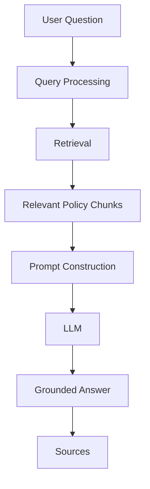

---

## 3. Core Design

The RAG system consists of two major pipelines.

### Ingestion Pipeline

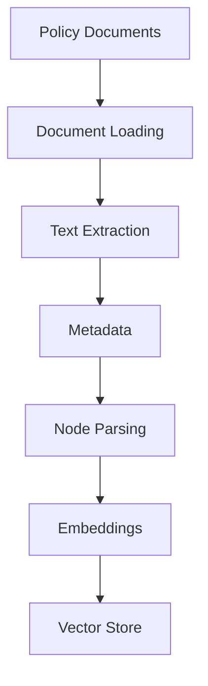

### Query Pipeline

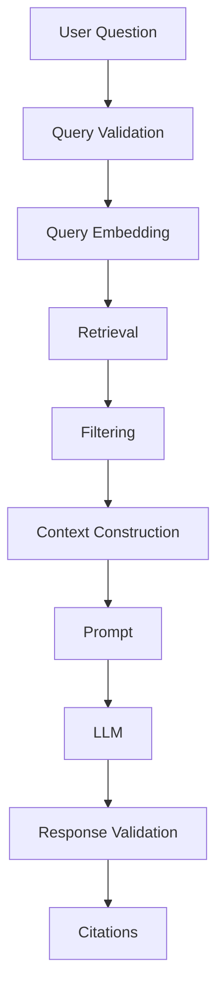

---

## 4. Design Goals

The RAG system must optimize for:

1. Groundedness
2. Retrieval relevance
3. Citation accuracy
4. Policy version correctness
5. Reliability
6. Explainability
7. Maintainability
8. Observability

The system should prefer a safe "I don't know" response over an unsupported policy answer.

---

## 5. Design Constraints

The first implementation should remain relatively simple.

Do not initially implement:

* Multi-agent orchestration
* Autonomous tools
* Customer account actions
* Complex workflow engines
* Multiple vector databases
* Distributed retrieval infrastructure

The first goal is a high-quality single-query RAG.

---

## 6. LlamaIndex Architecture

LlamaIndex is responsible for the main RAG orchestration.

Conceptually:

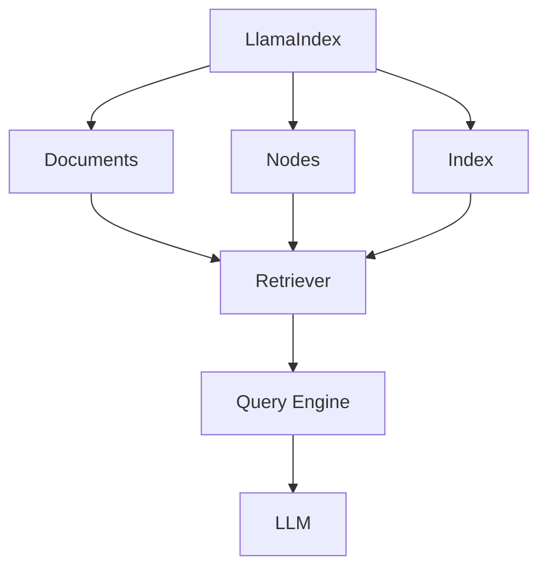

The application should still maintain clear boundaries around LlamaIndex.

---

## 7. Application Interfaces

The application should not allow LlamaIndex-specific objects to leak everywhere.

Use application-level interfaces.

For example:

```python
class PolicyRetriever:
    def retrieve(
        self,
        query: str,
        top_k: int = 5,
    ) -> list[PolicyChunk]:
        ...
```

And:

```python
class RAGService:
    def query(self, question: str) -> RAGResponse:
        ...
```

This makes the system easier to test and change later.

---

## 8. Domain Models

Pydantic models should represent application data.

### PolicyDocument

```python
class PolicyDocument(BaseModel):
    document_id: str
    name: str
    document_type: str
    category: str
    owner: str | None = None
```

### PolicyVersion

```python
class PolicyVersion(BaseModel):
    document_id: str
    version: str
    effective_date: date
    expiration_date: date | None = None
    status: str
```

### PolicyChunk

```python
class PolicyChunk(BaseModel):
    chunk_id: str
    document_id: str
    document_name: str
    version: str
    category: str
    page: int | None
    section: str | None
    section_title: str | None
    text: str
```

---

## 9. Source Model

Sources should be represented independently from the generated answer.

```python
class Source(BaseModel):
    document_id: str
    document_name: str
    version: str
    page: int | None
    section: str | None
    section_title: str | None
```

The source information should come from retrieved document metadata.

The LLM should not be trusted to invent source metadata.

---

## 10. RAG Response

The final application response should be structured.

```python
class RAGResponse(BaseModel):
    answer: str
    sources: list[Source]
    confidence: str
    grounded: bool
```

Example:

```json
{
  "answer": "Customers may request a refund...",
  "sources": [
    {
      "document_id": "refund-001",
      "document_name": "Refund Policy",
      "version": "3.2",
      "page": 8,
      "section": "4.2",
      "section_title": "Refund Eligibility"
    }
  ],
  "confidence": "high",
  "grounded": true
}
```

---

## 11. Ingestion Pipeline

The ingestion pipeline is responsible for transforming policy documents into searchable knowledge.

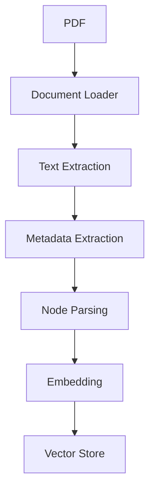

---

## 12. Document Loading

For the initial implementation, policy PDFs can be loaded from:

```text
data/documents/
```

Example:

```text
data/documents/
├── billing/
│   ├── refund-policy.pdf
│   └── billing-dispute-policy.pdf
├── mobile/
│   ├── cancellation-policy.pdf
│   └── sim-replacement-policy.pdf
└── roaming/
    └── roaming-policy.pdf
```

LlamaIndex document loaders can be used where appropriate.

For PDFs requiring page-level metadata or custom extraction, PyMuPDF can be used before creating LlamaIndex documents.

---

## 13. Text Extraction

The system should preserve page boundaries.

Avoid converting an entire PDF into one large text string without page information.

Preferred representation:

```text
Page 1
   ↓
text

Page 2
   ↓
text

Page 3
   ↓
text
```

This allows citations such as:

```text
Refund Policy
Page 8
```

---

## 14. Metadata Extraction

Metadata should be added before indexing.

Example:

```python
metadata = {
    "document_id": "refund-policy-001",
    "document_name": "Refund Policy",
    "document_type": "policy",
    "category": "billing",
    "version": "3.2",
    "effective_date": "2026-06-01",
    "status": "active",
}
```

Page-level metadata:

```python
{
    "page": 8,
    "section": "4.2",
    "section_title": "Refund Eligibility"
}
```

---

## 15. Node Creation

LlamaIndex uses nodes as units of indexed content.

Conceptually:

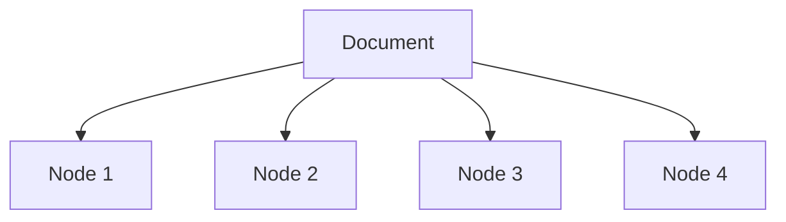

Each node should contain:

```text
text
metadata
embedding
```

Example:

```text
Node
──────────────────────────────
ID: chunk-00123

Document:
Refund Policy

Version:
3.2

Page:
8

Section:
4.2

Text:
Customers may request...
```

---

## 16. Chunking Strategy

Chunking should preserve semantic meaning.

The initial implementation can use:

```text
LlamaIndex SentenceSplitter
```

with parameters such as:

```text
chunk_size
chunk_overlap
```

These parameters should be treated as configuration rather than hard-coded assumptions.

Example:

```text
chunk_size = configurable
chunk_overlap = configurable
```

The correct values must be determined through evaluation.

---

## 17. Policy-Aware Chunking

A later version should use policy structure.

Instead of:

```text
Every N characters
```

prefer:

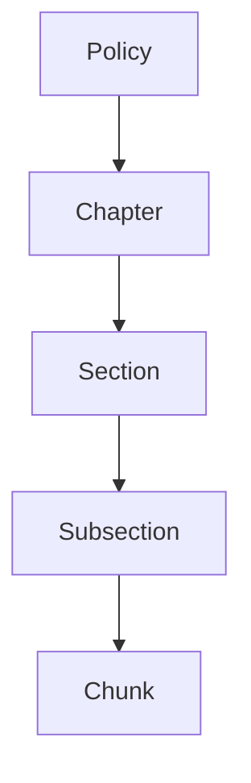

Example:

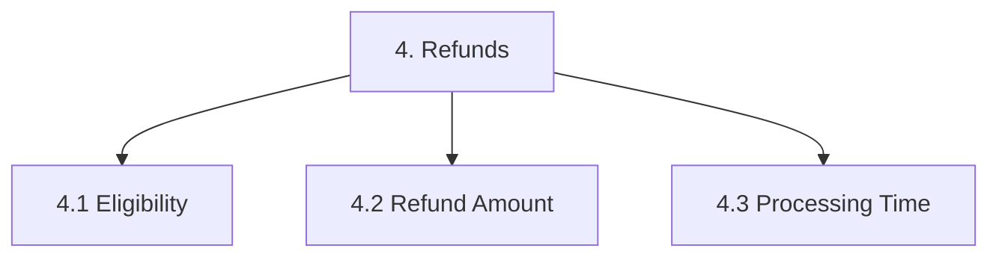

This improves retrieval and citations.

---

## 18. Chunk Metadata

Every node should retain enough metadata to identify its origin.

Minimum metadata:

```text
document_id
document_name
version
category
status
effective_date
page
section
section_title
```

Optional future metadata:

```text
region
customer_type
product
language
policy_owner
access_level
```

---

## 19. Embedding Pipeline

After chunking:

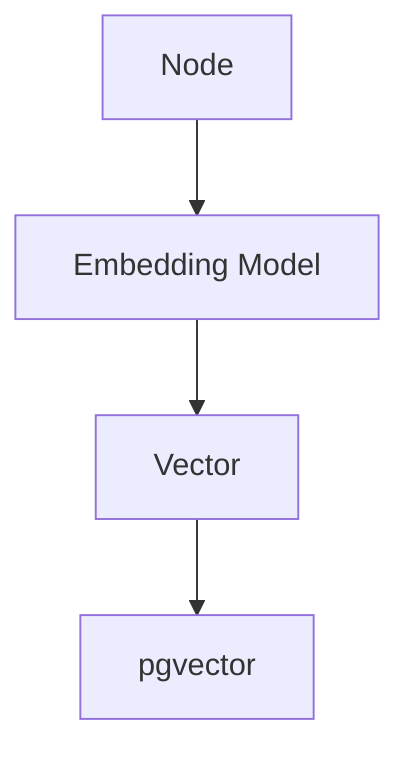

Example conceptually:

```text
"Refund requests must be submitted..."
                 ↓
             Embedding
                 ↓
       [0.012, -0.231, ...]
```

The same embedding model must be used consistently for indexing and querying.

---

## 20. Vector Store

PostgreSQL with pgvector is the persistent vector store.

Conceptually:

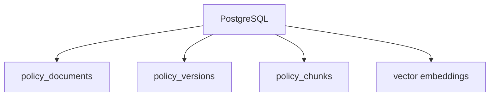

LlamaIndex should use the pgvector integration to persist and retrieve indexed nodes.

---

## 21. Index Creation

The indexing pipeline should conceptually perform:

```python
documents = load_documents()

nodes = parse_documents(documents)

index = create_vector_index(nodes)

persist(index)
```

The actual implementation should use LlamaIndex's PostgreSQL/pgvector integration.

---

## 22. Indexing Must Be Idempotent

Running the ingestion process twice should not create duplicate policy chunks.

Use stable identifiers.

Example:

```text
document_id
+
version
+
page
+
section
+
chunk_number
```

can be used to construct a deterministic chunk identifier.

Example:

```text
refund-policy-001:v3.2:p8:s4.2:c01
```

---

## 23. Document Lifecycle

Documents should have states.

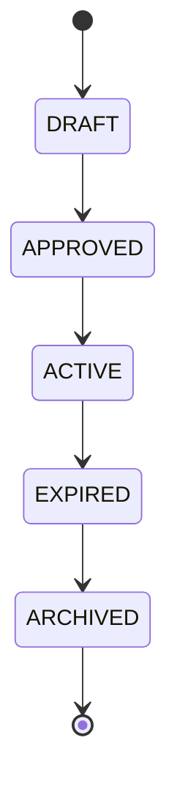

Only approved/current documents should normally be searchable.

---

## 24. Query Pipeline

The query pipeline starts when a user submits a question.

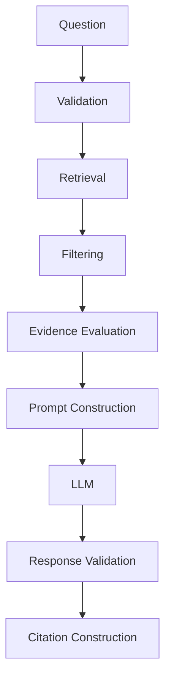

---

## 25. Query Validation

Validate the incoming question using Pydantic.

Example:

```python
class QueryRequest(BaseModel):
    question: str = Field(min_length=3, max_length=2000)
```

Reject:

* Empty questions
* Extremely long questions
* Invalid payloads

---

## 26. Query Embedding

The query is converted into an embedding.

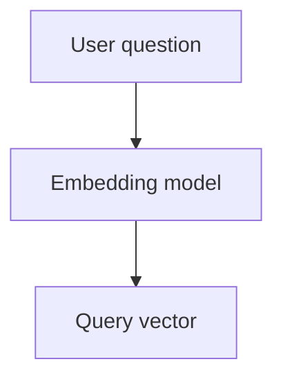

The query vector is compared against indexed policy vectors.

---

## 27. Initial Retrieval

Start with vector similarity retrieval.

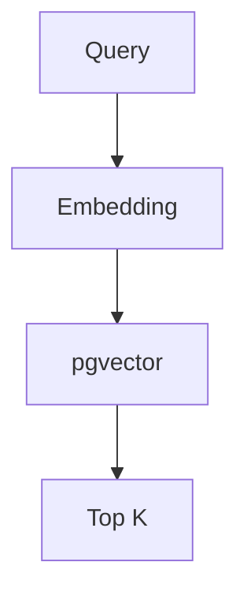

Initial configuration:

```text
top_k = 5
```

This is a starting point only.

Evaluation should determine whether `3`, `5`, `8`, `10`, or another value performs better.

---

## 28. Metadata Filtering

Retrieval should eventually apply policy constraints.

Example:

```text
status = ACTIVE
```

Potential filters:

```text
category
product
customer_type
region
language
effective_date
```

Example:

```text
Question:
"What is the cancellation policy for prepaid customers?"

Possible filters:

customer_type = prepaid
status = active
```

---

## 29. Retrieval Pipeline

The complete retrieval pipeline should eventually be:

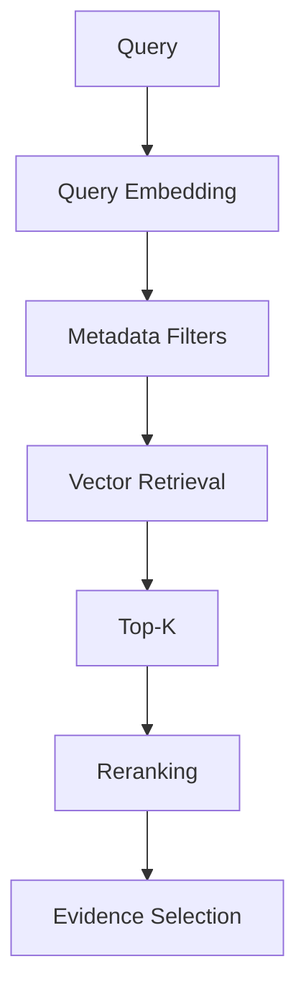

Reranking is a later phase.

The first implementation can stop after vector retrieval.

---

## 30. Similarity Threshold

A similarity threshold can prevent obviously irrelevant context from reaching the LLM.

Conceptually:

```python
if best_score < threshold:
    return insufficient_evidence()
```

Do not choose the threshold arbitrarily.

Use the evaluation dataset to determine an appropriate value.

---

## 31. Reranking

After the initial RAG works, add reranking.

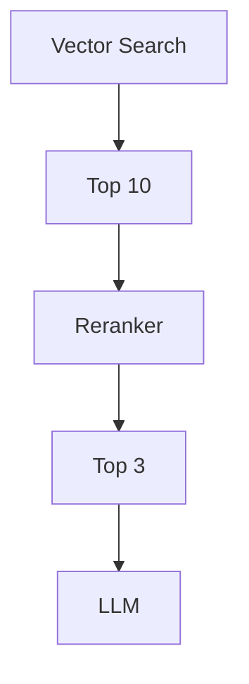

The vector search performs broad candidate retrieval.

The reranker performs more precise relevance ranking.

---

## 32. Context Selection

The final context should contain only the most relevant evidence.

Example:

```text
Retrieved Nodes

1. Refund Policy / 4.2 / page 8
2. Refund Policy / 4.3 / page 9
3. Billing Dispute Policy / 3.1 / page 5
```

The context builder converts these nodes into an LLM-readable format.

---

## 33. Context Format

Recommended format:

```text
SOURCE 1
Document: Refund Policy
Version: 3.2
Section: 4.2
Page: 8

Customers may request a refund when...

---

SOURCE 2
Document: Refund Policy
Version: 3.2
Section: 4.3
Page: 9

Refund requests are processed...
```

This makes the source information explicit.

---

## 34. Prompt Design

The prompt should have four logical parts:

```text
System Instructions
       +
Policy Context
       +
User Question
       +
Response Requirements
```

---

## 35. System Prompt

Example:

```text
You are a Telecom Policy Assistant.

Your task is to answer questions using only
the approved policy context provided to you.

Rules:

1. Use only the supplied policy context.
2. Do not invent company policies.
3. Do not use unsupported assumptions.
4. Prefer active and current policies.
5. If the context is insufficient, say that you
   cannot determine the answer from the available
   policies.
6. Clearly distinguish policy requirements from
   general explanations.
7. Do not fabricate citations.
```

---

## 36. User Prompt

The user question should be clearly separated.

```text
USER QUESTION

What is the refund policy for an incorrect charge?
```

---

## 37. Response Requirements

The LLM should be instructed to produce:

```text
Answer
Reasoning based on policy context
Relevant source references
```

However, internal chain-of-thought should not be requested or exposed.

The application only needs the final answer and source references.

---

## 38. Structured Output

Prefer structured output where supported.

Conceptually:

```json
{
  "answer": "...",
  "source_ids": [
    "chunk-001",
    "chunk-002"
  ]
}
```

The application can then resolve the source IDs against the retrieved nodes.

This is safer than asking the LLM to generate complete document metadata.

---

## 39. Citation Construction

Citation generation should happen in the application layer.

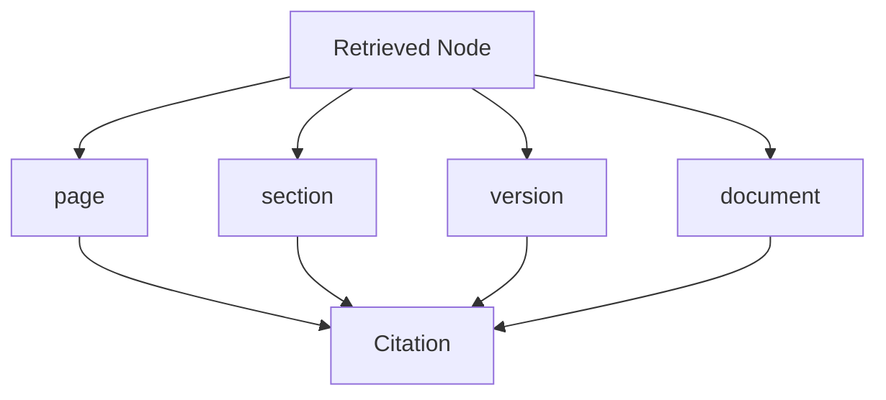

Example:

```text
Source:
Refund Policy
Version 3.2
Section 4.2
Page 8
```

---

## 40. Grounding Validation

After generation, the response should be evaluated against the retrieved context.

Conceptually:

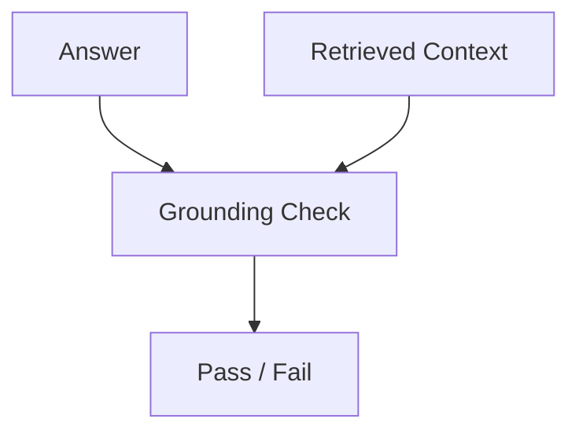

If the answer contains unsupported claims, the application can:

* Reject the answer
* Retry with stricter instructions
* Return an insufficient-evidence response
* Flag the request for review

The first MVP can use simpler validation and evolve later.

---

## 41. No-Answer Behavior

If retrieval fails:

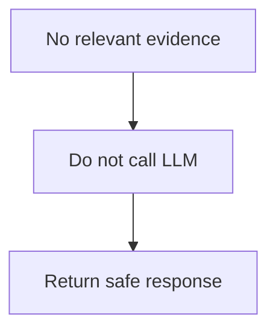

Example:

```text
I could not find sufficient information in the
available approved policies to answer this question.
```

This is preferable to generating an answer from the LLM's general knowledge.

---

## 42. Out-of-Scope Questions

The RAG should distinguish between policy questions and unrelated questions.

Example:

```text
User:
What is the capital of France?
```

The system should not search telecom policies unnecessarily.

Possible response:

```text
I can help with questions related to the
telecom policies available to me.
```

A simple scope classifier can be introduced later if necessary.

---

## 43. Conflicting Evidence

If retrieved active policies conflict:

```text
Policy A:
Refund period = 30 days

Policy B:
Refund period = 14 days
```

The system should not blindly pass both to the LLM and expect reliable resolution.

A future conflict-resolution layer should evaluate:

```text
Policy status
Policy version
Effective date
Expiration date
Scope
Priority
```

If the conflict cannot be resolved:

```text
The available approved policies contain conflicting
information. This question requires policy review.
```

---

## 44. Confidence

Confidence should be based on measurable signals rather than arbitrary LLM language.

Potential signals:

```text
retrieval similarity
retrieval consistency
number of relevant sources
grounding evaluation
policy status
```

Initial implementation:

```text
high
medium
low
insufficient
```

Later, define a formal scoring model.

---

## 45. RAG Service Design

The RAG service is the central application component.

```python
class RAGService:

    def query(
        self,
        question: str,
    ) -> RAGResponse:
        ...
```

Internally:

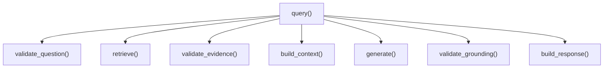

---

## 46. Retriever Interface

Keep retrieval separate from generation.

```python
class PolicyRetriever:

    def retrieve(
        self,
        query: str,
        top_k: int,
    ) -> list[RetrievedChunk]:
        ...
```

This makes retrieval independently testable.

---

## 47. RetrievedChunk

Use an application-level model:

```python
class RetrievedChunk(BaseModel):
    chunk_id: str
    text: str
    score: float
    source: Source
```

Example:

```json
{
  "chunk_id": "refund-001:v3.2:p8:s4.2:c01",
  "text": "Customers may request...",
  "score": 0.91,
  "source": {
    "document_name": "Refund Policy",
    "version": "3.2",
    "section": "4.2",
    "page": 8
  }
}
```

---

## 48. Context Builder

Create a dedicated component:

```python
class ContextBuilder:

    def build(
        self,
        chunks: list[RetrievedChunk],
    ) -> str:
        ...
```

Responsibilities:

* Format retrieved chunks
* Preserve source metadata
* Limit context size
* Remove duplicate content
* Maintain ordering

---

## 49. Prompt Builder

Use a separate prompt component.

```python
class PromptBuilder:

    def build(
        self,
        question: str,
        context: str,
    ) -> str:
        ...
```

This makes prompts versionable and testable.

---

## 50. LLM Client

Do not spread provider-specific code throughout the application.

Create:

```python
class LLMClient:

    def generate(
        self,
        prompt: str,
    ) -> str:
        ...
```

The implementation can use:

* OpenAI
* Azure OpenAI
* OpenRouter

without changing the RAG service architecture.

---

## 51. Embedding Client

Use the same abstraction for embeddings.

```python
class EmbeddingClient:

    def embed(
        self,
        text: str,
    ) -> list[float]:
        ...
```

This makes it easier to change embedding providers later.

---

## 52. Configuration

All important RAG parameters should be configurable.

Example:

```text
LLM_MODEL
EMBEDDING_MODEL

TOP_K
SIMILARITY_THRESHOLD

CHUNK_SIZE
CHUNK_OVERLAP

DATABASE_URL
```

Use Pydantic Settings.

---

## 53. Example Configuration Model

```python
class Settings(BaseSettings):

    llm_model: str
    embedding_model: str

    top_k: int = 5
    similarity_threshold: float = 0.75

    chunk_size: int = 512
    chunk_overlap: int = 50

    database_url: str
```

Actual values should be tuned through evaluation.

---

## 54. Query Flow — Detailed

Example question:

```text
What is the cancellation policy for a postpaid customer?
```

Flow:

```mermaid
flowchart TD
    T1["1. FastAPI receives question"]
    T2["2. Pydantic validates request"]
    T3["3. RAGService receives question"]
    T4["4. LlamaIndex retriever searches"]
    T5["5. PostgreSQL + pgvector returns candidates"]
    T6["6. Metadata filtering removes obsolete policies"]
    T7["7. Top relevant nodes selected"]
    T8["8. ContextBuilder formats nodes"]
    T9["9. PromptBuilder creates prompt"]
    T10["10. LLM generates answer"]
    T11["11. Grounding validation"]
    T12["12. Sources generated from node metadata"]
    T13["13. RAGResponse returned"]
    T1 --> T2
    T2 --> T3
    T3 --> T4
    T4 --> T5
    T5 --> T6
    T6 --> T7
    T7 --> T8
    T8 --> T9
    T9 --> T10
    T10 --> T11
    T11 --> T12
    T12 --> T13
```

---

## 55. Ingestion Flow — Detailed

Example:

```mermaid
flowchart TD
    U1["refund-policy-v3.2.pdf"]
    U2["PDF parser"]
    U3["Pages"]
    U4["Metadata"]
    U5["LlamaIndex Document"]
    U6["Node parser"]
    U7["Nodes"]
    U8["Embedding model"]
    U9["pgvector"]
    U1 --> U2
    U2 --> U3
    U3 --> U4
    U4 --> U5
    U5 --> U6
    U6 --> U7
    U7 --> U8
    U8 --> U9
```

---

## 56. Database Design

Logical schema:

```mermaid
erDiagram
    policy_documents ||--o{ policy_versions : "has"
    policy_versions ||--o{ policy_chunks : "has"
    policy_chunks ||--o| embedding : "stores"
```

---

## 57. policy_documents

Conceptual fields:

```text
id
document_id
name
document_type
category
owner
created_at
updated_at
```

Example:

```text
refund-001
Refund Policy
policy
billing
Customer Operations
```

---

## 58. policy_versions

Conceptual fields:

```text
id
document_id
version
effective_date
expiration_date
status
created_at
```

Example:

```text
refund-001
3.2
2026-06-01
NULL
ACTIVE
```

---

## 59. policy_chunks

Conceptual fields:

```text
id
policy_version_id
chunk_id
page
section
section_title
text
embedding
created_at
```

The `embedding` column uses the pgvector type.

---

## 60. Indexing Strategy

The vector column should have an appropriate pgvector index.

The exact index type should be selected based on scale and workload.

Common options include:

```text
HNSW
IVFFlat
```

For an initial project, HNSW is a reasonable option to investigate.

Benchmark the actual workload before making a production decision.

---

## 61. Retrieval Strategy Evolution

### V1

```text
Vector Search
```

### V2

```text
Vector Search
+
Metadata Filtering
```

### V3

```text
Vector Search
+
Keyword Search
```

### V4

```text
Hybrid Search
+
Reranking
```

### V5

```text
Hybrid Search
+
Reranking
+
Policy Conflict Detection
```

---

## 62. Hybrid Search

Telecom policies contain exact terminology.

For example:

```text
"early termination fee"
"IMEI"
"SIM"
"30-day cooling-off period"
"roaming zone 2"
```

Semantic search may understand meaning, while keyword search can capture exact terminology.

Therefore:

```mermaid
flowchart TD
    V1["Keyword Search"]
    V2["Vector Search"]
    V3["Hybrid Results"]
    V4["Reranking"]
    V1 --> V3
    V2 --> V3
    V3 --> V4
```

should be a later improvement.

---

## 63. Evaluation-Driven Development

Every major RAG change should be evaluated.

Example:

```mermaid
flowchart TD
    W1["Change chunk size"]
    W2["Run evaluation"]
    W3["Compare results"]
    W1 --> W2
    W2 --> W3
```

Or:

```mermaid
flowchart TD
    X1["Change top_k"]
    X2["Run evaluation"]
    X3["Compare results"]
    X1 --> X2
    X2 --> X3
```

Do not optimize the RAG based only on subjective impressions.

---

## 64. Evaluation Metrics

The evaluation system should eventually measure:

### Retrieval Recall

Did the correct policy chunk appear in the retrieved results?

### Precision

How much of the retrieved context was actually relevant?

### Context Relevance

Was the retrieved context relevant to the question?

### Faithfulness / Groundedness

Is the answer supported by the retrieved context?

### Answer Correctness

Does the answer correctly answer the question?

### Citation Accuracy

Do citations point to sources that support the answer?

---

## 65. Evaluation Dataset

Initial target:

```text
50 questions
```

Later:

```text
100–500+ questions
```

Categories:

```text
billing
mobile
roaming
SIM
contracts
complaints
customer verification
payments
```

Also include:

```text
easy questions
ambiguous questions
out-of-scope questions
no-answer questions
version questions
conflict questions
```

---

## 66. Test Case Example

```json
{
  "id": "Q001",
  "question": "What is the refund period?",
  "expected_document": "refund-policy.pdf",
  "expected_version": "3.2",
  "expected_section": "4.1"
}
```

The evaluation runner executes:

```mermaid
flowchart TD
    Y1["Question"]
    Y2["RAG"]
    Y3["Retrieved chunks"]
    Y4["Answer"]
    Y5["Evaluation"]
    Y1 --> Y2
    Y2 --> Y3
    Y3 --> Y4
    Y4 --> Y5
```

---

## 67. Unit Tests

Test components independently.

Examples:

```text
test_document_loader()
test_metadata_extraction()
test_chunking()
test_retriever()
test_context_builder()
test_prompt_builder()
test_response_parser()
```

---

## 68. Integration Tests

Test the complete RAG pipeline.

Example:

```mermaid
flowchart TD
    Z1["Question"]
    Z2["Retriever"]
    Z3["PostgreSQL"]
    Z4["LlamaIndex"]
    Z5["LLM"]
    Z6["Response"]
    Z1 --> Z2
    Z2 --> Z3
    Z3 --> Z4
    Z4 --> Z5
    Z5 --> Z6
```

Integration tests should verify:

* Relevant source retrieved
* Response generated
* Citation exists
* Unknown question is handled safely

---

## 69. Observability

Each query should have a unique request ID.

Example:

```text
request_id=abc123
```

Track:

```text
query
retrieval_latency
retrieval_count
retrieval_scores
llm_latency
input_tokens
output_tokens
model
answer
source_ids
errors
```

---

## 70. RAG Trace

A complete trace should look like:

```mermaid
flowchart TD
    AA1["rag.query"]
    AA2["query.validate"]
    AA3["embedding.generate"]
    AA4["retrieval.search"]
    AA5["chunk-001"]
    AA6["chunk-002"]
    AA7["chunk-003"]
    AA8["context.build"]
    AA9["llm.generate"]
    AA10["grounding.validate"]
    AA11["response.build"]
    AA1 --> AA2
    AA1 --> AA3
    AA1 --> AA4
    AA1 --> AA8
    AA1 --> AA9
    AA1 --> AA10
    AA1 --> AA11
    AA4 --> AA5
    AA4 --> AA6
    AA4 --> AA7
```

---

## 71. Error Handling

Expected failures include:

```text
Invalid question
LLM unavailable
Embedding service unavailable
Database unavailable
No relevant policy
Invalid document
Malformed PDF
Conflicting policies
```

Errors should be handled explicitly.

Do not expose internal exceptions to users.

---

## 72. API Boundary

The API should expose the RAG functionality without exposing internal LlamaIndex details.

Example:

```text
POST /api/v1/rag/query
```

Request:

```json
{
  "question": "What is the refund policy?"
}
```

Response:

```json
{
  "answer": "...",
  "sources": [],
  "confidence": "high",
  "grounded": true
}
```

---

## 73. Streamlit Boundary

Streamlit should consume the API.

```mermaid
flowchart TD
    AB1["Streamlit"]
    AB2["HTTP"]
    AB3["FastAPI"]
    AB4["RAG Service"]
    AB1 --> AB2
    AB2 --> AB3
    AB3 --> AB4
```

Do not duplicate RAG logic inside Streamlit.

---

## 74. Security

The RAG system should never log:

* Customer passwords
* Authentication tokens
* Payment credentials
* Sensitive personal information

If customer-specific data is introduced later, retrieval must respect user authorization.

The policy knowledge base itself should also support document access controls if different teams have access to different policies.

---

## 75. RAG Pipeline Versioning

RAG configuration should be versioned.

Track:

```text
RAG version
Prompt version
Embedding model
LLM model
Chunking configuration
Retriever configuration
Reranker configuration
```

Example:

```text
RAG_VERSION=1.2

PROMPT_VERSION=3

EMBEDDING_MODEL=...

LLM_MODEL=...

TOP_K=5
```

This is important when evaluating changes.

---

## 76. Recommended Initial Configuration

For the first MVP:

```text
Documents:
5–10

Chunking:
Sentence-based

Vector Store:
PostgreSQL + pgvector

Retrieval:
Vector similarity

Top K:
5

Reranking:
Disabled initially

Metadata filtering:
Active policies

LLM:
One selected provider

Embeddings:
One selected embedding model

UI:
Streamlit

API:
FastAPI
```

These are starting points, not final production values.

---

## 77. Implementation Order

Implement the RAG in this order:

```mermaid
flowchart TD
    AC1["1. Project setup"]
    AC2["2. PostgreSQL + pgvector"]
    AC3["3. LlamaIndex installation"]
    AC4["4. PDF ingestion"]
    AC5["5. Metadata"]
    AC6["6. Node parsing"]
    AC7["7. Embeddings"]
    AC8["8. Vector index"]
    AC9["9. Retrieval"]
    AC10["10. LLM"]
    AC11["11. Prompt"]
    AC12["12. RAG query engine"]
    AC13["13. Citations"]
    AC14["14. Streamlit"]
    AC15["15. FastAPI"]
    AC16["16. Evaluation"]
    AC17["17. Guardrails"]
    AC18["18. Observability"]
    AC19["19. Hybrid search"]
    AC20["20. Reranking"]
    AC1 --> AC2
    AC2 --> AC3
    AC3 --> AC4
    AC4 --> AC5
    AC5 --> AC6
    AC6 --> AC7
    AC7 --> AC8
    AC8 --> AC9
    AC9 --> AC10
    AC10 --> AC11
    AC11 --> AC12
    AC12 --> AC13
    AC13 --> AC14
    AC14 --> AC15
    AC15 --> AC16
    AC16 --> AC17
    AC17 --> AC18
    AC18 --> AC19
    AC19 --> AC20
```

---

## 78. First Milestone

The first milestone should be extremely simple:

```mermaid
flowchart TD
    AD1["3 PDF policies"]
    AD2["LlamaIndex"]
    AD3["Vector index"]
    AD4["User question"]
    AD5["Retrieve top 5"]
    AD6["LLM"]
    AD7["Answer"]
    AD1 --> AD2
    AD2 --> AD3
    AD3 --> AD4
    AD4 --> AD5
    AD5 --> AD6
    AD6 --> AD7
```

Example:

```text
Question:
What is the refund policy?

Answer:
[Grounded answer]

Sources:
Refund Policy
Version 3.2
Page 8
Section 4.2
```

---

## 79. Second Milestone

Add:

```text
PostgreSQL
+
pgvector
+
metadata
+
policy versions
```

Flow:

```mermaid
flowchart TD
    AE1["PDF"]
    AE2["LlamaIndex"]
    AE3["PostgreSQL + pgvector"]
    AE4["Retriever"]
    AE5["LLM"]
    AE1 --> AE2
    AE2 --> AE3
    AE3 --> AE4
    AE4 --> AE5
```

---

## 80. Third Milestone

Add retrieval quality:

```text
Metadata filtering
+
Similarity threshold
+
Hybrid search
+
Reranking
```

---

## 81. Fourth Milestone

Add reliability:

```text
No-answer detection
+
Grounding validation
+
Citation validation
+
Conflict detection
```

---

## 82. Fifth Milestone

Add engineering capabilities:

```text
FastAPI
+
Streamlit
+
pytest
+
logging
+
OpenTelemetry
```

---

## 83. Final RAG Architecture

The target RAG architecture is:

```mermaid
flowchart TD
    AF1["USER"]
    AF2["Streamlit UI"]
    AF3["FastAPI"]
    AF4["RAG Service"]
    AF5["LlamaIndex"]
    AF6["Query Processing"]
    AF7["Query Embedding"]
    AF8[("PostgreSQL + pgvector")]
    AF9["Top-K Results"]
    AF10["Metadata Filtering"]
    AF11["Reranking"]
    AF12["Evidence Selection"]
    AF13["Context Construction"]
    AF14["Prompt"]
    AF15["LLM"]
    AF16["Grounding Validation"]
    AF17["Citation Construction"]
    AF18["RAGResponse"]
    AF19["USER"]
    AF1 --> AF2
    AF2 --> AF3
    AF3 --> AF4
    AF4 --> AF5
    AF5 --> AF6
    AF6 --> AF7
    AF7 --> AF8
    AF8 --> AF9
    AF9 --> AF10
    AF10 --> AF11
    AF11 --> AF12
    AF12 --> AF13
    AF13 --> AF14
    AF14 --> AF15
    AF15 --> AF16
    AF16 --> AF17
    AF17 --> AF18
    AF18 --> AF19
```

---

## 84. Design Rules

The implementation should follow these rules:

### Rule 1

**Retrieve before generating.**

### Rule 2

**Never treat the LLM as the policy database.**

### Rule 3

**Preserve document metadata throughout the pipeline.**

### Rule 4

**Prefer active policies over obsolete policies.**

### Rule 5

**Do not fabricate citations.**

### Rule 6

**Do not answer when evidence is insufficient.**

### Rule 7

**Evaluate retrieval independently from generation.**

### Rule 8

**Keep retrieval and generation independently testable.**

### Rule 9

**Keep provider-specific code behind interfaces.**

### Rule 10

**Make RAG configuration versioned and observable.**

---

## 85. Future Evolution

Once the RAG is stable, the architecture can evolve toward agentic RAG.

```mermaid
flowchart TD
    AG1["USER"]
    AG2["AGENT"]
    AG3["Policy RAG"]
    AG4["Billing Tool"]
    AG5["Account Tool"]
    AG6["Retriever"]
    AG7["Policy Knowledge"]
    AG8["Guardrails"]
    AG9["Response"]
    AG1 --> AG2
    AG2 --> AG3
    AG2 --> AG4
    AG2 --> AG5
    AG3 --> AG6
    AG6 --> AG7
    AG7 --> AG8
    AG8 --> AG9
```

Potential future capabilities:

* Query routing
* Tool use
* Agent planning
* Conversation memory
* Customer-specific data retrieval
* Escalation workflows
* Human-in-the-loop review

These should only be introduced after the core RAG has strong retrieval and evaluation performance.

---

## 86. Definition of Done

The RAG implementation is considered complete for the first production-oriented MVP when:

```text
✓ Policy documents can be ingested

✓ Documents preserve page and section metadata

✓ Nodes are created correctly

✓ Embeddings are generated

✓ Vectors are persisted in PostgreSQL + pgvector

✓ LlamaIndex can retrieve relevant policy nodes

✓ Active policy versions are preferred

✓ LLM receives retrieved context

✓ Answers are grounded in retrieved evidence

✓ Sources are displayed

✓ Page/section information is preserved

✓ Insufficient evidence produces a safe response

✓ Retrieval is independently testable

✓ RAG responses are evaluated

✓ Requests are logged

✓ RAG execution can be traced

✓ API exposes the RAG service

✓ Streamlit provides the initial UI
```

---

## 87. Final Mental Model

The most important mental model for this project is:

```mermaid
flowchart TD
    AH1["KNOWLEDGE"]
    AH2["INGESTION"]
    AH3["CHUNKS"]
    AH4["EMBEDDINGS"]
    AH5["VECTOR STORE"]
    AH6["RETRIEVAL"]
    AH7["EVIDENCE"]
    AH8["PROMPT"]
    AH9["LLM"]
    AH10["ANSWER"]
    AH11["CITATIONS"]
    AH12["EVALUATION"]
    AH13["USER"]
    AH1 --> AH2
    AH2 --> AH3
    AH3 --> AH4
    AH4 --> AH5
    AH5 --> AH6
    AH13 --> AH6
    AH6 --> AH7
    AH7 --> AH8
    AH8 --> AH9
    AH9 --> AH10
    AH10 --> AH11
    AH11 --> AH12
```

The fundamental principle is:

> **The RAG system retrieves the evidence; the LLM explains the evidence; the application controls the sources, policy versions, guardrails, and final response.**