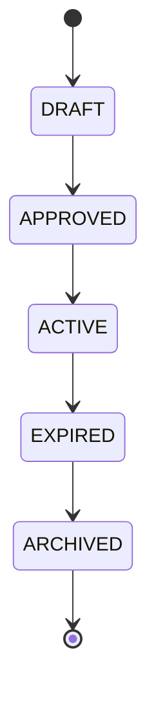
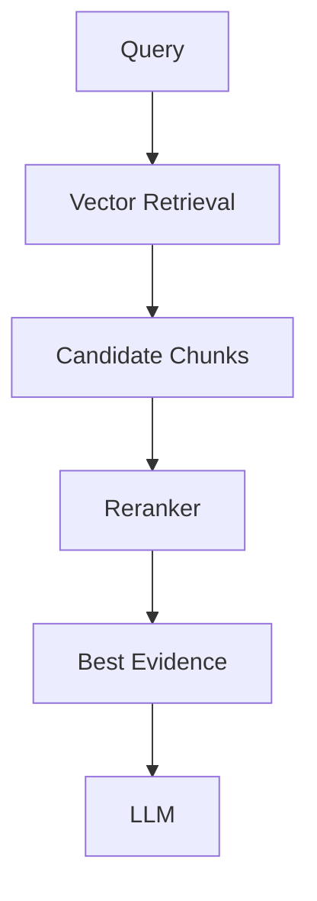
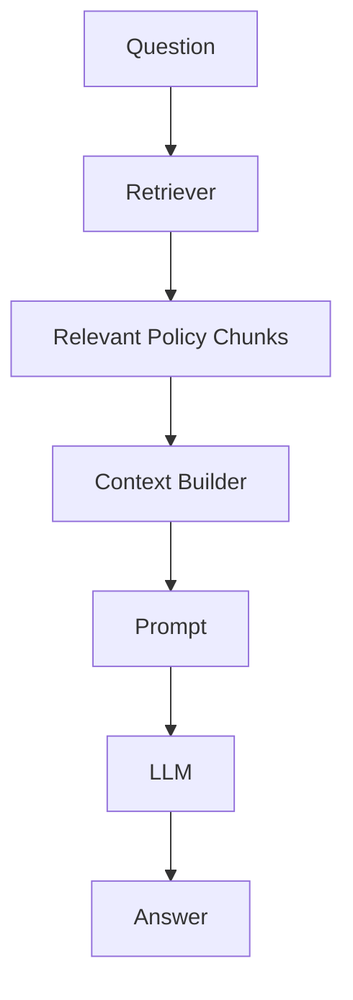
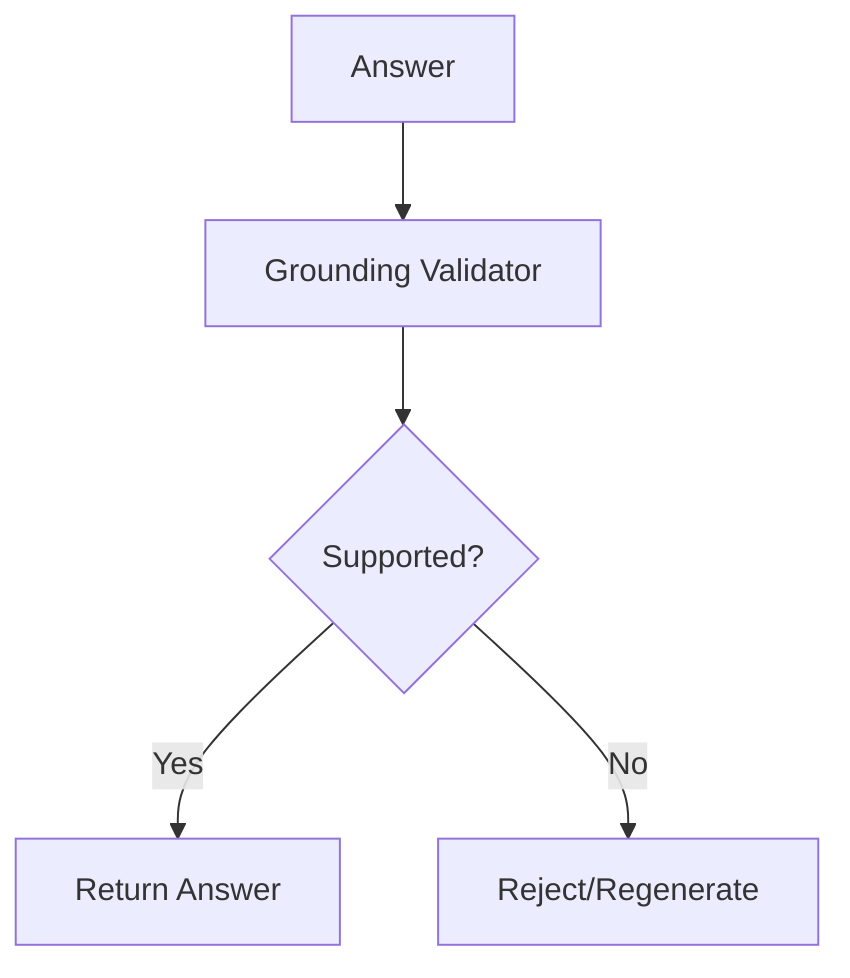
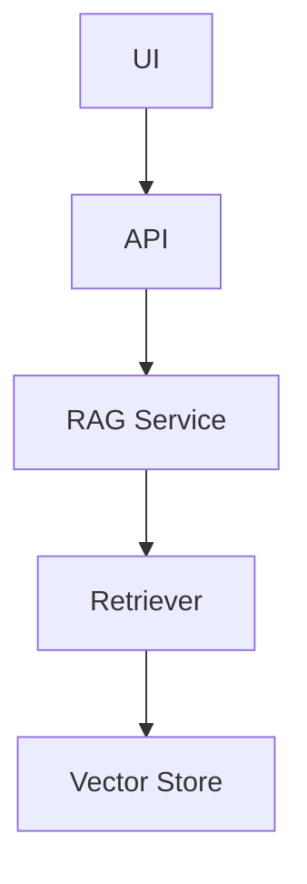
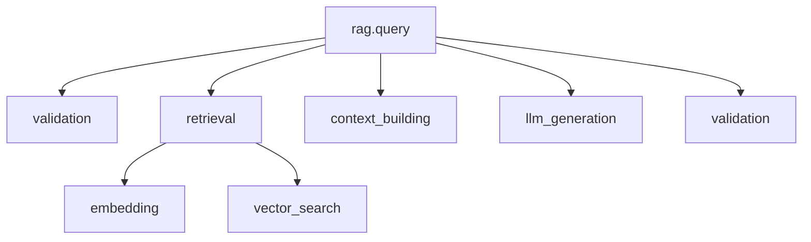
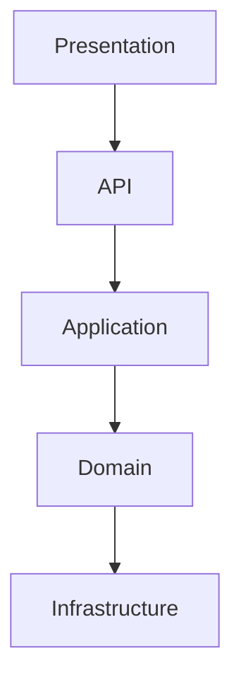
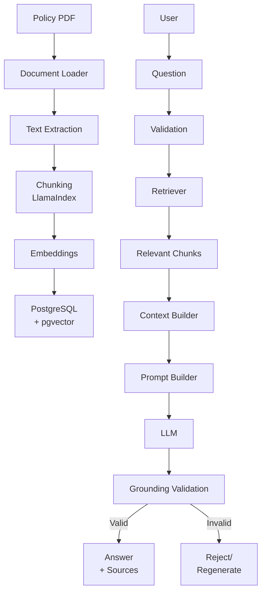
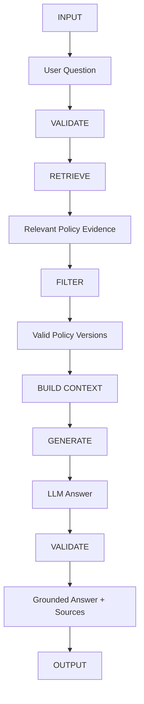

# Requirements Specification

## Telecom Policy RAG System

**Version:** 1.0
**Status:** Draft
**Project:** Telecom Policy RAG
**Primary Framework:** LlamaIndex
**Language:** Python

---

# 1. Purpose

The Telecom Policy RAG system provides an AI-powered question-answering interface over a controlled collection of telecom policy and procedure documents.

The system allows users to ask questions such as:

* "What is the roaming policy for Europe?"
* "How long does a customer have to cancel a mobile plan?"
* "What are the conditions for a billing adjustment?"
* "What documents are required for account verification?"

The system must answer using information retrieved from approved policy documents.

The application must **not rely on the LLM's internal knowledge as the source of truth**.

The fundamental principle is:

> Retrieve the evidence first, then use the LLM to explain that evidence.

---

# 2. Goals

## 2.1 Primary Goals

The system must:

1. Ingest telecom policy documents.
2. Extract text from documents.
3. Preserve document metadata and page information.
4. Split documents into searchable chunks.
5. Generate embeddings for chunks.
6. Store embeddings in PostgreSQL with pgvector.
7. Retrieve relevant chunks for a user question.
8. Generate an answer using an LLM.
9. Provide citations to the source documents.
10. Avoid unsupported answers.
11. Support policy versions and effective dates.
12. Provide a simple API.
13. Provide a Streamlit interface.
14. Support evaluation of RAG quality.
15. Provide logging and observability.

---

# 3. Non-Goals

The first version will not:

* Modify telecom policies.
* Automatically approve customer requests.
* Execute customer account transactions.
* Access production customer accounts.
* Make billing changes.
* Replace human compliance decisions.
* Provide unrestricted general-purpose chatbot functionality.
* Train a new foundation model.
* Implement autonomous multi-agent behavior.

Agents may be introduced later as a separate learning phase.

---

# 4. Users

## 4.1 Primary Users

### Customer Operations Agent

A support employee who needs to quickly find policy information.

Example:

```text
What is the maximum roaming data allowance for this plan?
```

The system returns:

```text
According to the active roaming policy, the allowance is ...

Sources:
- Roaming Policy v3
- Page 12
```

---

## 4.2 Secondary Users

### Policy Administrator

Responsible for managing policy documents and versions.

### Developer

Responsible for maintaining the RAG application.

### Evaluator

Responsible for measuring retrieval and answer quality.

---

# 5. Functional Requirements

## FR-001 — Document Ingestion

The system shall support ingestion of telecom policy documents.

Initial supported format:

* PDF

Future formats may include:

* DOCX
* TXT
* Markdown
* HTML

Documents shall be placed in:

```text
data/documents/
```

---

## FR-002 — Document Metadata

Each document shall have metadata including:

```text
document_id
document_name
document_type
category
version
status
effective_date
expiration_date
source
```

Example:

```json
{
  "document_id": "roaming-policy",
  "document_name": "International Roaming Policy",
  "document_type": "policy",
  "category": "roaming",
  "version": "3.0",
  "status": "ACTIVE",
  "effective_date": "2026-01-01"
}
```

---

# 6. Policy Lifecycle

Policies shall support the following lifecycle:



Only appropriate policy versions should be available for normal RAG retrieval.

The system should prioritize:

```text
ACTIVE
```

policies.

---

# 7. Document Parsing

## FR-003 — PDF Extraction

The system shall extract text from PDF documents.

The extraction process must preserve:

* Page number
* Section information when available
* Document identity
* Document version

Example:

```text
Document: roaming-policy-v3.pdf
Page: 12
Section: Data Usage
```

---

# 8. Chunking

## FR-004 — Document Chunking

Documents shall be divided into smaller searchable chunks.

The initial implementation shall use LlamaIndex's node parsing capabilities.

Initial configuration:

```text
chunk_size: configurable
chunk_overlap: configurable
```

The configuration must not be hard-coded throughout the application.

Example:

```python
chunk_size = 512
chunk_overlap = 50
```

The exact values shall be validated through evaluation.

---

# 9. Embeddings

## FR-005 — Embedding Generation

Each document chunk shall receive an embedding.

The embedding model must be configurable.

The system shall store:

```text
chunk_id
chunk_text
embedding
metadata
```

The embedding model used during indexing must be recorded.

Changing the embedding model shall require re-indexing.

---

# 10. Vector Database

## FR-006 — PostgreSQL

The system shall use PostgreSQL as the primary database.

## FR-007 — pgvector

The system shall use pgvector for vector similarity search.

Logical structure:

```text
PostgreSQL
│
├── policy_documents
├── policy_versions
├── policy_chunks
└── vector embeddings
```

---

# 11. Retrieval

## FR-008 — Semantic Retrieval

The system shall retrieve chunks based on semantic similarity.

Initial retrieval configuration:

```text
top_k = 5
```

The value shall be configurable.

Example:

```python
retriever.retrieve(
    query="What is the roaming allowance?",
    top_k=5
)
```

---

# 12. Metadata Filtering

The system shall support filtering using document metadata.

Examples:

```text
category = roaming
status = ACTIVE
version = 3.0
```

Example query:

```text
Find active roaming policies.
```

The retriever should avoid returning expired policies when an active policy exists.

---

# 13. Hybrid Search

Hybrid search is a future requirement.

The system should eventually combine:

```text
Vector Search
+
Keyword Search
```

This is particularly useful for:

* Policy IDs
* Product names
* Contract codes
* Plan names
* Technical terminology

---

# 14. Reranking

Reranking is a future requirement.

The initial architecture should allow a reranking stage:



---

# 15. Question Processing

## FR-009 — User Question

The API shall accept a natural-language question.

Example:

```json
{
  "question": "What is the international roaming allowance?"
}
```

The question shall be validated before processing.

---

# 16. Prompt Construction

## FR-010 — Grounded Prompt

The system shall construct prompts using:

```text
User Question
+
Retrieved Evidence
```

The prompt must instruct the LLM to:

1. Use only supplied evidence.
2. Avoid inventing information.
3. Prefer active policies.
4. State when evidence is insufficient.
5. Not fabricate citations.
6. Clearly distinguish evidence from assumptions.

---

# 17. Answer Generation

## FR-011 — LLM Response

The LLM shall generate an answer based on retrieved context.

Example:



---

# 18. Citations

## FR-012 — Source Citations

Every grounded answer should provide source information.

A source should contain information such as:

```text
document_name
version
page
section
document_id
```

Example:

```json
{
  "document_name": "International Roaming Policy",
  "version": "3.0",
  "page": 12,
  "section": "Data Usage"
}
```

The LLM should not be responsible for inventing source metadata.

Source metadata must come from the retrieved chunks.

---

# 19. No-Answer Behavior

## FR-013 — Insufficient Evidence

If the retrieved evidence does not sufficiently answer the question, the system shall not invent an answer.

Example response:

```text
I couldn't find sufficient information in the available telecom policies to answer this question.
```

The system should indicate that additional information or human assistance may be required.

---

# 20. Grounding Validation

## FR-014 — Grounded Answer

The system shall validate whether the generated answer is supported by retrieved evidence.

Conceptually:



---

# 21. Conflict Detection

## FR-015 — Policy Conflicts

The system should detect situations where retrieved policies contain conflicting information.

Example:

```text
Policy v2:
Roaming allowance = 10 GB

Policy v3:
Roaming allowance = 20 GB
```

The system should prioritize the valid active policy according to policy lifecycle rules.

If the conflict cannot be resolved safely, the system should flag the ambiguity rather than silently choosing an answer.

---

# 22. Out-of-Scope Questions

## FR-016 — Scope Control

The system shall identify questions that are outside the available policy knowledge base.

Example:

```text
Who will win the World Cup?
```

Expected behavior:

```text
This question is outside the scope of the telecom policy knowledge base.
```

---

# 23. API

## FR-017 — RAG Query API

The system shall expose a REST API.

Base path:

```text
/api/v1
```

Query endpoint:

```http
POST /api/v1/rag/query
```

Request:

```json
{
  "question": "What is the roaming allowance?"
}
```

Response:

```json
{
  "answer": "The active roaming policy provides ...",
  "sources": [
    {
      "document_id": "roaming-policy",
      "document_name": "International Roaming Policy",
      "version": "3.0",
      "page": 12
    }
  ],
  "grounded": true,
  "confidence": "high"
}
```

---

# 24. API Validation

The API shall reject invalid requests.

Examples:

```text
Empty question
Question too long
Invalid request body
Malformed JSON
```

Example:

```json
{
  "detail": "Question cannot be empty."
}
```

---

# 25. Streamlit UI

## FR-018 — User Interface

The application shall provide a Streamlit interface.

The interface shall allow users to:

1. Enter a question.
2. Submit the question.
3. View the generated answer.
4. View sources.
5. View policy version.
6. View page numbers.
7. See when the system cannot answer.

Example:

```text
┌──────────────────────────────────────────────┐
│ Telecom Policy Assistant                    │
├──────────────────────────────────────────────┤
│                                              │
│ What is the roaming allowance?               │
│                                              │
│                  [ Ask ]                     │
│                                              │
├──────────────────────────────────────────────┤
│ Answer                                       │
│                                              │
│ The active policy states ...                 │
│                                              │
├──────────────────────────────────────────────┤
│ Sources                                      │
│                                              │
│ International Roaming Policy v3              │
│ Page 12                                      │
└──────────────────────────────────────────────┘
```

---

# 26. Separation of Responsibilities

The application shall separate:



The Streamlit application shall not contain the core RAG implementation.

---

# 27. Configuration

The system shall use environment-based configuration.

Examples:

```text
DATABASE_URL
LLM_API_KEY
LLM_MODEL
EMBEDDING_MODEL
VECTOR_TABLE
TOP_K
CHUNK_SIZE
CHUNK_OVERLAP
```

Secrets must not be committed to Git.

---

# 28. Logging

## FR-019 — Application Logging

The system shall provide structured application logging.

Important events include:

```text
document_ingestion_started
document_ingestion_completed
embedding_generation
retrieval_started
retrieval_completed
llm_request_started
llm_request_completed
rag_query_completed
rag_query_failed
```

---

# 29. Observability

## FR-020 — RAG Telemetry

The system should record metrics such as:

```text
request latency
retrieval latency
LLM latency
number of retrieved chunks
token usage
errors
no-answer rate
```

Future implementation:

```text
OpenTelemetry
```

---

# 30. Tracing

The system should support distributed tracing.

A RAG request should conceptually look like:



Each stage should be independently observable.

---

# 31. Evaluation

## FR-021 — RAG Evaluation

The system shall include an evaluation dataset.

Example:

```json
{
  "question": "What is the roaming allowance?",
  "expected_answer": "...",
  "expected_sources": [
    "roaming-policy-v3"
  ]
}
```

---

# 32. Retrieval Evaluation

The system shall evaluate retrieval quality.

Initial metrics:

```text
Recall@K
Precision@K
MRR
```

The goal is to determine whether the correct policy chunks are being retrieved.

---

# 33. Generation Evaluation

The system should evaluate:

```text
Answer correctness
Faithfulness
Context relevance
Citation correctness
Completeness
```

---

# 34. Evaluation Dataset

The initial evaluation dataset should contain at least:

```text
20–50 questions
```

Categories should include:

```text
Simple factual questions
Policy-specific questions
Multi-section questions
Version-related questions
No-answer questions
Out-of-scope questions
Ambiguous questions
Conflict questions
```

---

# 35. Guardrails

## FR-022 — Input Guardrails

The system shall validate user input before processing.

Potential checks:

```text
empty input
maximum length
unsupported requests
malicious prompt attempts
```

---

# 36. Output Guardrails

The system shall validate generated answers.

The validator should check:

```text
Is the answer grounded?
Are sources present?
Are citations valid?
Does the answer contain unsupported claims?
```

---

# 37. Security

The system shall:

* Keep API keys outside source code.
* Avoid logging secrets.
* Avoid logging authentication tokens.
* Avoid storing unnecessary personal information.
* Validate external input.
* Restrict database access.
* Use least-privilege database credentials.

If customer-specific data is introduced later, authorization and access control must be implemented before exposing that data to the RAG system.

---

# 38. Performance Requirements

Initial target:

```text
Normal RAG request: < 5 seconds
```

This is a development target rather than a production SLA.

The application should separately measure:

```text
retrieval latency
LLM latency
total latency
```

---

# 39. Reliability

The system shall gracefully handle:

```text
Database unavailable
LLM unavailable
Embedding service unavailable
Invalid documents
Malformed PDF
Empty extraction
Retrieval failure
Timeout
```

Errors should return controlled responses rather than exposing internal stack traces to users.

---

# 40. Reproducibility

Every RAG answer should be reproducible as far as practical.

The system should record:

```text
RAG version
Prompt version
LLM model
Embedding model
Chunk size
Chunk overlap
Top K
Retriever configuration
Policy version
```

---

# 41. Idempotent Ingestion

Running ingestion multiple times should not create duplicate chunks.

The system should generate stable identifiers.

Example:

```text
document_id
+
version
+
page
+
chunk_index
```

can be used to derive a stable chunk identity.

---

# 42. Document Versioning

Multiple versions of a policy must be supported.

Example:

```text
roaming-policy
├── v1
├── v2
└── v3
```

The retrieval layer must be able to determine which version is valid.

---

# 43. Data Model Requirements

The initial database model should support:

### policy_documents

```text
id
document_id
name
type
category
created_at
updated_at
```

### policy_versions

```text
id
document_id
version
status
effective_date
expiration_date
file_path
created_at
```

### policy_chunks

```text
id
version_id
chunk_index
text
page
section
embedding
metadata
created_at
```

---

# 44. Architecture Requirements

The application should follow these logical layers:



Suggested components:

```text
Streamlit
FastAPI
RAG Service
Retriever
Context Builder
Prompt Builder
LLM Client
Embedding Client
LlamaIndex
PostgreSQL
pgvector
```

---

# 45. Technology Requirements

| Component       | Technology                   |
| --------------- | ---------------------------- |
| Language        | Python                       |
| RAG framework   | LlamaIndex                   |
| API             | FastAPI                      |
| UI              | Streamlit                    |
| Validation      | Pydantic                     |
| Database        | PostgreSQL                   |
| Vector database | pgvector                     |
| LLM             | Configurable                 |
| Embeddings      | Configurable                 |
| Testing         | pytest                       |
| Logging         | Python logging               |
| Telemetry       | OpenTelemetry                |
| Packaging       | uv                           |
| Version control | Git                          |
| CI/CD           | GitHub Actions or equivalent |

---

# 46. Suggested Project Structure

```text
telecom-rag/
│
├── src/
│   ├── __init__.py
│   │
│   ├── config/
│   │   ├── __init__.py
│   │   └── settings.py
│   │
│   ├── models/
│   │   ├── __init__.py
│   │   ├── policy_document.py
│   │   ├── policy_version.py
│   │   ├── policy_chunk.py
│   │   ├── rag_request.py
│   │   ├── rag_response.py
│   │   ├── retrieval_result.py
│   │   └── ingestion_run.py
│   │
│   ├── llm/
│   │   ├── __init__.py
│   │   ├── llm_client.py
│   │   ├── embedding_client.py
│   │   └── prompt_manager.py
│   │
│   ├── documents/
│   │   ├── __init__.py
│   │   ├── document_loader.py
│   │   ├── pdf_loader.py
│   │   ├── document_extractor.py
│   │   ├── document_chunker.py
│   │   └── hash_service.py
│   │
│   ├── database/
│   │   ├── __init__.py
│   │   ├── database_client.py
│   │   ├── policy_repository.py
│   │   ├── chunk_repository.py
│   │   ├── ingestion_repository.py
│   │   ├── retrieval_repository.py
│   │   └── user_repository.py
│   │
│   ├── indexing/
│   │   ├── __init__.py
│   │   ├── indexing_service.py
│   │   ├── version_service.py
│   │   └── activation_service.py
│   │
│   ├── rag/
│   │   ├── __init__.py
│   │   ├── rag_service.py
│   │   ├── retrieval_service.py
│   │   ├── context_builder.py
│   │   └── citation_service.py
│   │
│   ├── guardrails/
│   │   ├── __init__.py
│   │   ├── input_guard.py
│   │   ├── retrieval_guard.py
│   │   ├── grounding_guard.py
│   │   └── output_guard.py
│   │
│   ├── memory/
│   │   ├── __init__.py
│   │   └── conversation_memory.py
│   │
│   ├── evaluation/
│   │   ├── __init__.py
│   │   ├── evaluation_service.py
│   │   ├── retrieval_evaluator.py
│   │   └── answer_evaluator.py
│   │
│   ├── tracing/
│   │   ├── __init__.py
│   │   ├── trace_service.py
│   │   ├── request_tracer.py
│   │   └── retrieval_tracer.py
│   │
│   ├── operations/
│   │   ├── __init__.py
│   │   ├── indexing_operations.py
│   │   ├── verification_service.py
│   │   ├── repair_service.py
│   │   ├── rollback_service.py
│   │   ├── cleanup_service.py
│   │   └── health_service.py
│   │
│   ├── api/
│   │   ├── __init__.py
│   │   ├── routes/
│   │   │   ├── __init__.py
│   │   │   ├── rag.py
│   │   │   ├── documents.py
│   │   │   ├── indexing.py
│   │   │   ├── operations.py
│   │   │   └── health.py
│   │   │
│   │   └── schemas/
│   │       ├── __init__.py
│   │       ├── rag.py
│   │       ├── documents.py
│   │       └── operations.py
│   │
│   ├── cli/
│   │   ├── __init__.py
│   │   ├── main.py
│   │   ├── indexing_commands.py
│   │   └── operations_commands.py
│   │
│   └── utils/
│       ├── __init__.py
│       ├── logger.py
│       └── config_loader.py
│
├── data/
│   ├── documents/
│   │   ├── billing/
│   │   ├── mobile/
│   │   ├── roaming/
│   │   ├── customer/
│   │   └── compliance/
│   │
│   └── validation/
│       └── eval_questions.json
│
├── database/
│   └── migrations/
│       ├── 001_initial_schema.sql
│       ├── 002_tracing.sql
│       └── 003_indexes.sql
│
├── tests/
│   ├── unit/
│   │   ├── test_config_loader.py
│   │   ├── test_prompt_manager.py
│   │   ├── test_llm_client.py
│   │   ├── test_embeddings.py
│   │   ├── test_document_loader.py
│   │   ├── test_document_chunker.py
│   │   ├── test_retrieval.py
│   │   ├── test_guardrails.py
│   │   ├── test_memory.py
│   │   └── test_evaluation.py
│   │
│   └── integration/
│       ├── test_llm_integration.py
│       ├── test_database.py
│       ├── test_indexing.py
│       └── test_rag.py
│
├── docs/
│   ├── requirements.md
│   ├── architecture.md
│   ├── rag-design.md
│   ├── database-schema.md
│   ├── security.md
│   │
│   └── operations/
│       ├── indexing.md
│       ├── troubleshooting.md
│       ├── degradation.md
│       ├── rollback.md
│       └── runbook.md
│
├── scripts/
│   ├── index_documents.py
│   ├── verify_index.py
│   └── evaluate_rag.py
│
├── app/
│   └── streamlit_app.py
│
├── .env
├── .env.example
├── .gitignore
├── pyproject.toml
├── README.md
└── uv.lock
```

---

# 47. Development Phases

## Phase 1 — Project Foundation

Deliverables:

```text
Python project
uv configuration
environment configuration
project structure
README
```

---

## Phase 2 — Document Ingestion

Deliverables:

```text
PDF loader
text extraction
metadata extraction
document models
```

---

## Phase 3 — Chunking

Deliverables:

```text
LlamaIndex node parser
chunk configuration
chunk metadata
chunking tests
```

---

## Phase 4 — Embeddings

Deliverables:

```text
embedding client
embedding generation
embedding configuration
```

---

## Phase 5 — Vector Store

Deliverables:

```text
PostgreSQL
pgvector
schema
LlamaIndex vector integration
```

---

## Phase 6 — Retrieval

Deliverables:

```text
retriever
top-k configuration
metadata filtering
retrieval tests
```

---

## Phase 7 — RAG Generation

Deliverables:

```text
context builder
prompt builder
LLM client
RAG service
```

---

## Phase 8 — Citations and Guardrails

Deliverables:

```text
source extraction
citation validation
grounding validation
no-answer behavior
```

---

## Phase 9 — API

Deliverables:

```text
FastAPI
POST /api/v1/rag/query
Pydantic request/response models
API tests
```

---

## Phase 10 — UI

Deliverables:

```text
Streamlit application
question interface
answer display
source display
error states
```

---

## Phase 11 — Evaluation

Deliverables:

```text
evaluation dataset
retrieval metrics
generation metrics
evaluation runner
evaluation report
```

---

## Phase 12 — Production Readiness

Deliverables:

```text
logging
telemetry
tracing
CI/CD
configuration management
security checks
performance testing
deployment documentation
```

---

# 48. Acceptance Criteria

The MVP is considered complete when a user can:

1. Add telecom policy PDFs.
2. Run the ingestion pipeline.
3. Store document chunks and embeddings.
4. Ask a policy question.
5. Retrieve relevant policy chunks.
6. Generate an answer using an LLM.
7. See the supporting sources.
8. See the policy version.
9. Receive a safe response when evidence is insufficient.
10. Query the system through the API.
11. Query the system through Streamlit.
12. Run automated tests.
13. Run the evaluation dataset.
14. Inspect basic logs and metrics.

---

# 49. Example End-to-End Flow



---

# 50. Key Engineering Principles

The implementation should follow these principles:

### Principle 1 — Evidence First

The LLM should explain retrieved evidence rather than invent knowledge.

### Principle 2 — Application Controls Sources

The application determines which documents and metadata are valid.

### Principle 3 — Version Awareness

Policy version and effective date are first-class concepts.

### Principle 4 — Fail Safely

When evidence is insufficient, the system should say so.

### Principle 5 — Evaluate Before Optimizing

Do not introduce hybrid search, reranking, or complex agentic behavior before measuring the baseline RAG system.

### Principle 6 — Keep Components Replaceable

LLM, embedding model, vector store, and retriever implementations should be replaceable without rewriting the entire application.

### Principle 7 — Observability Is Part of the Product

Latency, retrieval quality, LLM behavior, errors, and token usage should be measurable.

---

# 51. Definition of Done

The first production-oriented version is complete when:

```text
[✓] Documents can be ingested
[✓] Metadata is preserved
[✓] Documents are chunked
[✓] Embeddings are generated
[✓] pgvector stores embeddings
[✓] Relevant chunks can be retrieved
[✓] LLM generates grounded answers
[✓] Sources are returned
[✓] Policy versions are respected
[✓] No-answer behavior works
[✓] Guardrails exist
[✓] FastAPI endpoint works
[✓] Streamlit UI works
[✓] Automated tests exist
[✓] Evaluation dataset exists
[✓] Retrieval is evaluated
[✓] Generation is evaluated
[✓] Logging exists
[✓] Basic telemetry exists
[✓] CI/CD exists
[✓] Documentation exists
```

---

# 52. Final System Contract

The core RAG system can be summarized as:



The most important contract is:

> **The RAG system retrieves the evidence. The LLM explains the evidence. The application controls the policies, versions, sources, guardrails, and final response.**