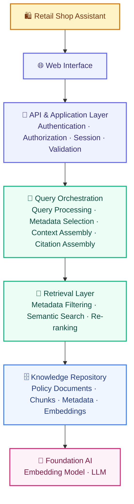
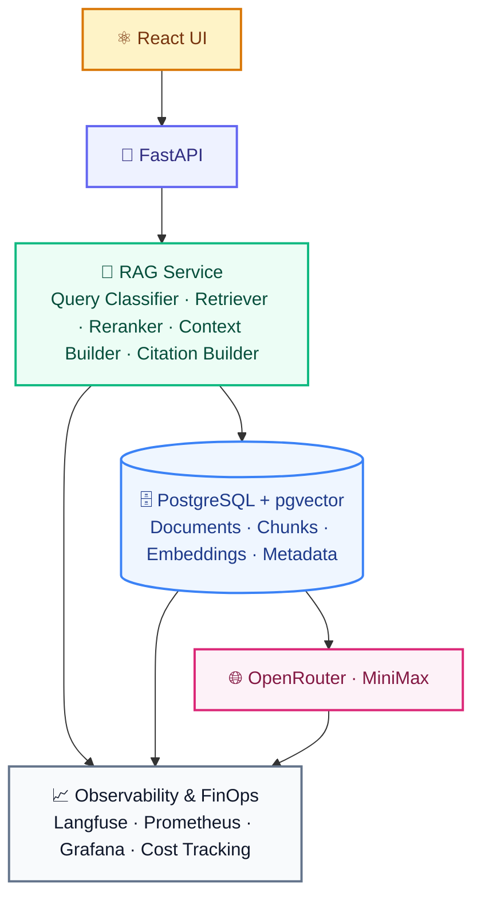
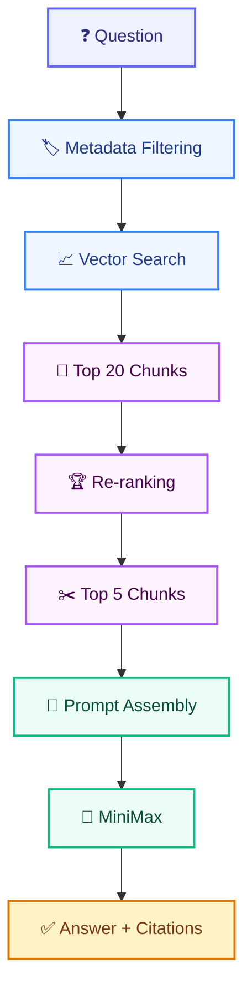
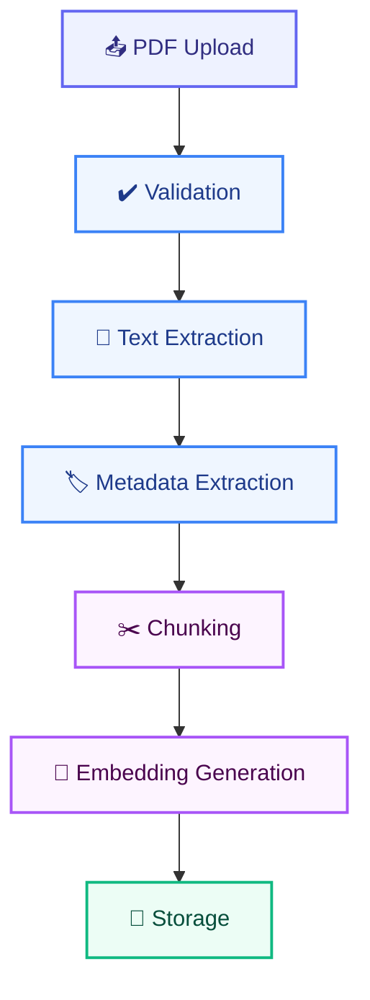
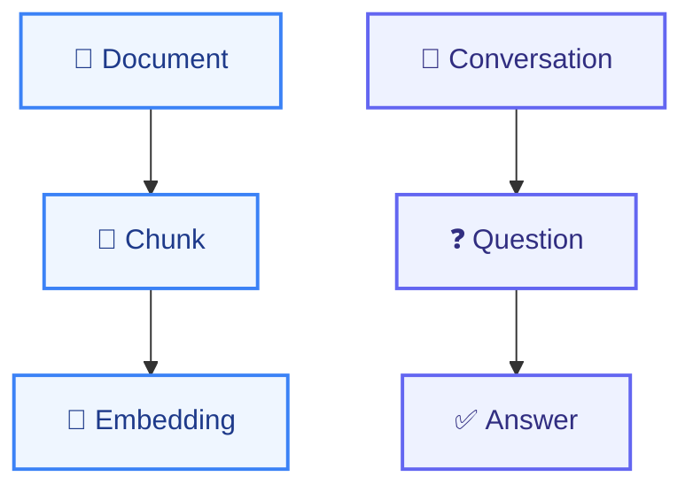
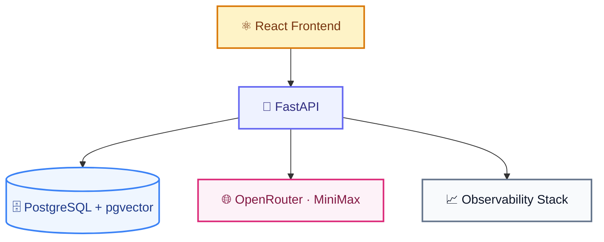

# ARCHITECTURE.md

# Telecom Policy Assistant

Version: 1.0  
Status: Draft  
Architecture Owner: AI & Platform Team

---

# 1. Overview

The Telecom Policy Assistant is a Retrieval-Augmented Generation (RAG) platform that enables retail shop assistants to ask natural language questions and receive trustworthy, source-cited answers based on approved telecom policies.

The platform is designed for:

- Policy search
- Knowledge retrieval
- Compliance support
- Source-based reasoning
- Enterprise observability
- Cost governance

---

# 2. Architecture Goals

## Functional Goals

- Answer policy questions in natural language
- Search across multiple policy documents
- Return traceable sources
- Support policy versioning
- Support metadata-based filtering

---

## Non-Functional Goals

- High availability
- Low latency
- Auditability
- Security
- Scalability
- Cost transparency

---

# 3. Architecture Principles

## AP-001 Retrieval Before Generation

The LLM must never answer without retrieved context.

---

## AP-002 Source Grounding

Every response must be supported by source documents.

---

## AP-003 Metadata First

Retrieval should leverage metadata before semantic search.

---

## AP-004 Observability by Design

Every request must be traceable.

---

## AP-005 FinOps by Design

Every AI interaction must be measurable and attributable.

---

## AP-006 Vendor Independence

The architecture should allow replacement of:

- LLM
- Embedding model
- Vector engine

without major redesign.

---

# 4. Logical Architecture



---

# 5. Technical Architecture



---

# 6. Component Architecture

## Frontend Layer

### Responsibilities

- Chat experience
- Source display
- Feedback collection
- Session management

### Technology

```text
React
Next.js
TailwindCSS
```

---

## API Layer

### Responsibilities

- Authentication
- Authorization
- Validation
- Session handling
- Request routing

### Technology

```text
FastAPI
```

---

## RAG Layer

### Responsibilities

- Query analysis
- Retrieval
- Re-ranking
- Context preparation
- Citation generation

### Technology

```text
LlamaIndex
```

---

## Knowledge Layer

### Responsibilities

Store:

- Documents
- Metadata
- Chunks
- Embeddings

### Technology

```text
PostgreSQL
pgvector
```

---

## AI Layer

### Embeddings

```text
BGE-M3
```

---

### Re-ranking

```text
bge-reranker-v2-m3
```

---

### LLM

```text
MiniMax

via

OpenRouter
```

---

# 7. Retrieval Architecture

## Workflow



---

## Retrieval Configuration

```yaml
embeddings_model: BGE-M3

reranker_model: BGE-Reranker-v2-M3

candidate_chunks: 20

final_chunks: 5

minimum_similarity: 0.65
```

---

# 8. Ingestion Architecture

## Workflow



---

## Chunking Strategy

```text
500-800 Tokens

100 Tokens Overlap
```

---

## Metadata Captured

```json
{
  "document_name": "",
  "category": "",
  "page_number": 0,
  "section": "",
  "version": "",
  "status": ""
}
```

---

# 9. Data Architecture

## Core Entities

```text
Users

Documents

Chunks

Embeddings

Conversations

Questions

Answers

Feedback

Usage Metrics

Audit Logs
```

---

## Relationships



---

# 10. Security Architecture

## Authentication

Supported Providers:

```text
Microsoft Entra ID

Keycloak

OIDC Provider
```

---

## Authorization

Roles:

```text
RETAIL_AGENT

SUPERVISOR

ADMIN

SYSTEM
```

---

## Security Controls

```text
TLS 1.2+

Encrypted Storage

Audit Logs

RBAC

Secrets Management
```

---

# 11. Observability Architecture

## Logging

Capture:

```text
Question

Retrieved Sources

Generated Answer

Errors
```

---

## Tracing

Technology:

```text
Langfuse
```

Trace Flow:

```text
Question

Retrieval

Prompt

Model Call

Response
```

---

## Metrics

Technology:

```text
Prometheus
```

Metrics:

```text
Requests

Latency

Errors

Token Usage

Costs
```

---

## Visualization

Technology:

```text
Grafana
```

Dashboards:

```text
Operations

Retrieval

AI Quality

FinOps
```

---

# 12. FinOps Architecture

## Cost Tracking

Track:

```text
User

Store

Model

Question

Tokens

Cost
```

---

## FinOps KPIs

```text
Cost per Question

Cost per User

Cost per Store

Cost per Model
```

---

## Budget Monitoring

Thresholds:

```text
80% Warning

90% Alert

100% Critical
```

---

# 13. Deployment Architecture

## Container Layout



---

## Docker Services

```text
frontend
api
postgres
prometheus
grafana
langfuse
```

---

## Repository Structure

```text
04-rag-telco-v2/
├── docs/
│   ├── PRD.md
│   ├── ARCHITECTURE.md
│   ├── DATA_MODEL.md
│   ├── INGESTION_SPEC.md
│   ├── RETRIEVAL_STRATEGY.md
│   ├── API_SPEC.md
│   ├── SECURITY.md
│   ├── OBSERVABILITY.md
│   ├── FINOPS.md
│   ├── EVALUATION_PLAN.md
│   └── RUNBOOK.md
├── .github/workflows/
│   ├── build.yml
│   ├── test.yml
│   ├── security.yml
│   ├── evaluation.yml
│   ├── deploy-test.yml
│   ├── deploy-prod.yml
│   └── rollback.yml
├── frontend/
│   └── src/
│       ├── app/
│       ├── components/
│       └── lib/
├── backend/
│   ├── app/
│   │   ├── main.py
│   │   ├── api/
│   │   ├── core/
│   │   ├── models/
│   │   ├── rag/
│   │   ├── ingestion/
│   │   ├── services/
│   │   └── observability/
│   ├── alembic/
│   └── tests/
├── scripts/
│   ├── ingest_documents.py
│   ├── reindex.py
│   └── rebuild_embeddings.py
├── prompts/
├── evaluations/
│   └── datasets/
├── infra/
│   ├── prometheus/
│   ├── grafana/
│   └── postgres/
├── .env.example
├── docker-compose.yml
└── README.md
```

### Key Layout Notes

```text
backend/app/api/        API routes per API_SPEC.md
backend/app/models/     Database tables per DATA_MODEL.md
backend/app/rag/        Retrieval pipeline per RETRIEVAL_STRATEGY.md
backend/app/ingestion/  Ingestion pipeline per INGESTION_SPEC.md
backend/app/services/   Guardrails, confidence scoring, fallback per SECURITY.md
scripts/                Operational CLI per RUNBOOK.md
.github/workflows/      CI/CD per RUNBOOK.md (Appendix A)
prompts/                Versioned prompt registry per SECURITY.md
evaluations/            Benchmark datasets per EVALUATION_PLAN.md
infra/                  Docker services per RUNBOOK.md Service Inventory
```

---

# 14. Scalability Strategy

## Horizontal Scaling

Scalable Components:

```text
Frontend

API

RAG Layer
```

---

## Database Scaling

Phase 1:

```text
Single PostgreSQL Instance
```

Phase 2:

```text
Read Replicas
```

---

# 15. Disaster Recovery

## Backups

```text
Daily Full Backup

Hourly WAL Archiving
```

---

## Targets

```text
RPO = 1 Hour

RTO = 4 Hours
```

---

# 16. Future Evolution

## Phase 2

Customer Context

```text
CRM Integration

Billing Information

Subscription Context
```

---

## Phase 3

Retail Copilot

```text
Policy Knowledge

Customer Context

Sales Guidance
```

---

## Phase 4

Agentic Workflows

```text
Case Creation

Escalation

Automated Actions
```

---

# Architecture Success Criteria

The Telecom Policy Assistant architecture shall provide:

- Reliable retrieval
- Source-grounded answers
- Strong security
- Full observability
- Cost visibility
- Enterprise scalability

while enabling retail employees to obtain accurate telecom policy information in seconds with complete traceability to the underlying source documents.
