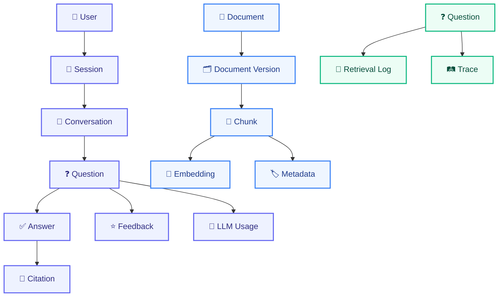
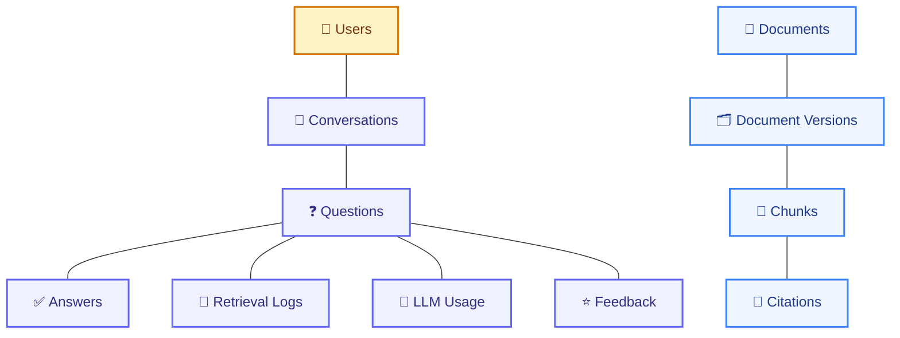

# DATA_MODEL.md

# Telecom Policy Assistant - Data Model

Version: 1.0  
Status: Draft  
Owner: Engineering Team

---

# 1. Purpose

This document defines the logical and physical data model for the Telecom Policy Assistant. The model supports:

- Document management
- Policy versioning
- Chunk storage
- Vector retrieval
- Conversation history
- Citations
- User feedback
- Observability
- FinOps
- Auditability

---

# 2. Design Principles

## DM-001 Traceability

Every answer must be traceable to:

- Document
- Version
- Section
- Page
- Chunk

---

## DM-002 Source of Truth

The knowledge repository is the authoritative source for policy information.

---

## DM-003 Auditability

Every user question and generated answer must be auditable.

---

## DM-004 Cost Visibility

Every model invocation must be measurable and attributable.

---

## DM-005 Future Compatibility

The data model must support:

- CRM integration
- Customer context
- Agentic workflows
- Multiple LLM providers

without schema redesign.

---

# 3. Logical Data Model



---

# 4. Entity Relationship Diagram



---

# 5. Core Domain Entities

## User

Represents an authenticated platform user.

### Fields

```text
id
email
display_name
role
store_id
status
created_at
updated_at
```

### Roles

```text
RETAIL_AGENT

SUPERVISOR

ADMIN

SYSTEM
```

---

## Session

Represents an authenticated user session.

### Fields

```text
id
user_id
started_at
ended_at
ip_address
user_agent
```

---

## Conversation

Represents a chat thread.

### Fields

```text
id
user_id
title
created_at
updated_at
```

---

## Question

Represents a user request.

### Fields

```text
id
conversation_id
question_text
predicted_category
created_at
```

### Example

```json
{
  "question_text": "Can I use my plan in Spain?",
  "predicted_category": "ROAMING"
}
```

---

## Answer

Represents an AI-generated answer.

### Fields

```text
id
question_id
answer_text
confidence_score
model_name
created_at
```

### Example

```json
{
  "confidence_score": 0.91,
  "model_name": "minimax"
}
```

---

# 6. Knowledge Base Entities

## Document

Represents a business document.

### Fields

```text
id
name
category
owner
status
created_at
updated_at
```

---

### Categories

```text
BILLING

ROAMING

USAGE

LEGAL

CONTRACT

PROMOTION

PROCEDURE

DEVICE

SIM_MANAGEMENT

OTHER
```

---

## Document Version

Tracks policy lifecycle.

### Fields

```text
id
document_id
version
status
effective_date
expiration_date
uploaded_at
```

---

### Status

```text
ACTIVE

DRAFT

RETIRED

ARCHIVED
```

---

### Example

```json
{
  "document": "Roaming Policy",
  "version": "v3",
  "status": "ACTIVE"
}
```

---

## Chunk

Represents a retrieval unit.

### Fields

```text
id
document_version_id
page_number
section
subsection
content
token_count
created_at
```

---

### Example

```json
{
  "page_number": 34,
  "section": "Zone 1 Europe",
  "subsection": "Spain"
}
```

---

## Chunk Metadata

Stores retrieval metadata.

### Fields

```text
chunk_id
category
country
product
policy_type
effective_date
status
```

---

### Example

```json
{
  "category": "ROAMING",
  "country": "Spain",
  "status": "ACTIVE"
}
```

---

## Embedding

Stores vector representation.

### Fields

```text
id
chunk_id
model_name
vector
created_at
```

### Model

```text
BGE-M3
```

---

# 7. Retrieval Entities

## Retrieval Log

Captures retrieval operations.

### Fields

```text
id
question_id
filter_metadata
retrieved_chunks
retrieval_time_ms
similarity_scores
created_at
```

---

### Example

```json
{
  "retrieved_chunks": [
    "chunk_1",
    "chunk_2"
  ]
}
```

---

## Citation

Tracks chunks used in final answer.

### Fields

```text
id
answer_id
chunk_id
document_name
page_number
section
```

---

### Example

```json
{
  "document_name": "Roaming Policy",
  "page_number": 34,
  "section": "Zone 1 Europe"
}
```

---

# 8. Feedback Entities

## Feedback

User evaluation of answer quality.

### Fields

```text
id
answer_id
user_id
rating
comment
created_at
```

---

### Rating Values

```text
HELPFUL

NOT_HELPFUL
```

---

# 9. FinOps Entities

## LLM Usage

Tracks model usage and spending.

### Fields

```text
id
question_id
user_id
model_name
input_tokens
output_tokens
total_tokens
latency_ms
estimated_cost
created_at
```

---

### Example

```json
{
  "model_name": "minimax",
  "input_tokens": 2450,
  "output_tokens": 310,
  "estimated_cost": 0.0041
}
```

---

## Cost Summary

Daily aggregated spend.

### Fields

```text
summary_date
questions
tokens
total_cost
```

---

## Store Cost Allocation

### Fields

```text
store_id
month
questions
tokens
cost
```

---

# 10. Observability Entities

## Application Log

### Fields

```text
id
level
service
message
trace_id
created_at
```

---

## Trace

Stores request lifecycle data.

### Fields

```text
id
question_id
started_at
ended_at
duration_ms
status
```

---

## Metrics Snapshot

### Fields

```text
metric_name
metric_value
captured_at
```

### Examples

```text
retrieval_latency

llm_latency

cost_per_question

error_rate
```

---

# 11. Audit Entities

## Audit Log

Captures sensitive actions.

### Fields

```text
id
user_id
action
resource
resource_id
timestamp
```

---

### Actions

```text
LOGIN

LOGOUT

UPLOAD_DOCUMENT

DELETE_DOCUMENT

REINDEX

ACTIVATE_VERSION

UPDATE_ROLE
```

---

# 12. PostgreSQL Schema

## users

```sql
CREATE TABLE users (
    id UUID PRIMARY KEY,
    email VARCHAR(255) UNIQUE NOT NULL,
    display_name VARCHAR(255),
    role VARCHAR(50),
    store_id VARCHAR(50),
    status VARCHAR(20),
    created_at TIMESTAMP DEFAULT NOW(),
    updated_at TIMESTAMP DEFAULT NOW()
);
```

---

## documents

```sql
CREATE TABLE documents (
    id UUID PRIMARY KEY,
    name TEXT NOT NULL,
    category VARCHAR(100),
    owner VARCHAR(255),
    status VARCHAR(50),
    created_at TIMESTAMP,
    updated_at TIMESTAMP
);
```

---

## document_versions

```sql
CREATE TABLE document_versions (
    id UUID PRIMARY KEY,
    document_id UUID REFERENCES documents(id),
    version VARCHAR(20),
    status VARCHAR(20),
    effective_date DATE,
    expiration_date DATE,
    uploaded_at TIMESTAMP
);
```

---

## chunks

```sql
CREATE TABLE chunks (
    id UUID PRIMARY KEY,
    document_version_id UUID REFERENCES document_versions(id),
    page_number INTEGER,
    section TEXT,
    subsection TEXT,
    content TEXT,
    token_count INTEGER,
    embedding VECTOR(1024),
    created_at TIMESTAMP
);
```

---

## conversations

```sql
CREATE TABLE conversations (
    id UUID PRIMARY KEY,
    user_id UUID REFERENCES users(id),
    title TEXT,
    created_at TIMESTAMP,
    updated_at TIMESTAMP
);
```

---

## questions

```sql
CREATE TABLE questions (
    id UUID PRIMARY KEY,
    conversation_id UUID REFERENCES conversations(id),
    question_text TEXT,
    predicted_category VARCHAR(100),
    created_at TIMESTAMP
);
```

---

## answers

```sql
CREATE TABLE answers (
    id UUID PRIMARY KEY,
    question_id UUID REFERENCES questions(id),
    answer_text TEXT,
    confidence_score NUMERIC(4,2),
    model_name VARCHAR(100),
    created_at TIMESTAMP
);
```

---

## citations

```sql
CREATE TABLE citations (
    id UUID PRIMARY KEY,
    answer_id UUID REFERENCES answers(id),
    chunk_id UUID REFERENCES chunks(id),
    document_name TEXT,
    page_number INTEGER,
    section TEXT
);
```

---

## feedback

```sql
CREATE TABLE feedback (
    id UUID PRIMARY KEY,
    answer_id UUID REFERENCES answers(id),
    user_id UUID REFERENCES users(id),
    rating VARCHAR(50),
    comment TEXT,
    created_at TIMESTAMP
);
```

---

## retrieval_logs

```sql
CREATE TABLE retrieval_logs (
    id UUID PRIMARY KEY,
    question_id UUID REFERENCES questions(id),
    filter_metadata JSONB,
    retrieved_chunks JSONB,
    retrieval_time_ms INTEGER,
    similarity_scores JSONB,
    created_at TIMESTAMP
);
```

---

## llm_usage

```sql
CREATE TABLE llm_usage (
    id UUID PRIMARY KEY,
    question_id UUID REFERENCES questions(id),
    user_id UUID REFERENCES users(id),
    store_id VARCHAR(50),
    model_name VARCHAR(100),
    input_tokens INTEGER,
    output_tokens INTEGER,
    total_tokens INTEGER,
    latency_ms INTEGER,
    estimated_cost NUMERIC(12,6),
    created_at TIMESTAMP
);
```

---

## sessions

```sql
CREATE TABLE sessions (
    id UUID PRIMARY KEY,
    user_id UUID REFERENCES users(id),
    started_at TIMESTAMP,
    ended_at TIMESTAMP,
    ip_address INET,
    user_agent TEXT
);
```

---

## audit_logs

```sql
CREATE TABLE audit_logs (
    id UUID PRIMARY KEY,
    user_id UUID REFERENCES users(id),
    action VARCHAR(100),
    resource VARCHAR(100),
    resource_id UUID,
    created_at TIMESTAMP
);
```

---

## application_logs

```sql
CREATE TABLE application_logs (
    id UUID PRIMARY KEY,
    level VARCHAR(20),
    service VARCHAR(100),
    message TEXT,
    trace_id VARCHAR(100),
    created_at TIMESTAMP
);
```

---

## traces

```sql
CREATE TABLE traces (
    id UUID PRIMARY KEY,
    question_id UUID REFERENCES questions(id),
    started_at TIMESTAMP,
    ended_at TIMESTAMP,
    duration_ms INTEGER,
    status VARCHAR(20)
);
```

---

## metrics_snapshots

```sql
CREATE TABLE metrics_snapshots (
    metric_name VARCHAR(100),
    metric_value NUMERIC,
    captured_at TIMESTAMP
);
```

---

## daily_cost_summary

```sql
CREATE TABLE daily_cost_summary (
    summary_date DATE,
    requests INTEGER,
    tokens BIGINT,
    cost NUMERIC(12,2)
);
```

---

## store_cost_summary

```sql
CREATE TABLE store_cost_summary (
    store_id VARCHAR(50),
    summary_month DATE,
    questions INTEGER,
    tokens BIGINT,
    cost NUMERIC(12,2)
);
```

---

# 13. Indexing Strategy

## Relational Indexes

```sql
CREATE INDEX idx_documents_category
ON documents(category);
```

```sql
CREATE INDEX idx_document_versions_status
ON document_versions(status);
```

```sql
CREATE INDEX idx_questions_category
ON questions(predicted_category);
```

---

## Full Text Search

```sql
CREATE INDEX idx_chunks_fts
ON chunks
USING GIN (
    to_tsvector('english', content)
);
```

---

## Vector Search

```sql
CREATE INDEX idx_chunks_embedding
ON chunks
USING ivfflat (
    embedding vector_cosine_ops
);
```

---

# 14. Retention Policy

## Conversations

```text
24 Months
```

---

## Retrieval Logs

```text
12 Months
```

---

## LLM Usage

```text
24 Months
```

---

## Audit Logs

```text
According to corporate policy
```

---

# 15. Future

Planned evolution of the data model:

```text
CRM Integration

Customer Context Tables

Agentic Workflow Support

Multiple LLM Provider Tracking

Session Analytics

Knowledge Graph Entities
```

These extensions shall not require schema redesign.

---

# Definition of Success

The data model provides complete traceability from documents and versions through chunks, embeddings, retrieval, answers, and citations, while making every question, model invocation, and cost attributable to a user, store, and conversation — with full audit and observability support.
