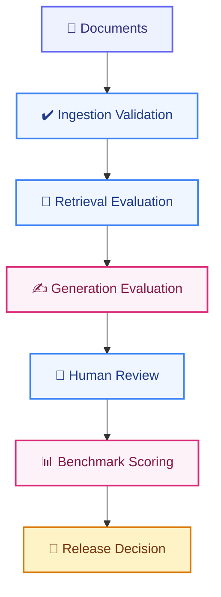

# EVALUATION_PLAN.md

# Telecom Policy Assistant - Evaluation Plan

Version: 1.0  
Status: Draft  
Owner: AI Engineering Team  
Review Cycle: Monthly

---

# 1. Purpose

This document defines the evaluation framework for the Telecom Policy Assistant. The objective is to continuously measure and improve:

- Retrieval quality
- Answer quality
- Citation accuracy
- User satisfaction
- Hallucination prevention
- Latency
- Cost efficiency

Evaluation must be performed:

```text
Before Production Release

After Major Changes

Continuously in Production
```

The evaluation framework serves as the release gate for all model, retrieval, prompt, and ingestion updates.

---

# 2. Evaluation Objectives

The platform must demonstrate:

## Accurate Retrieval

The correct policy content is retrieved.

---

## Grounded Responses

Responses must be supported by retrieved evidence.

---

## Source Traceability

Every answer must reference valid source documents.

---

## Low Hallucination Rate

The assistant must not generate unsupported policy statements.

---

## Operational Efficiency

The system must achieve target response times and cost objectives.

---

# 3. Evaluation Scope

The evaluation process covers:

## Ingestion Layer

Validate:

```text
Document Extraction

Chunk Quality

Metadata Quality

Embedding Coverage
```

---

## Retrieval Layer

Validate:

```text
Recall

Precision

Ranking Quality

Context Relevance
```

---

## Generation Layer

Validate:

```text
Correctness

Completeness

Grounding

Clarity
```

---

## Production Experience

Validate:

```text
Latency

Reliability

User Satisfaction

Cost Efficiency
```

---

# 4. Evaluation Framework



---

# 5. Benchmark Dataset

## Objective

Create a representative dataset of telecom policy questions.

---

## Dataset Sources

Questions should come from:

```text
Retail Agents

Store Managers

Call Center Agents

Training Teams

FAQs

Support Tickets
```

---

## Dataset Size

### MVP

```text
200 Questions
```

---

### Target

```text
500 Questions
```

---

### Mature Platform

```text
1000+ Questions
```

---

# 6. Dataset Categories

The test set should contain balanced domain coverage.

---

## Billing

Examples:

```text
Why was the customer charged extra?

What are out-of-bundle fees?

How is prorated billing calculated?
```

---

## Roaming

Examples:

```text
Can I use my plan in Spain?

What countries belong to Zone 1?

How is roaming charged?
```

---

## Usage Policies

Examples:

```text
What happens after data exhaustion?

What is the fair use policy?
```

---

## Contracts

Examples:

```text
Can a customer cancel early?

Are termination fees charged?
```

---

## Legal

Examples:

```text
What is the cooling-off period?

What are cancellation rights?
```

---

## Promotions

Examples:

```text
Can two promotions be combined?

When does promotion X expire?
```

---

# 7. Gold Standard Dataset

Each test case must contain:

```json
{
  "question_id": "ROAM_001",
  "category": "ROAMING",
  "question": "Can I use my plan in Spain?",
  "expected_documents": [
    "Roaming Policy V3"
  ],
  "expected_section": "Zone 1 Europe",
  "expected_answer": "..."
}
```

---

# 8. Ingestion Evaluation

## Objective

Ensure content enters the knowledge base correctly.

---

## Metrics

### Extraction Success Rate

Formula:

```text
Successfully Extracted Documents
/
Total Documents
```

Target:

```text
100%
```

---

### Metadata Coverage

Formula:

```text
Populated Metadata Fields
/
Expected Metadata Fields
```

Target:

```text
> 95%
```

---

### Embedding Coverage

Formula:

```text
Embedded Chunks
/
Total Chunks
```

Target:

```text
100%
```

---

# 9. Retrieval Evaluation

## Objective

Verify the correct chunks are retrieved.

---

# 10. Retrieval Metrics

## Recall@5

Measures whether relevant chunks appear within top five results.

Formula:

```text
Relevant Chunks Retrieved
/
Relevant Chunks Available
```

Target:

```text
> 90%
```

---

## Recall@10

Target:

```text
> 95%
```

---

## Precision@5

Measures retrieval relevance.

Target:

```text
> 85%
```

---

## Mean Reciprocal Rank (MRR)

Measures ranking quality.

Target:

```text
> 0.85
```

---

## nDCG

Measures ranking effectiveness.

Target:

```text
> 0.90
```

---

# 11. Reranker Evaluation

## Objective

Prove reranking improves retrieval quality.

---

## Compare

Baseline:

```text
Retriever Only
```

Candidate:

```text
Retriever + Reranker
```

---

## Metrics

```text
Recall@5

Precision@5

MRR

nDCG
```

Expected:

```text
Improved Top-5 Relevance
```

---

# 12. Citation Evaluation

## Objective

Ensure sources are accurate.

---

## Citation Coverage

Measures:

```text
Answers Containing Citations
```

Target:

```text
100%
```

---

## Citation Accuracy

Measures:

```text
Correct Document Referenced
```

Target:

```text
> 95%
```

---

## Page Accuracy

Measures:

```text
Correct Page Referenced
```

Target:

```text
> 90%
```

---

# 13. Generation Evaluation

## Objective

Evaluate answer quality.

---

## Correctness

Question:

```text
Is the answer factually correct?
```

Target:

```text
> 90%
```

---

## Completeness

Question:

```text
Does the answer fully address the user question?
```

Target:

```text
> 85%
```

---

## Clarity

Question:

```text
Can a retail employee understand the answer?
```

Target:

```text
> 90%
```

---

## Consistency

Question:

```text
Does the assistant provide consistent answers?
```

Target:

```text
> 95%
```

---

# 14. Grounding Evaluation

## Objective

Measure answer support from retrieved evidence.

---

## Grounding Score

Score:

```text
0–100
```

Target:

```text
> 90
```

---

## Unsupported Statements

Target:

```text
0%
```

for policy claims.

---

# 15. Hallucination Evaluation

## Definition

A hallucination occurs when the assistant states information not supported by retrieved documents.

---

## Examples Forbidden

```text
Invented Policies

Invented Fees

Invented Penalties

Invented Roaming Rules

Invented Legal Conditions
```

---

## Hallucination Rate

Formula:

```text
Hallucinated Answers
/
Total Answers
```

Target:

```text
< 2%
```

---

## Critical Hallucinations

Examples:

```text
Legal Advice

Pricing Errors

Contract Terms

Regulatory Statements
```

Target:

```text
0%
```

---

# 16. Fallback Evaluation

## Objective

Verify behavior when information does not exist.

---

## Test Examples

```text
What is the roaming policy for Mars?

What is the customer discount policy from 2040?
```

---

## Expected Response

```text
I could not find this information in the available policy documents.
```

---

## Success Rate

Target:

```text
100%
```

---

# 17. Human Evaluation

## Participants

```text
Retail Agents

Supervisors

Knowledge Managers

Training Teams
```

---

## Review Criteria

### Accuracy

Rate 1-5

---

### Clarity

Rate 1-5

---

### Helpfulness

Rate 1-5

---

### Trustworthiness

Rate 1-5

---

### Source Quality

Rate 1-5

---

# 18. User Acceptance Testing (UAT)

## Minimum Participants

```text
20 Retail Users
```

---

## Minimum Questions

```text
200 Real Questions
```

---

## Target Satisfaction

```text
> 80%
```

positive feedback.

---

# 19. Production Evaluation

## Continuous Monitoring

Track:

```text
Feedback

Confidence Scores

Failed Questions

Citation Quality

Response Times
```

---

## Weekly Review

Review:

```text
Top Questions

Negative Feedback

Knowledge Gaps

Cost Trends
```

---

# 20. Performance Evaluation

## Response Time

Target:

```text
< 5 Seconds
```

Preferred:

```text
< 3 Seconds
```

---

## Retrieval Latency

Target:

```text
< 500 ms
```

---

## Reranking Latency

Target:

```text
< 1000 ms
```

---

## LLM Latency

Target:

```text
< 3000 ms
```

---

# 21. Load Testing

## Concurrent Users

Test:

```text
50 Users

100 Users

250 Users

500 Users
```

---

## Success Criteria

```text
No Service Failure

No Data Loss

Error Rate < 2%
```

---

# 22. FinOps Evaluation

## Cost Per Question

Target:

```text
< $0.03
```

---

## Average Tokens

Target:

```text
< 3000 Tokens Per Request
```

---

## Daily Spend

Must remain within approved budget.

---

## Cost Trend Analysis

Track:

```text
User Growth

Question Growth

Cost Growth
```

---

# 23. Regression Testing

Regression testing is mandatory after changes to:

```text
Prompts

Embedding Model

Reranker

Retrieval Logic

Chunking Strategy

LLM Provider

Metadata Rules
```

---

## Release Gate

Deployment may proceed only if:

```text
Recall@5 >= 90%

Citation Accuracy >= 95%

Answer Accuracy >= 90%

Hallucination Rate < 2%

Latency < 5 Seconds

Cost Targets Met

Unit Tests Passed

Integration Tests Passed

Security Scan Passed

No Critical Vulnerabilities
```

---

# 24. Evaluation Dashboard

The dashboard shall display:

---

## Retrieval Metrics

```text
Recall@5

Recall@10

Precision@5

MRR

nDCG
```

---

## Generation Metrics

```text
Accuracy

Grounding Score

Hallucination Rate

Citation Accuracy
```

---

## User Metrics

```text
Feedback Score

Helpful Rate

UAT Results
```

---

## Operational Metrics

```text
Response Time

Error Rate

Availability

Cost Per Question
```

---

# 25. Production Readiness Criteria

The Telecom Policy Assistant is considered production ready when:

```text
Recall@5 > 90%

Citation Accuracy > 95%

Answer Accuracy > 90%

Hallucination Rate < 2%

Helpful Feedback > 80%

Availability > 99.5%

Response Time < 5 Seconds
```

---

# 26. Guardrail Evaluation

## Objective

Verify that AI guardrails remain effective in production.

---

## Effectiveness Criteria

Guardrails are considered effective when:

```text
Hallucination Rate < 2%

Citation Coverage = 100%

Unsupported Statements = 0%

Prompt Injection Success Rate = 0%

Data Leakage Events = 0%

Fallback Compliance = 100%
```

---

## Guardrail Monitoring

Track:

```text
Guardrail Triggered Events

Fallback Response Rate

Restricted Topic Attempts

PII Detection Events
```

---

# 27. Adversarial Testing (Red Team)

## Purpose

Continuously test guardrail effectiveness against adversarial inputs.

---

## Test Categories

```text
Prompt Injection

Jailbreak Attempts

Role Manipulation

Data Exfiltration Attempts

Unsupported Policy Claims
```

---

## Frequency

```text
Quarterly red team exercises

After every prompt change

After every model change
```

---

## Success Criteria

Red team testing is successful when:

```text
No prompt injection succeeds

No system prompts are revealed

No data leakage occurs

All unsupported claims are refused
```

---

# Definition of Success

The Telecom Policy Assistant consistently delivers accurate, grounded, source-cited answers with high retrieval quality, low hallucination rates, acceptable operational costs, and strong user satisfaction, while providing measurable evidence that every release meets enterprise-grade quality standards.