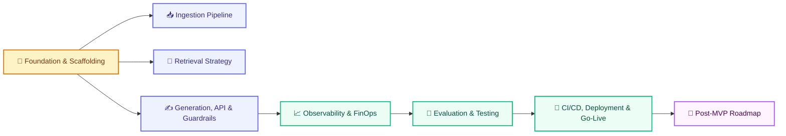

# EXECUTION_PLAN.md

# Telecom Policy Assistant - Execution Plan

Version: 1.0  
Status: Draft  
Owner: Platform Engineering & Product Management

---

# 1. Purpose

This document defines the execution plan for building, hardening, and delivering the Telecom Policy Assistant. It sequences the work defined across the specification documents into phases with clear scope, deliverables, exit criteria, and governed requirements.

The plan covers the MVP vertical slice (ingestion, retrieval, generation, chat) through production hardening and post-MVP evolution.

---

# 2. Plan Overview



---

# 3. Phase 0 - Foundation & Scaffolding

## Objective

Establish the repository, infrastructure, database schema, and baseline delivery pipeline.

---

## Deliverables

Scaffold the repository per ARCHITECTURE.md (Repository Structure):

```text
frontend/
backend/
scripts/
prompts/
evaluations/
infra/
.github/workflows/
docs/
```

Provision:

```text
docker-compose.yml (frontend, api, postgres, prometheus, grafana, langfuse)

.env.example (DATABASE_URL, OPENROUTER_API_KEY, JWT_SECRET, LANGFUSE_PUBLIC_KEY, LANGFUSE_SECRET_KEY)

PostgreSQL + pgvector

Alembic migrations for all DATA_MODEL tables
```

Establish baseline CI:

```text
build.yml

test.yml

security.yml
```

---

## Exit Criteria

```text
All services boot via docker compose

GET /api/v1/health/ready returns READY / UP

Database schema migrations apply cleanly

CI pipeline executes without failure
```

---

## References

```text
ARCHITECTURE.md (Section 13 - Deployment Architecture)

DATA_MODEL.md (Section 12 - PostgreSQL Schema)

RUNBOOK.md (Appendix A, Sections 7-10)
```

---

# 4. Phase 1 - Ingestion Pipeline

## Objective

Transform raw policy PDFs into versioned, searchable, embedded knowledge assets.

---

## Deliverables

```text
Upload and document validation (PDF only, <= 100 MB, <= 2,000 pages)

Text extraction (PyMuPDF / pdfplumber)

Structure and metadata extraction

Chunking (500-800 tokens target, 100 overlap, 200 min, 1,000 max)

Embedding generation (BAAI/bge-m3, 1024 dimensions)

Storage into pgvector

Version management (one ACTIVE version per policy family)

Duplicate detection (flag at >= 95% similarity)

Quality validation and ingestion audit logging
```

---

## Exit Criteria

```text
Sample policy set ingests with > 99% success rate

Processing speed < 5 seconds per 100 pages

Embedding throughput >= 1,000 chunks/minute

ingestion_* metrics and audit logs recorded
```

---

## References

```text
INGESTION_SPEC.md

DATA_MODEL.md (Document, Document Version, Chunk, Embedding)

OBSERVABILITY.md (Sections 6, 8)
```

---

# 5. Phase 2 - Retrieval Strategy

## Objective

Deliver precise, ranked, source-traceable retrieval of active policy content.

---

## Deliverables

```text
Query normalization and classification (10 categories)

Metadata-first filtering (category, status, version, effective date)

Cosine vector search (top 20 candidates)

Re-ranking (BAAI/bge-reranker-v2-m3, top 5 chunks)

Context assembly and citation construction

Confidence scoring (0.85 high, 0.70 threshold, 0.65 minimum similarity)

Unified fallback responses

retrieval_logs capture
```

---

## Exit Criteria

```text
Retrieval honors candidate_chunks: 20, final_chunks: 5

Recall@5 and related metrics are measurable

Retrieval latency < 500 ms; total pipeline < 2 seconds

Fallback and confidence behavior matches RETRIEVAL_STRATEGY and SECURITY
```

---

## References

```text
RETRIEVAL_STRATEGY.md

SECURITY.md (Section 13 - AI Security Controls)
```

---

# 6. Phase 3 - Generation, API & Guardrails

## Objective

Expose the assistant through a secure, versioned REST API with grounded, source-cited answers.

---

## Deliverables

Implement all API_SPEC endpoints under the /api/v1 base URL:

```text
POST /chat/ask

POST /conversations (CRUD)

POST /feedback

POST /search

POST /documents/upload, /documents/{id}, /activate, /reindex

POST /admin/reindex, /admin/embeddings/rebuild

GET /reports/costs, /reports/usage, /reports/models

GET /health, /health/ready, /health/live
```

Integrate:

```text
MiniMax via OpenRouter

Versioned prompt registry under prompts/

Guardrails: grounding, citations, confidence/fallback, injection protection, restricted topics, PII handling

OIDC authentication (Entra ID / Keycloak)

RBAC (RETAIL_AGENT, SUPERVISOR, ADMIN, SYSTEM)

Rate limits (60 / 120 / 300 requests per minute)
```

---

## Exit Criteria

```text
Chat round-trip < 5 seconds (target < 3 seconds) with citations

All health endpoints respond correctly

Guardrail test suite passes

Unauthenticated access is rejected
```

---

## References

```text
API_SPEC.md

SECURITY.md

RUNBOOK.md (Section 7 - Start-Up Procedure)
```

---

# 7. Phase 4 - Observability & FinOps

## Objective

Provide full visibility into reliability, retrieval quality, LLM behavior, user experience, and cost.

---

## Deliverables

```text
Structured JSON logging

Langfuse distributed tracing

Prometheus metrics (api_*, llm_*, retrieval_*, cost_*)

Grafana dashboards (Executive, Operations, AI Quality, FinOps)

Alertmanager alerting to Teams / Email

Cost tracking (llm_usage with store_id, daily_cost_summary, store_cost_summary)

Budget thresholds (warning 80%, high 90%, critical 100%)

Delivery pipeline metrics
```

---

## Exit Criteria

```text
SLOs visible and measured (availability 99.5%, P95 API < 5 seconds)

Cost per question < $0.03 tracked

Alerts fire on configured conditions

100% of requests traceable
```

---

## References

```text
OBSERVABILITY.md

FINOPS.md

RUNBOOK.md (Sections 17, 23)
```

---

# 8. Phase 5 - Evaluation & Testing

## Objective

Prove the system meets enterprise quality standards before release.

---

## Deliverables

```text
Gold standard dataset (MVP 200 questions toward 500)

Ingestion, retrieval, generation, grounding, hallucination, and citation evaluation

Guardrail evaluation (hallucination < 2%, citation 100%, injection 0%, leaks 0%)

Adversarial red team testing (quarterly, after prompt/model changes)

Human evaluation and UAT (20 retail users, 200 real questions)

Load testing (50 to 500 concurrent users, error rate < 2%)
```

---

## Exit Criteria

Release gate satisfied:

```text
Recall@5 >= 90%

Citation Accuracy >= 95%

Answer Accuracy >= 90%

Hallucination Rate < 2%

Latency < 5 Seconds

Cost Targets Met

Unit / Integration Tests Passed

Security Scan Passed

No Critical Vulnerabilities
```

---

## References

```text
EVALUATION_PLAN.md (Sections 23, 26, 27)

RUNBOOK.md (Appendix A - Quality Gates)
```

---

# 9. Phase 6 - CI/CD, Deployment & Go-Live

## Objective

Ship tested, secure, evaluated releases through a governed pipeline and operate the service in production.

---

## Deliverables

```text
Full delivery pipeline (build, test, security, evaluation, deploy-test, deploy-prod, rollback)

Environment promotion (Development, Test, Staging, Production)

Blue-green or rolling deployment with automated health checks

Security scanning (dependency, SAST, container, secret detection)

Disaster recovery (daily full backup, hourly WAL, quarterly restore; RTO 4h, RPO 1h)

Go-live and operational checklists (daily, weekly, monthly)
```

---

## Exit Criteria

```text
Production deployment passes all quality gates

Rollback tested and functional

Recovery objectives validated

Post-deployment validation confirms health, search, chat, metrics, tracing
```

---

## References

```text
RUNBOOK.md (Appendix A, Sections 9-11, 15-16, 24)

SECURITY.md (Secure Delivery Gates, Backup & Recovery Security)
```

---

# 10. Phase 7 - Post-MVP Roadmap

## Objective

Extend the assistant with customer context, copilot capabilities, and intelligent retrieval.

---

## Evolution Path

```text
Phase 2 - CRM Context Integration

Phase 3 - Retail Copilot

Phase 4 - Omnichannel / Agentic Workflows
```

Retrieval enhancements:

```text
Hybrid retrieval (vector + full-text)

Query expansion

Knowledge graph retrieval

Agentic retrieval
```

Cost maturation:

```text
Caching

Prompt compression

Dynamic model routing

Automated budget enforcement
```

---

## References

```text
PRD.md (Section 19 - Roadmap)

ARCHITECTURE.md (Section 16 - Future Evolution)

RETRIEVAL_STRATEGY.md (Section 22 - Future Enhancements)

FINOPS.md (FinOps Maturity Roadmap)
```

---

# 11. Dependencies & Parallelization

## Sequential Dependencies

```text
Phase 0 must complete before all implementation phases

Phase 4 (Observability) must precede Phase 5 (Evaluation)

Phase 5 must precede Phase 6 (Go-Live)
```

---

## Parallelizable Workstreams

Once Phase 0 completes, the following may proceed in parallel:

```text
Ingestion (Phase 1) and Retrieval (Phase 2)

Generation / API / Guardrails (Phase 3)

Observability and FinOps instrumentation (Phase 4)
```

Evaluation dataset curation (Phase 5) should begin early in parallel with Phases 1-3.

---

# 12. Reference Documents

```text
PRD.md

ARCHITECTURE.md

DATA_MODEL.md

INGESTION_SPEC.md

RETRIEVAL_STRATEGY.md

API_SPEC.md

SECURITY.md

OBSERVABILITY.md

FINOPS.md

EVALUATION_PLAN.md

RUNBOOK.md
```

---

# Definition of Success

The Telecom Policy Assistant is delivered through a phased, governed execution plan in which each phase produces a validated, measured increment — from raw policy PDFs to versioned, embedded knowledge, source-cited grounded answers, secure access, full observability, controlled cost, and a pipeline that releases with confidence — enabling retail employees to ask policy questions naturally and receive trustworthy answers within seconds.