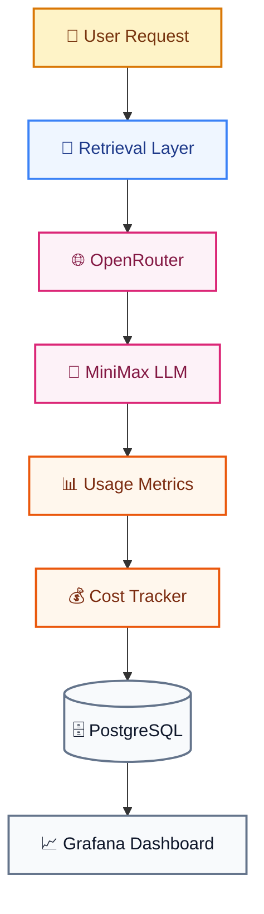

# FINOPS.md

# Telecom Policy Assistant - FinOps Strategy

Version: 1.0  
Status: Draft  
Owner: Platform Engineering & Product Management

---

# 1. Purpose

This document defines the Financial Operations (FinOps) framework for the Telecom Policy Assistant. The purpose of FinOps is to provide visibility, accountability, governance, forecasting, and optimization of AI-related expenses while ensuring business value is maximized.

The framework covers:

- AI model costs
- Token usage
- Storage costs
- Infrastructure costs
- Monitoring costs
- Cost attribution
- Budget management
- Cost optimization

---

# 2. FinOps Objectives

## FIN-001 Cost Transparency

Every AI request must be measurable.

---

## FIN-002 Cost Allocation

Costs must be attributable to:

```text
User

Store

Team

Environment

Feature

Model
```

---

## FIN-003 Budget Control

Consumption must remain within approved budgets.

---

## FIN-004 Optimization

Cost reduction initiatives must not negatively impact answer quality.

---

## FIN-005 Forecasting

Future spending must be predictable.

---

# 3. Financial Architecture



---

# 4. Cost Components

## AI Costs

Includes:

```text
Prompt Tokens

Context Tokens

Completion Tokens

Embedding Generation
```

---

## Platform Costs

Includes:

```text
FastAPI Hosting

PostgreSQL

Storage

Networking

Monitoring
```

---

## Operations Costs

Includes:

```text
Support

Maintenance

Monitoring
```

---

# 5. Cost Attribution Model

## User Attribution

Each request shall be linked to:

```text
User ID
Store ID
Question ID
```

Example:

```json
{
  "user_id": "agent123",
  "store_id": "TOR001",
  "question_id": "uuid",
  "cost": 0.0042
}
```

---

## Store Attribution

Track:

```text
Questions

Tokens

Cost

Users
```

per store.

---

## Model Attribution

Track:

```text
Model Name

Request Count

Token Usage

Cost

Latency
```

---

# 6. Usage Tracking Requirements

Every LLM request must store:

```text
Question ID

Conversation ID

User ID

Store ID

Model Name

Input Tokens

Output Tokens

Latency

Estimated Cost

Timestamp
```

Example:

```json
{
  "model": "minimax",
  "input_tokens": 2300,
  "output_tokens": 290,
  "latency_ms": 1850,
  "estimated_cost": 0.0045
}
```

---

# 7. Cost Data Model

## llm_usage

```sql
CREATE TABLE llm_usage (
    id UUID PRIMARY KEY,
    question_id UUID,
    user_id UUID,
    store_id VARCHAR(50),
    model_name VARCHAR(100),
    input_tokens INTEGER,
    output_tokens INTEGER,
    total_tokens INTEGER,
    latency_ms INTEGER,
    estimated_cost NUMERIC(12,6),
    created_at TIMESTAMP
);
```

---

## daily_cost_summary

```sql
CREATE TABLE daily_cost_summary (
    summary_date DATE,
    requests INTEGER,
    tokens BIGINT,
    cost NUMERIC(12,2)
);
```

---

## store_cost_summary

```sql
CREATE TABLE store_cost_summary (
    store_id VARCHAR(50),
    summary_month DATE,
    questions INTEGER,
    tokens BIGINT,
    cost NUMERIC(12,2)
);
```

---

# 8. Core KPIs

## Total AI Cost

Formula:

```text
Sum(All LLM Costs)
```

---

## Cost Per Question

Formula:

```text
Total Cost / Total Questions
```

Target:

```text
< $0.03
```

---

## Cost Per User

Formula:

```text
Monthly Cost / Active Users
```

---

## Cost Per Store

Formula:

```text
Store Cost / Store Questions
```

---

## Cost Per 1,000 Questions

Formula:

```text
(Total Cost / Total Questions) × 1000
```

---

## Average Token Consumption

Formula:

```text
Total Tokens / Total Questions
```

---

# 9. Token Governance

## Input Tokens

Includes:

```text
System Prompt

User Question

Conversation Context

Retrieved Chunks
```

---

## Output Tokens

Includes:

```text
Generated Answer
```

---

## Total Tokens

Formula:

```text
Input Tokens + Output Tokens
```

---

## Target

Maintain:

```text
Average Total Tokens < 3000
```

per request.

---

# 10. Budget Management

## Daily Budget

Example:

```text
$15 / Day
```

---

## Monthly Budget

Example:

```text
$500 / Month
```

---

## Quarterly Budget

Example:

```text
$1500 / Quarter
```

---

# 11. Budget Thresholds

## Warning

Triggered at:

```text
80%
```

---

## High Alert

Triggered at:

```text
90%
```

---

## Critical

Triggered at:

```text
100%
```

---

## Action Matrix

| Threshold | Action |
|-----------|--------|
| 80% | Notify Platform Team |
| 90% | Notify Product Owner |
| 100% | Escalate and Review Usage |

---

# 12. Cost Monitoring

## Daily Review

Track:

```text
Questions

Costs

Token Usage

Error Rate
```

---

## Weekly Review

Track:

```text
Trend Analysis

Store Adoption

Model Utilization
```

---

## Monthly Review

Track:

```text
Budget Consumption

Forecast

Optimization Opportunities
```

---

# 13. Optimization Strategy

## Optimization 1 - Improve Retrieval

Better retrieval reduces:

```text
Context Size

Token Count

Response Cost
```

---

## Optimization 2 - Context Reduction

Current:

```text
20 Retrieved Chunks
```

Final:

```text
5 Reranked Chunks
```

---

## Optimization 3 - Prompt Engineering

Reduce:

```text
Repeated Instructions

Unnecessary Examples

Verbose System Prompts
```

---

## Optimization 4 - Response Constraints

Limit:

```text
Maximum Output Tokens
```

where appropriate.

---

## Optimization 5 - Caching

Cache:

```text
Popular Questions

Common Roaming Questions

Frequently Accessed Policies
```

---

# 14. Model Evaluation

## Purpose

Select best balance between:

```text
Quality

Latency

Cost
```

---

## Evaluation Metrics

### Quality Score

Based on:

```text
Grounding

Correctness

User Feedback
```

---

### Cost Score

Based on:

```text
Average Cost Per Request
```

---

### Latency Score

Based on:

```text
Average Response Time
```

---

## Benchmark Example

| Model | Quality | Cost | Latency |
|-------|---------|------|---------|
| MiniMax | 8.7 | Low | 2.1 sec |
| Claude | 9.2 | High | 3.4 sec |
| GPT | 9.0 | Medium | 3.0 sec |
| Qwen | 8.1 | Low | 2.3 sec |

---

# 15. Cost Forecasting

## Forecast Model

Formula:

```text
Expected Users
×
Questions Per Day
×
Cost Per Question
×
Days
```

---

## Example

```text
150 Users

15 Questions / Day

$0.004 Cost / Question
```

Monthly Cost:

```text
150 × 15 × 30 × 0.004

= $270
```

---

# 16. Dashboards

## Executive Dashboard

Audience:

```text
Management

Product Owners
```

Displays:

```text
Monthly Spend

Budget Status

Cost Trend

ROI Indicators
```

---

## FinOps Dashboard

Audience:

```text
Platform Team
```

Displays:

```text
Daily Cost

Token Consumption

Model Costs

Forecast
```

---

## Store Dashboard

Audience:

```text
Regional Managers
```

Displays:

```text
Questions by Store

Cost by Store

Cost per Question
```

---

# 17. Chargeback Model (Optional)

Future capability. Costs may be allocated by:

```text
Store

Region

Department

Business Unit
```

Example:

```text
Toronto Region

Monthly Spend: $145

Questions: 6,000

Cost / Question: $0.024
```

---

# 18. Cost Alerts

## Daily Cost Spike

Condition:

```text
> 30% increase compared to previous day
```

---

## Token Spike

Condition:

```text
> 30% increase in token consumption
```

---

## Excessive User Activity

Condition:

```text
User exceeds allowed request volume
```

---

## Budget Breach

Condition:

```text
Monthly spend exceeds approved budget
```

---

# 19. Roles & Responsibilities

## Product Owner

Responsible for:

```text
Budget Approval

Spend Monitoring

ROI Evaluation
```

---

## Platform Team

Responsible for:

```text
Tracking

Alerting

Forecasting

Optimization
```

---

## AI Engineering Team

Responsible for:

```text
Prompt Optimization

Retrieval Optimization

Model Benchmarking
```

---

# 20. FinOps Maturity Roadmap

## Phase 1 Visibility

```text
Cost Tracking

Usage Reporting

Token Monitoring
```

---

## Phase 2 Control

```text
Budgets

Alerts

Forecasting
```

---

## Phase 3 Optimization

```text
Caching

Prompt Compression

Context Reduction
```

---

## Phase 4 Automation

```text
Dynamic Model Routing

Cost-Based Model Selection

Automated Budget Enforcement
```

---

# FinOps Success Metrics

## Cost Per Question

Target:

```text
< $0.03
```

---

## Budget Compliance

Target:

```text
100%
```

within approved budget.

---

## Usage Visibility

Target:

```text
100% of requests traceable
```

---

## Forecast Accuracy

Target:

```text
±10%
```

monthly variance.

---

# Definition of Success

The Telecom Policy Assistant provides complete visibility and control over AI spending, allowing stakeholders to accurately track costs, forecast growth, optimize model usage, enforce budgets, and scale adoption while maintaining high answer quality and operational efficiency.