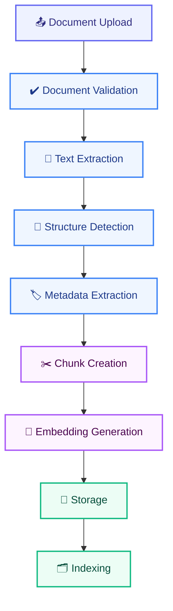
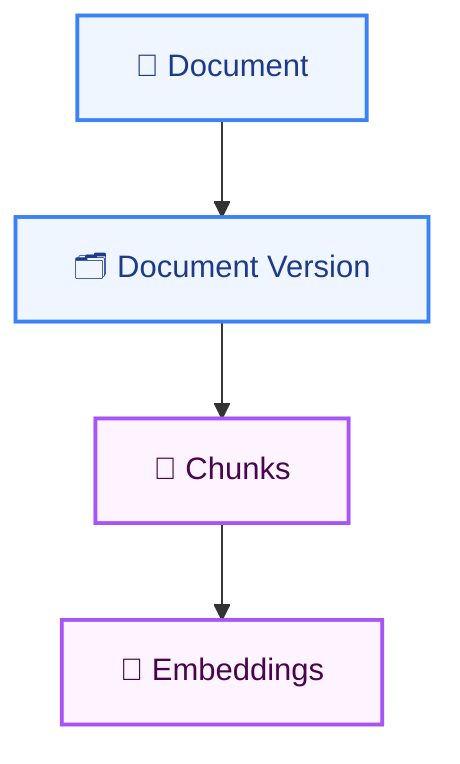

# INGESTION_SPEC.md

# Telecom Policy Assistant - Ingestion Specification

Version: 1.0  
Status: Draft  
Owner: AI Engineering Team

---

# 1. Purpose

This document defines the ingestion architecture, processing workflow, metadata standards, chunking strategy, quality controls, and operational requirements for onboarding telecom policy documents into the Telecom Policy Assistant knowledge base.

The goal of the ingestion process is to transform raw policy documents into high-quality, searchable, versioned knowledge assets that can be used by the retrieval system.

---

# 2. Objectives

The ingestion pipeline shall:

- Extract text from policy documents
- Preserve document structure
- Generate semantically meaningful chunks
- Create rich metadata
- Generate vector embeddings
- Store chunks in PostgreSQL + pgvector
- Support policy versioning
- Enable document traceability
- Support future document updates

---

# 3. Supported Input Sources

## Phase 1

Supported formats:

```text
PDF
```

Supported document categories:

```text
Billing Policies

Roaming Policies

Usage Policies

Legal Policies

Contract Policies

Promotional Offers

Procedures

SIM Management

Device Policies
```

---

## Future Phases

Potential formats:

```text
DOCX

HTML

SharePoint

Confluence

Knowledge Base Articles

Markdown
```

---

# 4. Ingestion Architecture



---

# 5. Ingestion Pipeline

## Stage 1 - Upload

Input:

```text
Roaming Policy.pdf
Billing Policy.pdf
Legal Terms.pdf
```

Requirements:

```text
PDF only

Maximum Size = 100 MB

Maximum Pages = 2,000
```

---

## Stage 2 - Validation

Validate:

```text
File type

Document readability

Category assignment

Version information
```

---

### Validation Failures

Examples:

```text
Corrupted PDF

Missing version

Unsupported file type

Unreadable document
```

---

## Stage 3 - Text Extraction

### Objective

Extract business content while preserving document hierarchy.

---

### Extract

```text
Headings

Subheadings

Paragraphs

Lists

Tables

Footnotes

Page Numbers
```

---

### Recommended Libraries

```text
PyMuPDF

pdfplumber
```

---

## Stage 4 - Structure Detection

### Objective

Preserve semantic sections.

---

### Example

Raw Document:

```text
7. Roaming

7.1 Zone 1

Spain

Customers can use ...
```

Structured Format:

```json
{
  "section": "Roaming",
  "subsection": "Zone 1",
  "topic": "Spain"
}
```

---

## Stage 5 - Metadata Extraction

### Objective

Generate retrieval-friendly metadata.

---

## Document Metadata

```json
{
  "document_name": "Roaming Policy",
  "category": "ROAMING",
  "version": "v3",
  "status": "ACTIVE",
  "effective_date": "2026-01-01"
}
```

---

## Chunk Metadata

```json
{
  "chunk_id": "uuid",
  "page_number": 34,
  "section": "Zone 1",
  "subsection": "Spain"
}
```

---

# 6. Metadata Standards

## Mandatory Fields

Each chunk must contain:

```json
{
  "document_id": "",
  "document_name": "",
  "document_version": "",
  "document_status": "",
  "category": "",
  "page_number": 0,
  "section": "",
  "subsection": "",
  "effective_date": ""
}
```

---

## Categories

Allowed values:

```text
BILLING

ROAMING

USAGE

LEGAL

CONTRACT

PROMOTION

PROCEDURE

DEVICE

SIM_MANAGEMENT

OTHER
```

---

## Status Values

```text
ACTIVE

DRAFT

RETIRED

ARCHIVED
```

---

# 7. Chunking Strategy

## Goal

Create semantically complete knowledge units. A chunk must represent a complete policy concept.

---

## Principles

### Keep Rules Together

Bad:

```text
Chunk 1

Customers roaming in Spain can

---

Chunk 2

use domestic allowance...
```

Good:

```text
Entire roaming rule stored together
```

---

### Keep Conditions With Exceptions

Do not separate:

```text
Eligibility

Conditions

Exceptions

Penalties
```

---

### Respect Sections

Do not mix:

```text
Billing

Roaming

Legal
```

content in the same chunk.

---

# 8. Chunk Configuration

## Target Size

```text
500 - 800 tokens
```

---

## Overlap

```text
100 tokens
```

---

## Minimum Size

```text
200 tokens
```

---

## Maximum Size

```text
1000 tokens
```

---

# 9. Chunk Structure

Example:

```json
{
  "chunk_id": "uuid",
  "document_id": "uuid",
  "document": "Roaming Policy",
  "page_number": 34,
  "section": "Zone 1 Europe",
  "subsection": "Spain",
  "content": "...",
  "token_count": 645
}
```

---

# 10. Embedding Generation

## Objective

Convert chunks into vector representations.

---

## Embedding Model

```text
BAAI/bge-m3
```

---

## Input

```text
Chunk Content
```

---

## Output

```text
Dense Vector Embedding
```

Stored in:

```text
pgvector
```

---

# 11. Storage Strategy

## Documents Table

Stores:

```text
Document Metadata

Version Information

Lifecycle State
```

---

## Chunks Table

Stores:

```text
Content

Metadata

Embeddings
```

---

## Relationships



---

# 12. Version Management

## Requirement

Every policy change must be traceable.

---

### Example

```text
Roaming Policy V1

Roaming Policy V2

Roaming Policy V3
```

---

## Active Policy Rule

Only one version may be:

```text
ACTIVE
```

for the same policy family.

---

## Retrieval Rule

Retrieval searches:

```text
ACTIVE versions only
```

unless explicitly overridden.

---

# 13. Duplicate Detection

## Objective

Avoid duplicate content.

---

### Rules

Flag documents when:

```text
95% similarity
```

or greater.

---

### Actions

```text
Reject

Replace

Create New Version
```

---

# 14. Quality Validation

## Document Validation

Verify:

```text
Document Name

Category

Version

Status
```

---

## Chunk Validation

Verify:

```text
Content Exists

Valid Page Number

Valid Token Count
```

---

## Metadata Validation

Verify:

```text
Category

Version

Section
```

are populated.

---

## Embedding Validation

Verify:

```text
Embedding Exists

Embedding Dimension Matches

Embedding Successfully Stored
```

---

# 15. Error Handling

## Recoverable Errors

Examples:

```text
Embedding Timeout

Temporary Database Issue

Network Failure
```

Action:

```text
Retry with Backoff
```

---

## Fatal Errors

Examples:

```text
Corrupted PDF

Unreadable Document

Missing Required Metadata
```

Action:

```text
Fail Ingestion
```

---

# 16. Reindexing Strategy

## Incremental Reindex

Triggered when:

```text
New Document Added

New Version Added

Metadata Updated
```

---

## Full Reindex

Triggered when:

```text
Embedding Model Changes

Chunking Strategy Changes

Schema Changes
```

---

# 17. Audit Requirements

For every ingestion job store:

```text
Document

Version

Pages

Chunks Generated

Embeddings Generated

Duration

Status

Timestamp
```

---

## Example

```json
{
  "document": "Roaming Policy V3",
  "pages": 124,
  "chunks": 412,
  "embeddings": 412,
  "duration_seconds": 85,
  "status": "SUCCESS"
}
```

---

# 18. Observability Requirements

Metrics to collect:

```text
Documents Processed

Pages Processed

Chunks Generated

Embedding Duration

Failed Documents

Processing Duration
```

---

## Prometheus Metrics

```text
ingestion_documents_total

ingestion_pages_total

ingestion_chunks_total

ingestion_failures_total

embedding_generation_seconds

ingestion_duration_seconds
```

---

# 19. Security Requirements

Only authorized administrators may:

```text
Upload Documents

Replace Versions

Archive Policies

Trigger Reindexing
```

---

## Data Protection

Requirements:

```text
Encrypted Storage

Audit Logging

Role-Based Access Control

Version History
```

---

# 20. Performance Targets

## Processing Speed

Target:

```text
< 5 seconds per 100 pages
```

(excluding embeddings)

---

## Embedding Throughput

Target:

```text
1000 chunks/minute
```

or better.

---

## Success Rate

Target:

```text
> 99%
```

successful ingestion jobs.

---

# 21. Future Enhancements

## Phase 2

```text
Table Extraction

OCR Support

Image Understanding
```

---

## Phase 3

```text
Automatic Classification

Policy Relationship Detection

Knowledge Graph Generation
```

---

## Phase 4

```text
SharePoint Connectors

Confluence Connectors

Automated Policy Synchronization
```

---

# Definition of Success

A policy document can be uploaded, processed, chunked, enriched with metadata, embedded, versioned, validated, and indexed into PostgreSQL + pgvector with full traceability and quality controls, making it immediately available for accurate retrieval and source-cited answers.
