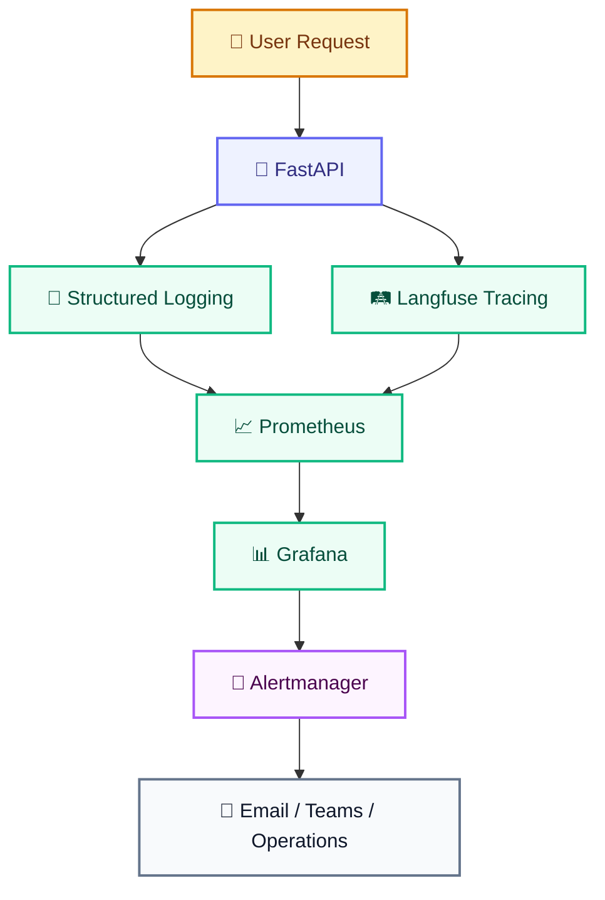
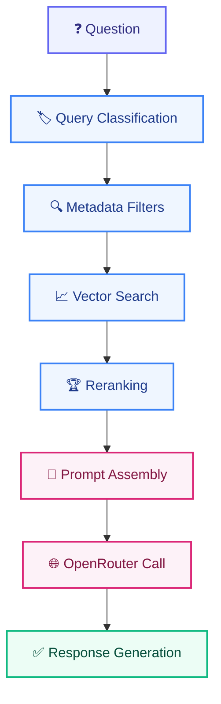

# OBSERVABILITY.md

# Telecom Policy Assistant - Observability Strategy

Version: 1.0  
Status: Draft  
Owner: Platform Engineering Team

---

# 1. Purpose

This document defines the observability framework for the Telecom Policy Assistant platform. The objective is to provide complete visibility into:

- System health
- Application performance
- Retrieval effectiveness
- LLM behavior
- User experience
- Cost consumption
- Security events

The observability framework enables teams to detect, diagnose, and resolve issues while continuously improving platform quality.

---

# 2. Observability Objectives

The platform must provide visibility into:

## Platform Reliability

Monitor:

```text
Availability

Latency

Error Rates

Capacity
```

---

## AI Quality

Monitor:

```text
Retrieval Accuracy

Citation Quality

Confidence Scores

User Feedback
```

---

## User Adoption

Monitor:

```text
Active Users

Questions Asked

Popular Topics

Store Usage
```

---

## Cost Governance

Monitor:

```text
Token Consumption

Model Costs

Usage Trends
```

---

## Security

Monitor:

```text
Authentication Events

Authorization Failures

Administrative Activities
```

---

# 3. Observability Architecture



---

# 4. Observability Pillars

The platform follows the three pillars of observability:

## Logs

Capture:

```text
Requests

Errors

Authentication Events

Document Operations

User Activity
```

---

## Metrics

Measure:

```text
Performance

Availability

Usage

Costs

Quality
```

---

## Traces

Track:

```text
Question Lifecycle

Retrieval Pipeline

Prompt Assembly

Model Calls

Response Generation
```

---

# 5. Logging Strategy

## Objectives

Enable:

```text
Troubleshooting

Auditing

Root Cause Analysis

Security Investigation
```

---

## Logging Format

All logs must be structured JSON. Example:

```json
{
  "timestamp": "2026-09-08T12:00:00Z",
  "level": "INFO",
  "service": "chat-service",
  "trace_id": "abc123",
  "message": "Question processed"
}
```

---

## Log Levels

Supported levels:

```text
DEBUG

INFO

WARNING

ERROR

CRITICAL
```

---

# 6. Log Categories

## Application Logs

Capture:

```text
Question Received

Answer Generated

Feedback Submitted

Exceptions
```

---

## Retrieval Logs

Capture:

```text
Classification Result

Metadata Filters

Retrieved Chunks

Reranker Scores

Retrieval Latency
```

---

## Model Logs

Capture:

```text
Model Selected

Prompt Version

Input Tokens

Output Tokens

Model Latency
```

---

## Security Logs

Capture:

```text
Login Success

Login Failure

Authorization Failure

Role Changes

Administrative Actions
```

---

## Ingestion Logs

Capture:

```text
Upload Started

Extraction Complete

Chunks Generated

Embeddings Generated

Ingestion Complete
```

---

# 7. Distributed Tracing

## Objective

Provide full visibility across request execution.

---

## Technology

```text
Langfuse
```

---

## Trace Lifecycle



---

## Trace Metadata

Store:

```text
User ID

Conversation ID

Question ID

Model Name

Latency

Cost
```

---

# 8. Retrieval Observability

## Objectives

Measure knowledge retrieval effectiveness.

---

## Metrics

### Retrieval Requests

```text
retrieval_requests_total
```

---

### Retrieval Success Rate

```text
retrieval_success_rate
```

Target:

```text
> 99%
```

---

### Retrieval Latency

```text
retrieval_latency_ms
```

Target:

```text
< 500 ms
```

---

### Similarity Score

```text
average_similarity_score
```

Target:

```text
> 0.75
```

---

### Retrieved Chunks

```text
retrieved_chunks_count
```

Expected:

```text
20
```

---

### Final Context Chunks

```text
context_chunks_count
```

Expected:

```text
5
```

---

# 9. LLM Observability

## Objectives

Monitor AI model usage and performance.

---

## Metrics

### LLM Requests

```text
llm_requests_total
```

---

### Model Latency

```text
llm_latency_ms
```

Target:

```text
< 3000 ms
```

---

### Prompt Tokens

```text
prompt_tokens
```

---

### Completion Tokens

```text
completion_tokens
```

---

### Total Tokens

```text
total_tokens
```

---

### Model Error Rate

```text
llm_error_rate
```

Target:

```text
< 1%
```

---

# 10. Application Metrics

## API Requests

```text
api_requests_total
```

---

## Response Time

```text
api_response_time_ms
```

Target:

```text
< 5000 ms
```

---

## Error Rate

```text
api_error_rate
```

Target:

```text
< 2%
```

---

## Active Users

```text
active_users_total
```

---

## Session Count

```text
active_sessions_total
```

---

# 11. User Experience Metrics

## Questions Asked

```text
questions_total
```

---

## Questions by Category

```text
questions_by_category
```

Examples:

```text
Billing

Roaming

Contracts

Legal
```

---

## Feedback Score

```text
helpful_feedback_percentage
```

Target:

```text
> 80%
```

---

## Unanswered Questions

```text
unanswered_questions_total
```

---

# 12. AI Quality Metrics

## Citation Coverage

Measure:

```text
Answers With Citations
```

Target:

```text
100%
```

---

## Citation Accuracy

Measure:

```text
Correct Citations
```

Target:

```text
> 95%
```

---

## Confidence Distribution

Track:

```text
High

Medium

Low
```

responses.

---

## Hallucination Rate

Measure:

```text
Unsupported Answers
```

Target:

```text
< 2%
```

---

# 13. FinOps Observability

## Cost Metrics

### Total Spend

```text
ai_cost_total
```

---

### Daily Spend

```text
ai_daily_cost
```

---

### Monthly Spend

```text
ai_monthly_cost
```

---

### Cost Per Question

```text
cost_per_question
```

---

### Cost Per User

```text
cost_per_user
```

---

### Cost By Model

```text
cost_by_model
```

---

## Token Metrics

```text
input_tokens_total

output_tokens_total

total_tokens_consumed
```

---

# 14. Security Observability

## Authentication Metrics

```text
login_success_total

login_failure_total
```

---

## Authorization Metrics

```text
access_denied_total
```

---

## Administrative Actions

```text
admin_actions_total
```

---

## Rate Limiting

```text
rate_limit_triggered_total
```

---

# 15. Dashboard Strategy

## Executive Dashboard

Audience:

```text
Management

Product Owners
```

Displays:

```text
User Adoption

Monthly Cost

Platform Availability

Feedback Score
```

---

## Operations Dashboard

Audience:

```text
Platform Operations
```

Displays:

```text
CPU

Memory

Errors

Latency

Availability
```

---

## AI Quality Dashboard

Audience:

```text
AI Engineering Team
```

Displays:

```text
Retrieval Metrics

Citation Accuracy

Confidence Scores

Hallucination Rate
```

---

## FinOps Dashboard

Audience:

```text
Engineering Management

Platform Team
```

Displays:

```text
Cost Trends

Token Usage

Model Utilization

Forecasting
```

---

# 16. Alerting Strategy

## Critical Alerts

### API Unavailable

Condition:

```text
Availability < 95%
```

Severity:

```text
Critical
```

---

### Database Unavailable

Condition:

```text
Database Connection Failure
```

Severity:

```text
Critical
```

---

### OpenRouter Failure

Condition:

```text
LLM Error Rate > 10%
```

Severity:

```text
Critical
```

---

# 17. Warning Alerts

## High Latency

Condition:

```text
P95 Latency > 5 Seconds
```

---

## High Cost

Condition:

```text
Daily Spend > Budget Threshold
```

---

## Retrieval Degradation

Condition:

```text
Average Similarity Score < 0.65
```

---

## Increased Error Rate

Condition:

```text
API Error Rate > 2%
```

---

# 18. Knowledge Gap Monitoring

## Purpose

Identify missing or weak documentation.

---

## Track

Questions that:

```text
Return No Results

Receive Negative Feedback

Have Low Confidence

Require Multiple Retries
```

---

## Outputs

```text
Top Missing Topics

Most Frequent Failed Queries

Knowledge Gap Report
```

---

# 19. SLOs & SLIs

## Availability

SLO:

```text
99.5%
```

SLI:

```text
Successful Requests / Total Requests
```

---

## API Latency

SLO:

```text
95% of requests < 5 seconds
```

---

## Retrieval Latency

SLO:

```text
95% of retrievals < 2 seconds
```

---

## User Satisfaction

SLO:

```text
Helpful Feedback > 80%
```

---

## Cost Efficiency

SLO:

```text
Average Cost Per Question < $0.03
```

---

# 20. Data Retention

## Application Logs

```text
90 Days
```

---

## Traces

```text
30 Days
```

---

## Metrics

```text
13 Months
```

---

## Audit Logs

```text
Based On Corporate Retention Policy
```

---

# 21. Recommended Technology Stack

## Logging

```text
Python Structured Logging

JSON Logs
```

---

## Tracing

```text
Langfuse
```

---

## Metrics

```text
Prometheus
```

---

## Dashboards

```text
Grafana
```

---

## Alerting

```text
Alertmanager

Microsoft Teams

Email
```

---

# 22. Delivery Pipeline Metrics

## Pipeline Metrics

```text
Build Time

Test Success Rate

Deployment Frequency

Lead Time

Change Failure Rate

Mean Time To Recovery
```

---

## Release Observability

Track:

```text
Evaluation Gate Results

Security Scan Results

Rollback Events

Release Health Check Results
```

---

# 23. Success Criteria

The observability platform is considered successful when engineering, operations, security, and business stakeholders can quickly understand:

- What happened
- Why it happened
- Who was affected
- How much it cost
- How to resolve it

while maintaining full visibility into platform reliability, retrieval quality, AI performance, security posture, and operational spending.

---

# Definition of Success

The Telecom Policy Assistant provides end-to-end observability across application, retrieval, AI, infrastructure, security, and financial dimensions, enabling proactive operations, rapid troubleshooting, continuous optimization, and confident production-scale operations.