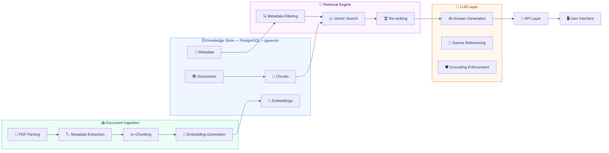

# Telecom Policy Assistant

**Version:** 1.0
**Status:** Draft
**Product Owner:** TBD
**Tech Lead:** TBD
**Last Updated:** September 2026

---

## 1. Executive Summary

The Telecom Policy Assistant is an AI-powered internal knowledge assistant designed to help retail shop assistants quickly retrieve and understand telecom policies. The solution uses Retrieval-Augmented Generation (RAG) to search approved company documentation and generate grounded answers with citations. The assistant will reduce search time, improve answer consistency, accelerate onboarding, and mitigate compliance risks. The first release focuses exclusively on policy knowledge retrieval and explanation.

---

## 2. Business Problem

Retail employees must navigate multiple documents to answer customer questions regarding:

- Billing
- Roaming
- Usage policies
- Contracts
- Legal terms
- Promotions
- SIM management procedures

Current challenges:

- Information is distributed across multiple PDFs
- Policies evolve frequently
- Employees provide inconsistent answers
- Search is slow and inefficient
- New employee onboarding takes time
- Compliance risks exist when policies are misunderstood

---

## 3. Vision

Provide a trusted AI assistant capable of answering telecom policy questions in natural language using only approved company documentation while always citing supporting sources.

---

## 4. Goals

### Business Goals

- Reduce policy search time by 80%
- Improve customer response speed
- Standardize answers across retail stores
- Reduce compliance risks
- Accelerate employee onboarding

### Product Goals

- Natural language search
- Source-cited answers
- Low hallucination rate
- High retrieval accuracy
- Fast response times (<5 seconds)

---

## 5. Success Metrics

### Business KPIs

**Search Time Reduction Target:** 80% reduction

**User Adoption Target:** >75% of retail agents actively using solution

**User Satisfaction Target:** >80% satisfaction

### Technical KPIs

**Retrieval Accuracy Target:** >90%

**Citation Accuracy Target:** >95%

**Hallucination Rate Target:** <2%

**Average Response Time Target:** <5 seconds

**Platform Availability Target:** 99.5%

---

## 6. Target Users

### Primary Users

**Retail Shop Assistants**

Responsibilities:

- Answer customer questions
- Explain policies
- Clarify roaming conditions
- Explain billing charges
- Interpret contract terms

### Secondary Users

- Supervisors
- Call Center Agents
- Training Teams
- Knowledge Management Teams

---

## 7. Scope

### In Scope

**Policy Search**

Search across:

- Billing policies
- Roaming policies
- Usage policies
- Legal documents
- Contract documents
- Promotions
- Procedures

**Question Answering**

Example: "Can I use my package in Spain?"

**Source Attribution**

Every response includes:

- Document Name
- Page Number
- Section

**Internal Chat Interface**

Chat-based interaction with search history.

**Usage Tracking**

Monitor usage, costs, and retrieval quality.

### Out of Scope

- **Customer Account Access** - No CRM integration
- **Billing Systems** - No access to billing engines
- **Sales Recommendations** - No commercial recommendations
- **Workflow Automation** - No transaction execution
- **Ticket Creation** - No support case generation

---

## 8. User Stories

**US-001:** As a retail assistant, I want to ask questions in natural language, so that I can quickly answer customers.

**US-002:** As a retail assistant, I want responses to include references, so that I can verify the information.

**US-003:** As a supervisor, I want employees to receive consistent answers, so that customer information is standardized.

**US-004:** As a compliance stakeholder, I want responses grounded in approved policies, so that legal risks are reduced.

**US-005:** As a knowledge manager, I want updated policy versions reflected in results, so that staff always use current information.

---

## 9. Functional Requirements

### FR-001 Natural Language Questions

The system shall allow users to ask questions using natural language.

Example: "Can I use my plan in Spain?"

### FR-002 Semantic Search

The system shall retrieve relevant document sections based on meaning.

### FR-003 Source Citations

The system shall provide:

- Document Name
- Page Number
- Section

For every answer.

### FR-004 Grounded Responses

The system shall generate answers only from retrieved content.

### FR-005 Fallback Responses

If information cannot be found: "I could not find this information in the available policy documents."

### FR-006 Multi-Document Retrieval

The system shall retrieve content from multiple documents when required.

### FR-007 Conversation Context

The system shall maintain context within a chat session.

### FR-008 Feedback Collection

Users shall be able to provide: "Helpful" / "Not Helpful" feedback.

### FR-009 Audit Logging

The system shall store:

- User
- Question
- Retrieved Documents
- Generated Answer
- Timestamp

### FR-010 Usage Reporting

The system shall track:

- Questions asked
- Token consumption
- Cost per request
- Model usage

---

## 10. Non-Functional Requirements

### Performance

Response time: < 5 seconds
Target: < 3 seconds

### Scalability

Support: 500 concurrent users

### Security

Support:

- SSO Authentication
- Role-Based Access Control
- Encrypted communication

### Reliability

Availability target: 99.5%

### Maintainability

New documents must be ingestible without code changes.

### Explainability

All answers must include references and citations.

---

## 11. Knowledge Sources

### Initial Sources

- Billing Policies
- Roaming Policies
- Usage Policies
- Legal Documents
- Contract Terms
- Promotions
- Internal Procedures

---

## 12. Data Model

Summary of the core entities. The authoritative logical and physical schema is defined in DATA_MODEL.md.

### Document

```json
{
  "id": "uuid",
  "name": "Roaming Policy",
  "category": "ROAMING",
  "owner": "Policy Team",
  "status": "ACTIVE",
  "created_at": "2026-01-01T00:00:00Z"
}
```

### Document Version

```json
{
  "id": "uuid",
  "document_id": "uuid",
  "version": "v3",
  "status": "ACTIVE",
  "effective_date": "2026-01-01"
}
```

### Chunk

```json
{
  "id": "uuid",
  "document_version_id": "uuid",
  "page_number": 34,
  "section": "Zone 1 Europe",
  "subsection": "Spain",
  "content": "...",
  "token_count": 645
}
```

Embeddings are stored on the chunk record using pgvector, and every answer references its retrieved chunks through the citations table.

For the complete logical and physical model, see DATA_MODEL.md.

---

## 13. Solution Architecture



### Core Components

**Document Ingestion**

Responsible for:

- PDF parsing
- Metadata extraction
- Chunking
- Embedding generation

**Knowledge Store**

PostgreSQL + pgvector

Stores:

- Documents
- Metadata
- Chunks
- Embeddings

**Retrieval Engine**

Responsible for:

- Metadata filtering
- Vector search
- Re-ranking

**LLM Layer**

Responsible for:

- Answer generation
- Source referencing
- Grounding enforcement

**API Layer**

Provides REST APIs for chat interactions.

**User Interface**

Provides web-based chat experience.

---

## 14. Technology Stack

| Component | Technology |
|-----------|------------|
| Backend | FastAPI |
| RAG Framework | LlamaIndex |
| Database | PostgreSQL |
| Vector Search | pgvector |
| Embeddings | BAAI BGE-M3 |
| Reranker | bge-reranker-v2-m3 |
| LLM | MiniMax via OpenRouter |
| Frontend | React / Next.js |
| Deployment | Docker |

---

## 15. Observability Requirements

### Logging

Log:

- User Questions
- Retrieved Chunks
- Generated Answers
- Errors

### Tracing

Capture:

- Prompt
- Context
- LLM Response
- Latency

Recommended: Langfuse

### Metrics

Track:

- Requests
- Response Time
- Retrieval Time
- Token Usage
- Feedback Score

Recommended: Prometheus + Grafana

---

## 16. FinOps Requirements

Track:

- Cost per question
- Cost per user
- Cost per store
- Cost per model
- Daily spend
- Monthly spend

Store:

- Input tokens
- Output tokens
- Estimated cost
- Latency

---

## 17. Security Requirements

### Authentication

Support: OIDC, Corporate SSO, Azure AD, Keycloak

### Authorization

Roles:

- Retail Agent
- Supervisor
- Administrator

### Data Protection

Requirements:

- Encryption in transit
- Encryption at rest
- Secret management
- Audit logging

---

## 18. MVP Deliverables

### Included

- ✅ Policy ingestion
- ✅ Embedding generation
- ✅ Vector retrieval
- ✅ Re-ranking
- ✅ Chat interface
- ✅ Source citations
- ✅ Logging
- ✅ Observability
- ✅ Cost tracking
- ✅ Feedback collection

### Not Included

- ❌ CRM integration
- ❌ Billing integrations
- ❌ Customer account lookup
- ❌ Workflow automation
- ❌ Plan recommendations

---

## 19. Roadmap

### Phase 1

Policy Knowledge Assistant

### Phase 2

CRM Context Integration

### Phase 3

Retail Copilot

### Phase 4

Omnichannel Knowledge Assistant

---

## Definition of Success

A retail employee can ask a telecom policy question in natural language and receive a trustworthy, source-cited answer within seconds without manually searching through policy documents.
