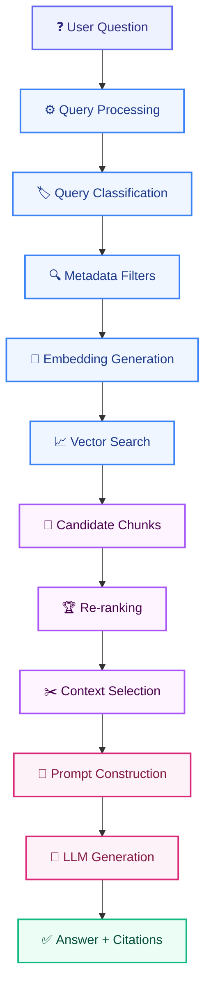
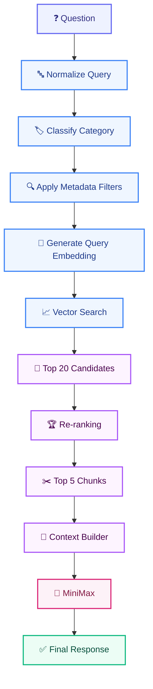

# RETRIEVAL_STRATEGY.md

# Telecom Policy Assistant - Retrieval Strategy

Version: 1.0  
Status: Draft  
Owner: AI Engineering Team

---

# 1. Purpose

This document defines the retrieval strategy used by the Telecom Policy Assistant. The retrieval subsystem is responsible for finding the most relevant, authoritative, and current policy content required to answer user questions.

The primary objective is to ensure:

- Accurate answers
- Source-grounded responses
- Traceable citations
- Low hallucination rates
- Low latency
- Cost-efficient AI inference

---

# 2. Retrieval Objectives

The retrieval layer shall:

```text
Retrieve the correct policy information

Return active policy versions only

Support source citations

Reduce hallucinations

Minimize irrelevant context

Improve user trust

Control token consumption
```

---

# 3. Retrieval Principles

## RET-001 Retrieval Before Generation

The language model must never answer policy questions without retrieved evidence.

---

## RET-002 Source Grounding

All answers must originate from retrieved policy content.

---

## RET-003 Metadata First

Metadata filtering must occur before semantic retrieval whenever possible.

---

## RET-004 Active Version Enforcement

Only policy versions marked as ACTIVE may participate in retrieval.

---

## RET-005 Explainability

Every generated answer must be traceable to one or more retrieved chunks.

---

## RET-006 Cost Efficiency

Only relevant context should be provided to the language model.

---

# 4. Retrieval Architecture



---

# 5. End-to-End Retrieval Workflow



---

# 6. Query Processing

## Objective

Prepare the user question for retrieval.

---

### Example Input

```text
Can I use my package in Spain?
```

---

### Example Output

```json
{
  "normalized_query": "use package in spain roaming",
  "category": "ROAMING"
}
```

---

## Processing Rules

Perform:

```text
Whitespace normalization

Case normalization

Punctuation cleanup

Language normalization
```

Preserve:

```text
Country names

Device names

Promotion names

Plan names

Product names
```

---

# 7. Query Classification

## Objective

Determine the business domain of the request.

---

## Supported Categories

```text
BILLING

ROAMING

USAGE

LEGAL

CONTRACT

PROMOTION

PROCEDURE

DEVICE

SIM_MANAGEMENT

OTHER
```

---

## Examples

### Example 1

Question:

```text
Can I use my plan in Spain?
```

Category:

```text
ROAMING
```

---

### Example 2

Question:

```text
Why was I charged additional fees?
```

Category:

```text
BILLING
```

---

### Example 3

Question:

```text
Can I cancel before my contract expires?
```

Category:

```text
CONTRACT
```

---

# 8. Metadata Filtering

## Objective

Reduce the search space before vector retrieval.

---

## Supported Filters

```text
Category

Document

Status

Version

Effective Date

Section
```

---

## Example

Generated metadata filter:

```json
{
  "category": "ROAMING",
  "status": "ACTIVE"
}
```

---

## Benefits

```text
Higher precision

Lower latency

Lower token consumption

Better source quality
```

---

# 9. Embedding Strategy

## Objective

Represent questions and chunks as semantic vectors.

---

## Embedding Model

```text
BAAI/bge-m3
```

---

## Generation Scope

Embeddings are generated for:

```text
Document Chunks

User Questions
```

---

## Output

```text
Dense Embedding Vector
```

---

# 10. Vector Search

## Technology

```text
PostgreSQL

pgvector
```

---

## Similarity Method

```text
Cosine Similarity
```

---

## Search Configuration

```yaml
top_k: 20
```

---

## Example Result

```json
{
  "chunk_id": "chunk_123",
  "score": 0.91
}
```

---

# 11. Re-ranking Strategy

## Objective

Improve relevance before context generation.

---

## Re-ranking Model

```text
BAAI/bge-reranker-v2-m3
```

---

## Input

```text
Question

Top 20 Candidate Chunks
```

---

## Output

```text
Top 5 Most Relevant Chunks
```

---

## Configuration

```yaml
retrieved_candidates: 20

final_context_chunks: 5
```

---

# 12. Context Selection

## Objective

Build the final context provided to the LLM.

---

## Selection Rules

Prefer:

```text
Highest ranked chunks

Highest confidence sources

Multiple supporting sources
```

Avoid:

```text
Duplicate chunks

Near duplicate chunks

Identical page fragments
```

---

## Diversity Rules

If relevant, prefer:

```text
Multiple sections

Multiple policy references

Supporting evidence
```

instead of repeated content.

---

# 13. Context Assembly

Format Example:

```text
[SOURCE]

Document:
Roaming Policy V3

Page:
34

Section:
Zone 1 Europe

Content:
Customers may use their domestic allowance in Spain...
```

---

# 14. Citation Strategy

## Objective

Provide explainability and auditability.

---

## Required Citation Fields

```text
Document Name

Page Number

Section
```

---

## Citation Example

```json
{
  "document": "Roaming Policy V3",
  "page": 34,
  "section": "Zone 1 Europe"
}
```

---

# 15. Confidence Scoring

## Objective

Determine answer reliability.

---

## Inputs

Confidence is calculated using:

```text
Similarity Score

Reranker Score

Source Agreement

Number of Supporting Chunks

Metadata Match Quality
```

---

## Confidence Levels

### High

```text
>= 0.85
```

Action:

```text
Generate standard response
```

---

### Medium

```text
0.70 - 0.84
```

Action:

```text
Response with verification notice:

I found limited information related to your question. Please verify the referenced policy source.
```

---

### Low

```text
< 0.70
```

Action:

```text
Fallback response (see Fallback Strategy)
```

---

# 16. Fallback Strategy

## No Matching Content

Response:

```text
I could not find this information in the available policy documents.
```

---

## Low Confidence Result

If confidence < 0.70, do not answer directly. Respond:

```text
I could not find this information in the available policy documents.
```

---

## Forbidden Behaviors

The model must never:

```text
Invent fees

Invent charges

Invent contract terms

Invent legal conditions

Invent policy rules
```

---

# 17. Retrieval Configuration

## Production Defaults

```yaml
embedding_model: BAAI/bge-m3

reranker_model: BAAI/bge-reranker-v2-m3

vector_store: pgvector

similarity_metric: cosine

candidate_chunks: 20

final_chunks: 5

minimum_similarity_score: 0.65

high_confidence_threshold: 0.85

medium_confidence_threshold: 0.70
```

---

# 18. Performance Targets

## Retrieval Latency

Target:

```text
< 500 ms
```

---

## Re-ranking Latency

Target:

```text
< 1000 ms
```

---

## Context Assembly

Target:

```text
< 200 ms
```

---

## Total Retrieval Pipeline

Target:

```text
< 2 seconds
```

---

# 19. Retrieval Evaluation Metrics

## Recall@5

Target:

```text
> 90%
```

---

## Recall@10

Target:

```text
> 95%
```

---

## Precision@5

Target:

```text
> 85%
```

---

## MRR

Target:

```text
> 0.85
```

---

## nDCG

Target:

```text
> 0.90
```

---

## Citation Accuracy

Target:

```text
> 95%
```

---

# 20. Observability Requirements

For every retrieval request capture:

```text
Question

Predicted Category

Metadata Filters

Retrieved Chunks

Similarity Scores

Reranker Scores

Context Chunks

Latency

Final Citations
```

---

## Prometheus Metrics

```text
retrieval_requests_total

retrieval_latency_ms

reranker_latency_ms

retrieval_failures_total

retrieval_success_rate

average_similarity_score

context_chunks_count
```

---

# 21. FinOps Considerations

Track:

```text
Embedding Calls

Context Tokens

Prompt Tokens

Average Context Size

Cost Per Retrieval
```

---

## Optimization Goals

Reduce:

```text
Token Usage

Duplicate Context

Oversized Prompts
```

Increase:

```text
Retrieval Accuracy

Grounding Quality

Cost Efficiency
```

---

# 22. Future Enhancements

## Phase 2 Hybrid Retrieval

```text
Vector Search

+

Full Text Search
```

---

## Phase 3 Query Expansion

Example:


---

## Phase 4 Knowledge Graph Retrieval

Relationships:

```text
Country

Policy

Plan

Promotion

Contract
```

---

## Phase 5 Agentic Retrieval

Capabilities:

```text
Multi-step Search

Dynamic Query Reformulation

Policy Comparison
```

---

# Success Criteria

The retrieval system consistently returns the most relevant, active, and source-traceable policy content with high precision, low latency, strong citation quality, and minimal hallucination risk, enabling the Telecom Policy Assistant to provide trustworthy and compliant answers to retail employees.