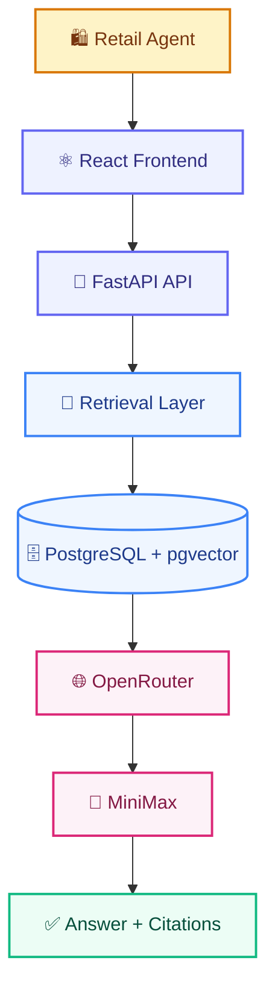
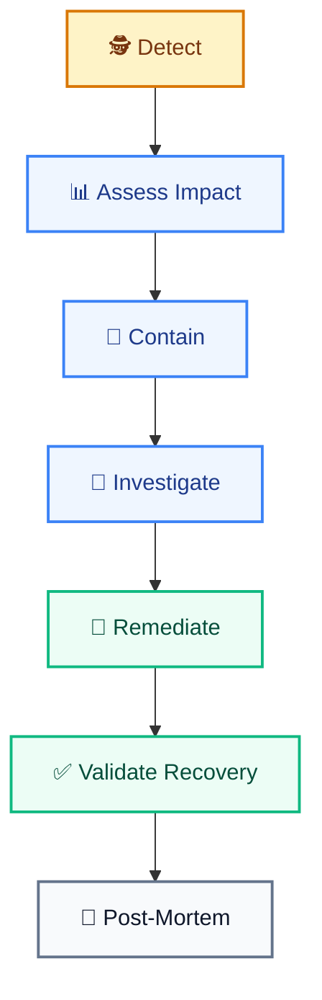
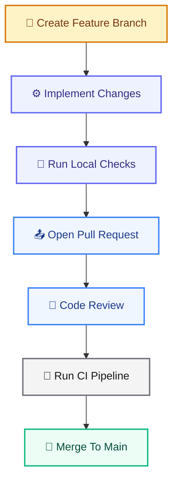
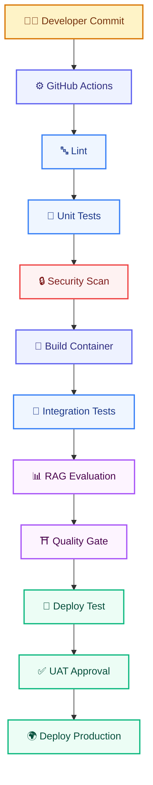

# RUNBOOK.md

# Telecom Policy Assistant - Operations Runbook

Version: 1.0  
Status: Draft  
Owner: Platform Operations Team

---

# 1. Purpose

This runbook provides operational procedures for deploying, monitoring, maintaining, troubleshooting, and recovering the Telecom Policy Assistant platform. The goal is to ensure that platform operators can:

- Deploy safely
- Monitor effectively
- Troubleshoot quickly
- Recover from incidents
- Maintain service quality
- Control operational costs

---

# 2. System Overview

## Business Purpose

The Telecom Policy Assistant enables retail agents to ask policy-related questions and receive source-cited answers generated through a Retrieval-Augmented Generation (RAG) architecture.

---

## Core Components

```text
Frontend (React/Next.js)

FastAPI Backend

LlamaIndex RAG Layer

PostgreSQL

pgvector

OpenRouter

MiniMax

Langfuse

Prometheus

Grafana
```

---

# 3. High-Level Architecture



---

# 4. Service Inventory

| Service | Purpose |
|---------|---------|
| frontend | User Interface |
| api | FastAPI Backend |
| postgres | Database |
| langfuse | AI Tracing |
| prometheus | Metrics |
| grafana | Dashboards |

---

# 5. Roles & Responsibilities

## Product Owner

Responsible for:

```text
Business Priorities

Release Approval

Budget Oversight
```

---

## AI Engineering

Responsible for:

```text
Prompts

Retrieval Logic

Embeddings

Model Evaluation
```

---

## Platform Operations

Responsible for:

```text
Deployments

Monitoring

Backup Operations

Incident Response
```

---

## Security Team

Responsible for:

```text
Access Reviews

Compliance

Security Monitoring
```

---

# 6. Environment Overview

## Development

Purpose:

```text
Local Development
```

---

## Test

Purpose:

```text
Integration Testing

UAT
```

---

## Production

Purpose:

```text
Business Operations
```

---

# 7. Start-Up Procedure

## Step 1

Verify environment variables. Required:

```text
DATABASE_URL

OPENROUTER_API_KEY

JWT_SECRET

LANGFUSE_PUBLIC_KEY

LANGFUSE_SECRET_KEY
```

---

## Step 2

Validate connectivity.

```bash
ping database
```

---

## Step 3

Start services.

```bash
docker compose up -d
```

---

## Step 4

Verify containers.

```bash
docker compose ps
```

Expected:

```text
frontend     running
api          running
postgres     running
prometheus   running
grafana      running
langfuse     running
```

---

## Step 5

Validate health endpoint.

```bash
curl http://localhost:8000/api/v1/health
```

Expected:

```json
{
  "status": "UP"
}
```

---

# 8. Shutdown Procedure

## Graceful Shutdown

```bash
docker compose down
```

---

## Verification

```bash
docker compose ps
```

Expected:

```text
No running containers
```

---

# 9. Deployment Procedure

## Pre-Deployment Checklist

Verify:

```text
Unit Tests Passed

Integration Tests Passed

Security Scan Passed

Evaluation Gate Passed

No Critical Defects
```

---

## Build Containers

```bash
docker compose build
```

---

## Deploy

```bash
docker compose up -d
```

---

## Post-Deployment Validation

Verify:

```text
Health Endpoint

Database Connectivity

Document Search

Question Answering

Metrics Collection

Tracing
```

---

# 10. Health Checks

## API Health

Endpoint:

```http
GET /api/v1/health
```

Expected:

```json
{
  "status": "UP"
}
```

---

## Readiness

Endpoint:

```http
GET /api/v1/health/ready
```

Expected:

```json
{
  "status": "READY",
  "database": "UP",
  "llm": "UP"
}
```

---

## Liveness

Endpoint:

```http
GET /api/v1/health/live
```

Expected:

```json
{
  "status": "ALIVE"
}
```

---

# 11. Daily Operations Checklist

Verify:

```text
API Healthy

Database Healthy

OpenRouter Reachable

No Critical Alerts

Cost Within Budget

Nightly Backups Completed
```

---

## Dashboard Review

Review:

```text
Availability

Average Latency

Error Rate

Questions Volume

Daily Cost
```

---

# 12. Database Operations

## Verify Connectivity

```sql
SELECT NOW();
```

---

## Verify Documents

```sql
SELECT COUNT(*)
FROM documents;
```

---

## Verify Chunks

```sql
SELECT COUNT(*)
FROM chunks;
```

---

## Verify Embeddings

```sql
SELECT COUNT(*)
FROM chunks
WHERE embedding IS NOT NULL;
```

---

## Verify Usage Data

```sql
SELECT COUNT(*)
FROM llm_usage;
```

---

# 13. Document Ingestion Operations

## Upload New Policy

Using Admin UI:

```text
Documents → Upload → Start Ingestion
```

---

## CLI Method

```bash
python scripts/ingest_documents.py \
  --file policy.pdf
```

---

## Validation

Verify:

```text
Document Created
Chunks Created
Embeddings Created
Status = SUCCESS
```

---

## Chunk Verification

```sql
SELECT COUNT(*)
FROM chunks
WHERE document_version_id = '<version_id>';
```

---

# 14. Reindex Procedures

## Incremental Reindex

Use when:

```text
New Document Added
Metadata Updated
Version Activated
```

Command:

```bash
python scripts/reindex.py
```

---

## Full Reindex

Use when:

```text
Embedding Model Changed
Chunking Strategy Changed
Major Schema Changes
```

Command:

```bash
python scripts/rebuild_embeddings.py
```

---

## Validation

Verify:

```text
No Failed Chunks
No Missing Embeddings
Retrieval Working
```

---

# 15. Backup Operations

## Database Backup

```bash
pg_dump telecom_assistant \
  > backup.sql
```

---

## Backup Verification

```bash
ls -lah backup.sql
```

Expected:

```text
Backup File Exists
```

---

# 16. Restore Operations

## Create Database

```bash
createdb telecom_assistant
```

---

## Restore Backup

```bash
psql telecom_assistant \
  < backup.sql
```

---

## Validation

Verify:

```text
Documents

Chunks

Conversations

Usage Data
```

---

# 17. Monitoring Procedures

## Prometheus

Validate:

```text
Targets Healthy

Metrics Collected

Alerts Functional
```

---

## Grafana

Verify dashboards:

```text
Operations

AI Quality

FinOps

Security
```

---

## Langfuse

Verify:

```text
Traces Generated

Prompts Captured

Costs Visible
```

---

# 18. Incident Management

## Severity Definitions

### P1 Critical

Examples:

```text
Platform Down

Database Failure

Authentication Failure
```

Response Time:

```text
15 Minutes
```

---

### P2 High

Examples:

```text
Retrieval Failure

LLM Failure

Severe Latency
```

Response Time:

```text
1 Hour
```

---

### P3 Medium

Examples:

```text
Reporting Issues

Dashboard Failures

Minor Feature Defects
```

Response Time:

```text
1 Business Day
```

---

# 19. Incident Response Workflow



---

# 20. Troubleshooting Guide

## Problem: No Answer Returned

Verify:

```text
OpenRouter Connectivity
Prompt Generated
Retrieved Chunks Available
```

---

Check logs:

```bash
docker logs api
```

---

## Problem: No Search Results

Verify:

```text
Document Exists
Chunks Exist
Embeddings Exist
Metadata Filters Correct
```

---

Query:

```sql
SELECT COUNT(*)
FROM chunks;
```

---

## Problem: Missing Citations

Verify:

```text
Chunk Metadata
Citation Builder
Prompt Template
```

---

## Problem: Slow Responses

Check:

```text
Database Performance

Retrieval Latency

OpenRouter Latency

Network Issues
```

---

# 21. Performance Diagnostics

## Database Activity

```sql
SELECT *
FROM pg_stat_activity;
```

---

## Long Running Queries

```sql
SELECT
  pid,
  query,
  state
FROM pg_stat_activity
WHERE state <> 'idle';
```

---

## Retrieval Metrics

Review:

```text
retrieval_latency_ms
```

---

## Model Metrics

Review:

```text
llm_latency_ms
```

---

# 22. Security Operations

## Daily Checks

Review:

```text
Failed Logins
Rate Limit Violations
Administrative Changes
```

---

## Weekly Checks

Review:

```text
User Access
Document Uploads
Role Changes
```

---

## Monthly Checks

Review:

```text
Security Audit Logs
Access Reviews
Privilege Reviews
```

---

# 23. FinOps Operations

## Daily Review

Monitor:

```text
Daily Cost
Token Usage
Questions Volume
```

---

## Weekly Review

Monitor:

```text
Cost Trends
Most Active Stores
Model Utilization
```

---

## Monthly Review

Monitor:

```text
Budget Usage
Forecast
Optimization Opportunities
```

---

# 24. Recovery Objectives

## Recovery Time Objective (RTO)

```text
4 Hours
```

---

## Recovery Point Objective (RPO)

```text
1 Hour
```

---

# 25. Change Management

## Production Changes Require

```text
Code Review
Testing
Security Validation
Evaluation Approval
Deployment Approval
```

---

## Regression Testing Required After

```text
Prompt Changes
Embedding Changes
LLM Changes
Chunking Changes
Retrieval Updates
```

---

# 26. Monthly Maintenance

Perform:

```text
Archive Retired Policies
Review AI Costs
Review Dashboard Alerts
Review Knowledge Gaps
Verify Backups
Review Security Logs
```

---

# 27. Escalation Matrix

## Level 1

```text
Platform Operations
```

---

## Level 2

```text
Engineering Team
```

---

## Level 3

```text
Architecture Team
```

---

## Level 4

```text
Vendor Support

OpenRouter

Cloud Provider
```

---

# 28. Definition of Healthy Service

The platform is considered healthy when:

```text
Availability ≥ 99.5%

Response Time ≤ 5 Seconds

Retrieval Success ≥ 99%

Citation Accuracy ≥ 95%

Error Rate ≤ 2%

Budget Within Approved Limits
```

---

# 29. Post-Incident Review Template

## Incident Summary

```text
Incident ID:
Date:
Severity:
Duration:
```

---

## Impact

```text
Users Affected

Stores Affected

Business Impact
```

---

## Root Cause

```text
Technical Cause

Contributing Factors
```

---

## Resolution

```text
Actions Taken

Recovery Time

Validation Results
```

---

## Preventive Actions

```text
Monitoring Improvements

Automation

Documentation Updates
```

---

# Appendix A - Continuous Delivery & Release Reference

This appendix defines the delivery pipeline that transforms code into tested, secure, evaluated, and production-ready releases with auditable approvals, fast rollback, and measurable quality at every stage.

## Purpose

The delivery pipeline governs:

```text
Build process

Testing process

Security scans

Release approvals

Deployment workflow

Rollback procedures
```

---

## Delivery Objectives

The pipeline shall:

```text
Automate builds

Automate testing

Automate security validation

Enforce quality gates

Automate staged deployments

Enable fast rollbacks

Ensure reproducible releases
```

---

## Branch Strategy

### Main Branch

Protected production-ready branch. Merges require:

```text
Code review

Passing checks

Security approval

Evaluation approval
```

---

### Feature Branches

```text
feature/<ticket>-<description>
```

---

### Release Branches

```text
release/<version>
```

---

### Hotfix Branches

```text
hotfix/<issue>-<description>
```

---

## Development Workflow



---

## Build Pipeline



---

## Quality Gates

### Delivery Gates

Before production deployment:

```text
Unit Tests Passed

Integration Tests Passed

Security Scan Passed

No Critical Vulnerabilities
```

---

### AI Quality Gates

```text
Recall@5 > 90%

Citation Accuracy > 95%

Hallucination Rate < 2%

Latency < 5 Seconds

Cost Targets Met
```

---

## Deployment Pipeline

### Stages

```text
Deploy Test

Deploy Staging

UAT Approval

Deploy Production
```

---

### Method

```text
Containerized deployments via docker compose

Blue-green or rolling strategy

Automated health checks after each stage
```

---

### Environment Promotion

| Environment | Purpose | Approval |
|-------------|---------|----------|
| Development | Local development | None |
| Test | Integration & UAT | CI checks |
| Staging | Pre-production validation | Engineering lead |
| Production | Business operations | Product owner |

---

## Rollback Strategy

### Triggers

```text
Health check failure

Elevated error rate

Increased latency

Monitoring alerts
```

---

### Rollback Procedure

```text
Restore previous container image

Re-run health checks

Verify database compatibility

Notify stakeholders
```

---

### Rollback Automation

```text
.github/workflows/rollback.yml
```

---

## Release Management

### Versioning

```text
Semantic Versioning (MAJOR.MINOR.PATCH)
```

---

### Release Notes

Each release must include:

```text
Features

Fixes

Migration Steps

Evaluation Results

Rollback Notes
```

---

## Infrastructure as Code

Environment configuration shall be managed as code and reviewed like application code.

```text
Reusable templates

Versioned configuration

Automated apply with validation
```

---

## Disaster Recovery Deployments

Prepared environment to restore service per the recovery objectives in Section 24:

```text
RTO = 4 Hours

RPO = 1 Hour
```

---

### DR Validation

```text
Quarterly restore test

Validated backup integrity

Automated recovery runbook
```

---

## Delivery Pipeline Metrics

```text
Build Time

Test Success Rate

Deployment Frequency

Lead Time

Change Failure Rate

Mean Time To Recovery
```

---

## GitHub Actions Structure

```text
.github/workflows/

├── build.yml
├── test.yml
├── security.yml
├── evaluation.yml
├── deploy-test.yml
├── deploy-prod.yml
└── rollback.yml
```

For the full repository layout, see ARCHITECTURE.md (Repository Structure).

---

# Definition of Success

Operations teams can confidently deploy, monitor, troubleshoot, secure, and recover the Telecom Policy Assistant while maintaining high availability, accurate retrieval, low operational risk, controlled AI costs, and a reliable experience for retail employees.