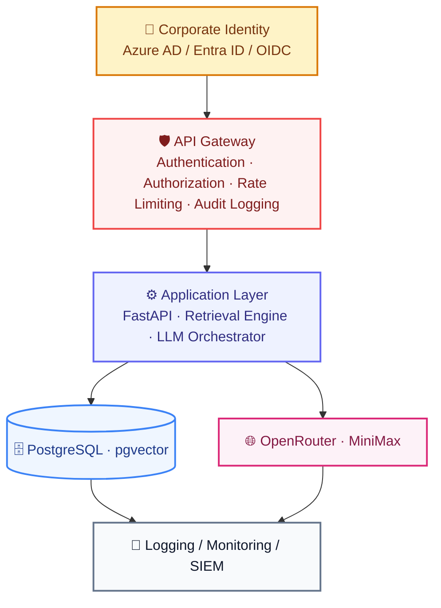

# SECURITY.md

# Telecom Policy Assistant - Security Architecture & Controls

Version: 1.0  
Status: Draft  
Owner: Security Team  
Classification: Internal

---

# 1. Purpose

This document defines the security architecture, controls, standards, policies, and operational requirements for the Telecom Policy Assistant platform. The objective is to ensure:

- Confidentiality of internal documents
- Integrity of policy content
- Secure access to AI capabilities
- Traceability of all operations
- Compliance with corporate security standards
- Protection against AI-specific threats

---

# 2. Security Objectives

## SEC-001 Confidentiality

Only authorized users shall access:

- Policy documents
- Generated answers
- Administrative functions
- Analytics and reports

---

## SEC-002 Integrity

The platform shall prevent unauthorized modification of:

- Documents
- Metadata
- Embeddings
- Prompts
- System configuration

---

## SEC-003 Availability

The platform shall remain available to authorized users and resilient to failures and abuse.

---

## SEC-004 Accountability

All user and administrative actions shall be auditable.

---

## SEC-005 Least Privilege

Users, services, and administrators shall receive the minimum permissions required to perform their duties.

---

# 3. Security Principles

## Defense in Depth

Protection shall exist at multiple layers:

```text
Identity

Application

API

Data

Infrastructure

Monitoring
```

---

## Zero Trust

Every request must be authenticated and authorized. Never trust:

```text
Network Location

IP Address

Previously Authenticated Session
```

alone.

---

## Secure by Default

Default configuration shall be:

```text
Restricted

Encrypted

Audited
```

---

## Assume Breach

Systems shall support:

```text
Detection

Containment

Investigation

Recovery
```

---

# 4. Security Architecture



---

# 5. Authentication

## Identity Providers

Supported providers:

```text
Microsoft Entra ID

Azure AD

Keycloak

OIDC-Compliant Identity Provider
```

---

## Authentication Method

Authentication shall use:

```text
OAuth2

OpenID Connect (OIDC)
```

---

## JWT Requirements

Required claims:

```json
{
  "sub": "user-id",
  "email": "user@company.com",
  "role": "RETAIL_AGENT",
  "store_id": "TOR001"
}
```

---

## Session Controls

Access Token:

```text
60 minutes
```

Refresh Token:

```text
8 hours
```

Idle Timeout:

```text
30 minutes
```

---

# 6. Authorization

## RBAC Model

The platform uses Role-Based Access Control.

---

## Retail Agent (RETAIL_AGENT)

Permissions:

```text
Ask Questions

View Answers

View Citations

Submit Feedback
```

---

## Supervisor (SUPERVISOR)

Permissions:

```text
Retail Agent Permissions

View Team Analytics

View Reports
```

---

## Administrator (ADMIN)

Permissions:

```text
Manage Documents

Activate Versions

Reindex Knowledge Base

View Audit Logs

Manage Users

View Cost Reports
```

---

## System Account (SYSTEM)

Permissions:

```text
Read Chunks

Generate Embeddings

Perform Retrieval
```

No UI access permitted.

---

# 7. Data Classification

## Public

Examples:

```text
Published Terms And Conditions

Public Marketing Content
```

---

## Internal

Examples:

```text
Retail Procedures

Knowledge Base Articles

Policy Documents
```

---

## Confidential

Examples:

```text
Draft Policies

Internal Commercial Rules

Audit Reports
```

---

# 8. Data Protection

## Encryption At Rest

Must protect:

```text
PostgreSQL Database

Document Storage

Backups

Logs
```

---

## Encryption Standard

```text
AES-256
```

---

## Encryption In Transit

All communications shall use:

```text
TLS 1.2+
```

Preferred: TLS 1.3

---

## Internal Traffic

Encrypt communications between:

```text
Frontend

API

Database

Monitoring Services
```

---

# 9. Secret Management

## Managed Secrets

Examples:

```text
OpenRouter API Key

Database Credentials

JWT Secret

Monitoring Credentials

Encryption Keys
```

---

## Approved Storage

Preferred:

```text
HashiCorp Vault

Azure Key Vault
```

Development Only:

```text
Environment Variables
```

---

## Prohibited

```text
Secrets In Source Code

Secrets In Git

Hardcoded Credentials
```

---

# 10. Document Security

## Upload Restrictions

Only Administrators may:

```text
Upload Documents

Delete Documents

Replace Versions

Archive Policies
```

---

## Version Governance

Rules:

```text
One ACTIVE version per document family
```

---

## Document Retention

Retired policies shall remain available for audit purposes.

---

# 11. Database Security

## Network Rules

Allowed:

```text
Application Services

Background Jobs
```

Denied:

```text
Public Internet
```

---

## Database Accounts

Application Account:

```text
SELECT

INSERT

UPDATE
```

Administrative Account:

```text
Schema Changes

Maintenance

Backup Operations
```

---

## Auditing

Track:

```text
Login Events

Permission Changes

Administrative Queries
```

---

# 12. API Security

## Authorization Header

```http
Authorization: Bearer <access_token>
```

---

## Security Headers

Required:

```text
Strict-Transport-Security

X-Content-Type-Options

Content-Security-Policy

X-Frame-Options

Referrer-Policy
```

---

## Rate Limiting

Retail Agent:

```text
60 requests/minute
```

Supervisor:

```text
120 requests/minute
```

Administrator:

```text
300 requests/minute
```

---

# 13. AI Security Controls

## Governance Principles

### GP-001 Policy Only

The assistant answers exclusively from approved, active policy documents.

### GP-002 Grounded Responses

Every answer must be supported by retrieved evidence.

### GP-003 Refusal Over Fabrication

When information is unavailable, the assistant must refuse rather than guess.

### GP-004 Traceable Outputs

Every answer must include source citations.

### GP-005 Security by Design

The assistant must resist manipulation and never reveal system internals.

---

## Safety Objectives

The platform shall prevent:

```text
Hallucinated policy statements

Invented fees and charges

Invented legal or contract terms

Prompt injection success

Data leakage

Exposure of system prompts
```

---

## Context Grounding

The LLM shall only answer using retrieved policies.

---

## Citation Enforcement

Every answer shall contain:

```text
Document Name

Page Number

Section
```

when available.

---

## Hallucination Prevention

Prohibited:

```text
Invented Policies

Invented Charges

Invented Fees

Invented Contract Terms

Invented Legal Conditions
```

---

## Fallback Response

If evidence is unavailable:

```text
I could not find this information in the available policy documents.
```

---

## Confidence Thresholds

### High Confidence

```text
>= 0.85
```

Action:

```text
Generate standard response
```

---

### Medium Confidence

```text
0.70 - 0.84
```

Action:

```text
I found limited information related to your question. Please verify the referenced policy source.
```

---

### Low Confidence

```text
< 0.70
```

Action:

```text
Do not answer directly

Use the fallback response
```

---

## Restricted Topics

The assistant shall not answer questions about:

```text
Other Customers' Account Data

Confidential Commercial Terms

Unpublished Policies

Future Promotions

Pricing Not In Policy Documents
```

---

## Sensitive Information Handling

### PII Protection

The assistant shall not request, store, or generate:

```text
Customer Personally Identifiable Information (PII)

Payment Card Information

Credentials
```

---

### Handling Rules

```text
If PII is presented, do not retain it

If PII is requested, refuse

If sensitive data is detected, alert and log
```

---

## Response Policies

### Tone

Responses shall be:

```text
Clear

Concise

Professional

Non-promotional
```

---

### Content Rules

```text
No invented policies

No unsupported charges

No legal advice

No guarantees beyond cited policies
```

---

## Human Oversight & Escalation

Questions requiring judgment beyond policy content shall escalate to:

```text
Supervisor

Knowledge Manager

Subject Matter Expert
```

---

### Review Triggers

```text
Low confidence answers

Negative feedback

Unanswered questions

Policy conflicts
```

---

## Monitoring & Auditing

### Logged Events

```text
Question Received

Guardrail Triggered

Fallback Response

Prompt Injection Attempt

Negative Feedback
```

---

### Review Cadence

```text
Daily monitoring of alerts

Weekly review of guardrail triggers

Monthly audit of safety metrics
```

---

# 14. Prompt Security

## Protected Prompts

Store prompts separately from application code.

Recommended:

```text
Prompt Registry

Configuration Repository
```

---

## Prompt Versioning

Track:

```text
Prompt Version

Editor

Approval Date

Deployment Date
```

---

# 15. AI Threat Protection

## Prompt Injection

Detect attempts to:

```text
Ignore Instructions

Reveal System Prompts

Bypass Grounding
```

---

## Data Exfiltration

Block requests attempting to retrieve:

```text
Credentials

Secrets

Internal Configuration

System Prompts
```

---

## Jailbreak Attempts

Flag suspicious patterns.

Examples:

```text
Ignore all instructions

Reveal hidden configuration

Act as administrator
```

---

## Data Leakage Prevention

The assistant shall block requests attempting to retrieve or reveal:

```text
Credentials

Secrets

Internal Configuration

System Prompts

Other Users' Data

Unpublished Policies
```

---

## Injection Response

When a prompt injection attempt is detected:

```text
Does not change system behavior

Does not reveal system prompts

Continues grounded answering only
```

---

# 16. Audit Logging

## Logged Events

Authentication:

```text
Login

Logout

Failed Login
```

Document Operations:

```text
Upload

Delete

Version Activation

Reindex
```

AI Operations:

```text
Question

Response

Retrieved Sources

Model Used
```

Administrative Actions:

```text
Role Changes

Configuration Changes

Access Changes
```

---

# 17. Security Monitoring

## Security Metrics

Monitor:

```text
Failed Authentication

Authorization Failures

Rate Limit Violations

Prompt Injection Attempts

Administrative Actions
```

---

## Alert Triggers

Generate alerts for:

```text
Multiple Failed Logins

Role Escalation

Unexpected Admin Activity

High API Abuse

Prompt Injection Detection
```

---

# 18. Vulnerability Management

## Dependency Scanning

Frequency:

```text
Every Build
```

---

## Container Scanning

Scan:

```text
Base Images

Application Images
```

before deployment.

---

## Patch SLAs

Critical:

```text
7 Days
```

High:

```text
30 Days
```

Medium:

```text
90 Days
```

---

## Secure Delivery Gates

Every release must pass security validation before deployment.

### Scans Performed

```text
Dependency Scan

Code Scan (SAST)

Container Scan

Secret Detection
```

---

### Security Gate Policy

```text
No critical vulnerabilities may be deployed

High vulnerabilities require mitigation plan

Secrets in code fail the build
```

---

### Release Compliance

Every release shall:

```text
Pass security scans

Preserve audit logging

Maintain access controls

Comply with retention policy
```

---

# 19. Backup & Recovery Security

## Backup Requirements

Backups must be:

```text
Encrypted

Immutable

Access Controlled
```

---

## Backup Retention

Minimum:

```text
30 Days
```

---

## Restore Testing

Frequency:

```text
Quarterly
```

---

# 20. Incident Response

## Severity Levels

### P1

```text
System Compromise

Credential Exposure

Data Breach
```

---

### P2

```text
Unauthorized Access Attempt

Privilege Escalation
```

---

### P3

```text
Policy Violation

Monitoring Alert
```

---

## Response Workflow

```text
Detect

Contain

Investigate

Remediate

Recover

Review
```

---

# 21. Compliance Requirements

The platform shall support compliance with:

```text
Corporate Security Policies

Data Protection Policies

Internal Audit Requirements

Operational Risk Standards
```

---

# 22. Security KPIs

## Authentication Success Rate

Target:

```text
> 99%
```

---

## Critical Vulnerabilities

Target:

```text
0 Open Critical Vulnerabilities
```

---

## Unsupported AI Claims

Target:

```text
0%
```

---

## Prompt Injection Success Rate

Target:

```text
0%
```

---

## Data Leakage Events

Target:

```text
0
```

---

## Fallback Compliance

Target:

```text
100%
```

---

## PII Retention Events

Target:

```text
0
```

---

# Definition of Success

The Telecom Policy Assistant maintains confidentiality, integrity, and availability of policy content and user data, enforces least-privilege access control, resists AI-specific threats such as prompt injection and hallucination, and demonstrates traceable, auditable operations that meet corporate security standards in every release.
