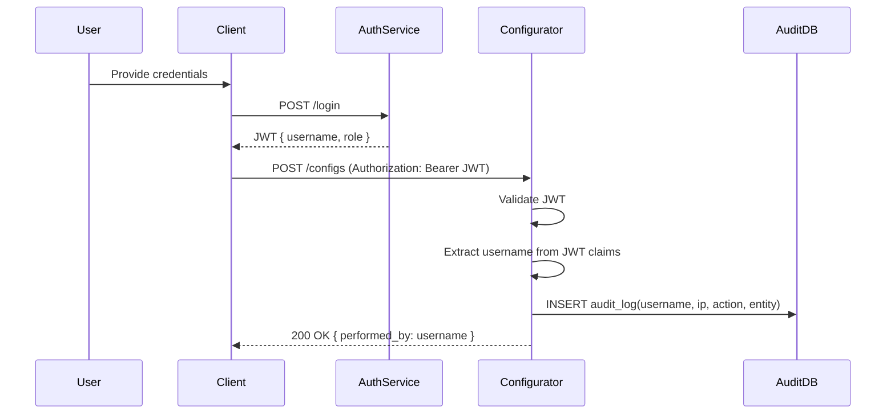

# 🔐 Security Design

## Overview
This document defines the **security architecture** of the microservices ecosystem:
- Auth-Service for authentication and authorization
- Configurator-Service and Locator-Service secured via JWT validation
- Role-based access control (RBAC)
- Mutual trust between services through public/private key pairs

---

# 🔹 Sequence: Getting Username and Sending to Configurator-Service

This sequence describes how an authenticated user's **username** flows from the **Auth-Service** to the **Configurator-Service**, ensuring auditability and role-based authorization.

---

## 1️⃣ User Login (Auth-Service)
1. User submits credentials:
   ```http
   POST /api/v1/auth/login
   Content-Type: application/json

   {
       "email": "operator@example.com",
       "password": "secret"
   }

2. Auth-Service validates credentials.

3. Auth-Service generates a JWT containing username and role:
   ```http{
    "sub": "uuid-123",
    "username": "operator_agent_1",
    "role": "ROLE_OP_AGENT",
    "exp": 1736789123,
    "iss": "auth-service"
    }
4. JWT is returned to the client:
   ```http{
    "access_token": "<jwt-token>",
    "token_type": "Bearer",
    "expires_in": 3600
    }
## 2️⃣ Client Sends Request to Configurator-Service

1. Client sends request with JWT:
   ```http
    POST /api/v1/configs
    Authorization: Bearer <jwt-token>
    Content-Type: application/json

    {
        "config_name": "network_policy",
        "value": { "bandwidth": "10Mbps" }
    }

2. The JWT carries the username and role claims.

## 3️⃣ Configurator-Service Validates Token

1. Middleware extracts JWT from Authorization header.

2. JWT signature is verified using Auth-Service public key.

3. Username and role are extracted from JWT claims:
   ```http
    struct JwtClaims {
        sub: String,
        username: String,  // "operator_agent_1"
        role: String,      // "ROLE_OP_AGENT"
        exp: i64
    }
## 4️⃣ Configurator-Service Performs Action & Audit

1. Performs requested action (create/update/delete).

2. Records audit log including username and IP address:
    ```
    let audit_log = AuditLog {
        username: claims.username.clone(),
        ip_address: req.connection_info().realip_remote_addr().unwrap_or("unknown").to_string(),
        action: "CREATE_CONFIG".to_string(),
        entity: "network_policy".to_string(),
        details: json!({"value": "10Mbps"}),
        status: "SUCCESS".to_string(),
        created_at: Utc::now(),
    };
    db.insert_audit_log(audit_log).await?;


## 5️⃣ Response to Client

. Configurator-Service returns:
    ```
    {
    "status": "success",
    "message": "Configuration created",
    "performed_by": "operator_agent_1"
    }

. Mermaid Sequence Diagram
. Configurator-Service returns:
    ```mermaid
    sequenceDiagram
        participant User
        participant Client
        participant AuthService
        participant Configurator
        participant AuditDB

        User->>Client: Provide credentials
        Client->>AuthService: POST /login
        AuthService-->>Client: JWT { username, role }
        Client->>Configurator: POST /configs (Authorization: Bearer JWT)
        Configurator->>Configurator: Validate JWT
        Configurator->>Configurator: Extract username from JWT claims
        Configurator->>AuditDB: INSERT audit_log(username, ip, action, entity)
        Configurator-->>Client: 200 OK { performed_by: username }


### 1️⃣ Authentication


### Flow
1. A user logs in via the **Auth-Service** endpoint:


2. Auth-Service validates the credentials.
3. A **JWT token** is issued and returned:
```json
{
  "access_token": "<jwt>",
  "expires_in": 3600,
  "token_type": "Bearer"
}
```
Authorization: Bearer <jwt>

sequenceDiagram
    participant User
    participant AuthService
    participant Configurator
    participant DB

    User->>AuthService: POST /login (credentials)
    AuthService-->>User: JWT (RS256)
    User->>Configurator: POST /configs (Authorization: Bearer JWT)
    Configurator->>AuthService: Verify JWT (public key)
    AuthService-->>Configurator: Valid ✅
    Configurator->>DB: Save config + audit (username, IP)


---

This fixes:

- Proper opening/closing of all code blocks  
- Correct languages for syntax highlighting (`http`, `json`, `rust`)  
- Removed duplicate diagrams and sections  
- Unified the flow for readability  

---

If you want, I can also **merge this with your previous `AUDIT_DESIGN.md` and `SECURITY.md`** into **one clean master doc** that includes all flows, diagrams, and tables for your microservices.  

Do you want me to do that?
