# 📦 EV Database Design

This document describes the **EV Database Architecture** used across the EVerest microservices ecosystem (e.g., Auth Service, Configurator Service, Locator Service).  
It includes the schema overview, synchronization logic, and view refresh mechanism.

---

## 🧩 Overview

The EV database is built on **PostgreSQL 14** with **PostGIS 3.3** for geospatial capabilities.

It supports:
- Normalized dimension and fact tables for data warehousing.
- Configuration and operational data for microservices.
- Materialized views for reporting and analytics.
- Automatic synchronization between staging and fact data.

---

## 🗺️ Entity Relationship Diagram (ERD)

