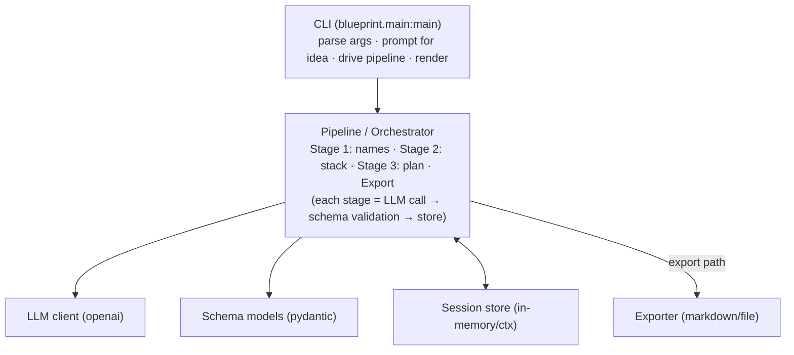
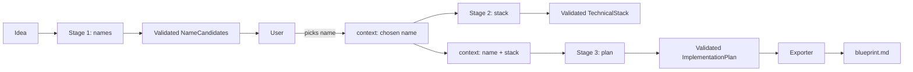

# Blueprint Generator — Architecture

## 1. Overview

Blueprint Generator ("Catalyst") converts a raw application idea into a schema-validated technical blueprint. It runs as a CLI and uses an LLM (OpenAI) behind a generation pipeline. All unstructured LLM output is validated against Pydantic schemas before it is exposed to the user.

Pipeline: **idea → names → technical stack → implementation plan → exported blueprint.**

## 2. Goals and constraints

| Goal / constraint | Detail |
|---|---|
| Schema-validated output | LLM responses are parsed and validated against Pydantic models; invalid output is rejected/retried, never surfaced raw. |
| Progressive refinement | Each stage consumes the previous stage's result (idea, chosen name) as context. |
| Deterministic interface | The CLI surface (`catalyst`) is stable even as the model or prompts change. |
| Minimal footprint | Small dependency set: `pydantic`, `openai`, `python-dotenv`. Python >= 3.13. |

## 3. High-level components

### 3.1 CLI layer — `blueprint.main:main`

- Entry point registered in `pyproject.toml` as `catalyst`.
- Captures the free-form idea (interactive prompt or `--idea` flag).
- Dispatches to the pipeline; renders each stage's result to the terminal.

### 3.2 Pipeline / Orchestrator

- Owns the stage sequence: `generate_names` → `select_name` → `generate_stack` → `generate_plan` → `export`.
- Maintains a **session context** holding the original idea and the user's chosen name so later stages are grounded in earlier decisions (see user journey).
- Each stage wraps an LLM call, then validates the result against the stage schema. On validation failure it retries or surfaces a clear error.

### 3.3 LLM client

- Thin wrapper over the `openai` SDK.
- Prompt source: per-stage prompt templates that inject the session context (idea, chosen name).
- Configurable via environment variables (e.g. `OPENAI_API_KEY`), loaded with `python-dotenv`.

### 3.4 Schema models (Pydantic)

- One or more validated response models per stage, e.g.:
  - `NameCandidates` — list of candidate names, each with a short rationale.
  - `TechnicalStack` — languages, frameworks, infrastructure, rationale.
  - `ImplementationPlan` — ordered phases, tasks, milestones.
- The "execution blueprint" itself is schema-validated, matching the project description: *"converts raw application ideas into schema-validated execution blueprints."*

### 3.5 Session store

- Holds current state across stages (idea, selected name, any prior outputs).
- MVP: in-memory within a single process run. Can be swapped for persistence (e.g. SQLite/JSON) when export or resume is added.

### 3.6 Exporter (future)

- Assembles the validated blueprint into a markdown/document file.
- Depends only on the session store, so it is trivially testable.

## 4. Data flow (user journey mapping)

## 5. Non-functional concerns

| Concern | Approach |
|---|---|
| Latency | Each stage is a single LLM call; show stage progress; cache context between stages. |
| Cost | Keep prompts targeted; only call the LLM when a stage is requested. |
| Reliability | Reject-and-retry on schema validation failure; never emit invalid blueprint data. |
| Errors | Dedicated exception types for LLM failures vs. validation failures; clear CLI messages. |

## 6. Testing strategy

- **Unit:** prompt builders, schema models (given example LLM payloads), orchestrator stage transitions.
- **Validation:** golden fixture LLM responses → assert correct Pydantic parsing and rejection of malformed output.
- **E2E (manual/optional):** run `catalyst` with a real key for the MVP name-generation path.

## 7. Future evolution

| Item | Path |
|---|---|
| LLM provider abstraction | Hidden behind `LLM client` interface; swap OpenAI for another provider. |
| Export formats | Add Markdown v1; extend to PDF/HTML behind the exporter interface. |
| Persistence | Replace in-memory session store with SQLite/JSON to support resume and history. |
| Web interface | Add an HTTP API layer reusing the same pipeline; CLI stays as one consumer. |