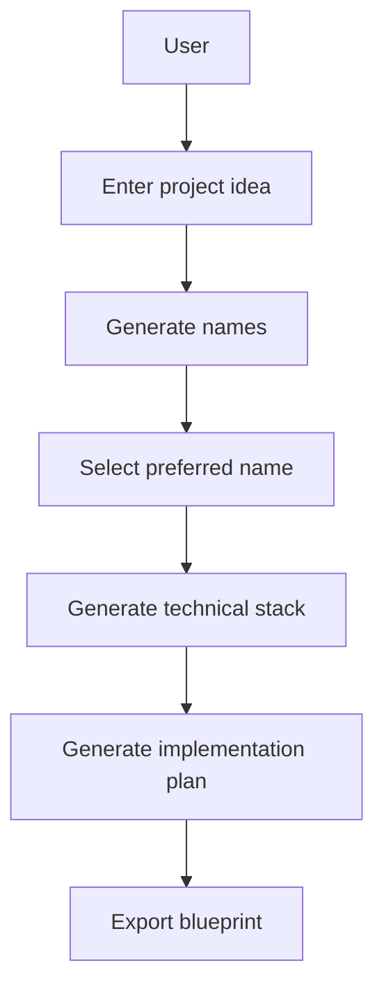

# Blueprint Generator — Product Discovery

## 1. Vision

Blueprint Generator transforms an informal IT project idea into an actionable technical blueprint.

| | |
|---|---|
| Vision statement | Turn "I have an idea" into "I know what to build and how." |
| Value promise | Reduce the time, uncertainty, and blank-page paralysis between an idea and a concrete technical plan. |
| Product category | AI-assisted project planning tool for software development. |

## 2. Problem

| | |
|---|---|
| Input | An informal IT project idea (e.g. "an app to track gym workouts"). |
| Pain point | The user doesn't know how to transform the idea into a concrete technical project. |
| Root causes | Unclear naming/branding, unknown technology choices, missing breakdown of work into steps. |
| Outcome | Users stall before writing any code because the path from idea to project is unmapped. |

## 3. Solution

Generate progressively, each step informed by the previous:

1. **Project names** — instant candidates so the idea has an identity.
2. **Technical stack** — recommended technologies grounded in the chosen concept.
3. **Implementation plan** — a sequenced, actionable build plan.

## 4. Product Scope

### MVP (Feature 1: Generate project names)

- User enters a free-form project idea.
- System generates a list of candidate project names.
- User can select a preferred name to continue.

### Future

| # | Feature | Description |
|---|---|---|
| 2 | Generate technical stack | Recommend a coherent stack (languages, frameworks, infrastructure) based on the idea and chosen name. |
| 3 | Generate implementation plan | Produce a step-by-step build plan (phases, tasks, milestones). |
| 4 | Export blueprint | Package name, stack, and plan into a shareable/exportable blueprint document. |

### Out of scope (for now)

- Code generation
- Deployment / hosting management
- Multi-user collaboration and accounts

## 5. User Journey

## 6. Personas

| Persona | Description | Needs |
|---|---|---|
| Software developer | Building a side project; wants to move fast from idea to scaffold. | Quick naming, sensible stack recommendations, actionable plan. |
| Technical lead | Scoping a new project; wants a defensible technical direction. | Coherent stack rationale, phased implementation plan. |
| Student (software engineering) | Learning by building; needs guidance and structure. | Explanations, step-by-step plan, beginner-friendly defaults. |
| Technical entrepreneur | Has a product idea but limited hands-on engineering time. | Fastest path from idea to a buildable, understandable blueprint. |

## 7. User Stories

- As a **user**, I want to enter my project idea in plain language so I don't need formal specs to get started.
- As a **user**, I want a list of generated project names so I can pick one that fits.
- As a **user**, I want to select a name so subsequent outputs stay consistent with my choice.
- As a **user**, I want a recommended technical stack so I know which technologies to use.
- As a **user**, I want an implementation plan so I know the order and size of the work.
- As a **user**, I want to export the blueprint so I can share or reference it later.

## 8. Roadmap

| Phase | Scope | Deliverable |
|---|---|---|
| Phase 1 — MVP | Name generation | CLI/UI accepting an idea and returning name candidates; select a name. |
| Phase 2 | Technical stack | Stack recommendation seeded by the idea + chosen name. |
| Phase 3 | Implementation plan | Sequenced build plan (phases, tasks, milestones). |
| Phase 4 | Export | Export the assembled blueprint to a document/file. |

### Success metrics

- Time from idea entered to name selected (target: under a minute).
- Funnel completion: % of users who reach the implementation plan.
- Blueprint exports per user.