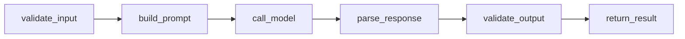

# Technical Design — Name Generator (Feature 1)

## 1. Overview

Feature 1 (MVP) takes a free-form project idea and returns a validated list of candidate project names. It is the first stage of the Blueprint Generator ("Catalyst") pipeline.

Documentation-first: this design is written **before** implementation and defines the contract every implementation must satisfy.

```
Technical Design
│
├── API / Interface
├── Domain Models
├── AI Model
├── Prompt Design
├── Output Schema
├── Validation
├── Error Handling
├── Guardrails
├── Evaluation
├── Observability
└── Deployment
```

## 2. API / Interface

### Public contract

| | |
|---|---|
| Input | `project_idea: str` — informal description of the project idea |
| Output | `list[ProjectName]` — validated candidate names |
| Entry point | `catalyst name --idea "..."` (CLI) |
| Underlying | `NameGenerator.generate(project_idea) -> list[ProjectName]` |

### CLI

```bash
catalyst name --idea "an app to track gym workouts"
# → prints candidate ProjectName entries (name, description, rationale)
```

### Python interface

```python
class NameGenerator:
    def generate(self, project_idea: str) -> list[ProjectName]: ...
```

## 3. Domain Models

```python
class ProjectName(BaseModel):
    name: str        # short, brandable candidate name
    description: str # what the project is, one sentence
    rationale: str   # why this name fits the idea

class NameCandidates(BaseModel):
    candidates: list[ProjectName]
```

- `ProjectName.name` — required, non-empty, alpha/alphanumeric, max 40 chars.
- `ProjectName.description` — required, 1–2 sentences.
- `ProjectName.rationale` — required, explains naming logic (domain fit, memorability).

## 4. NameGenerator pipeline



| Step | Responsibility |
|---|---|
| `validate_input()` | Reject empty/oversized/unsigned input before any LLM call. |
| `build_prompt()` | Compose the prompt from template + sanitized idea (see Prompt Design). |
| `call_model()` | Invoke the LLM with structured-output constraints; handle transport/timeout errors. |
| `parse_response()` | Parse the model payload into `NameCandidates`. |
| `validate_output()` | Apply schema + quality validation (see Validation). |
| `return_result()` | Return `list[ProjectName]` or raise domain error on failure. |

## 5. AI Model

- **Provider:** OpenAI (via `openai` SDK, already a project dependency).
- **Model class:** chat completion with structured JSON output; gpt-4o-mini-class as the cost-efficient default, model name configurable via env.
- **Config:** `OPENAI_API_KEY` (`.env` via `python-dotenv`), optional `CATALYST_MODEL`.
- **Temperature:** low (0.3) for consistent, deterministic candidate generation.

## 6. Prompt Design

Template (paraphrase-resilient, injects sanitized idea):

```
You are a product naming expert for software projects.
Given the idea below, generate {count} distinct, brandable project names.

Idea: {project_idea}

For each name, return JSON conforming to:
{"candidates": [{"name": ..., "description": ..., "rationale": ...}]}

Rules:
- Names are short and memorable; prefer real-word or portmanteau constructions.
- No trademarked brands, offensive terms, or tech-obscured jargon.
- descriptions are one sentence; rationale explains fit with the idea.
- Respond with JSON only.
```

- `project_idea` is trimmed and truncated (e.g. 1000 chars) before injection.
- Prompt is a dedicated template (not ad-hoc string interpolation in the pipeline).

## 7. Output Schema

Pydantic model (see §3). The LLM output is parsed into `NameCandidates` and only then released to the pipeline.

```json
{
  "candidates": [
    {
      "name": "GymStride",
      "description": "A workout tracker that logs routines and progress over time.",
      "rationale": "Combines the subject (gym) with movement/forward motion, easy to say."
    }
  ]
}
```

## 8. Validation

| Layer | Checks |
|---|---|
| Input | Non-empty, ≤ 1000 chars after trim, printable characters only. |
| Schema | Parses to `NameCandidates`; every field non-empty, types correct. |
| Quality | `1 ≤ len(candidates) ≤ {count}`; names ≤ 40 chars; unique names; no low-effort placeholders (e.g. "N/A"). |
| Guardrail post-checks | Reject candidates failing the rules in Prompt §6 (banned terms, near-duplicates). |

Failure at any validation layer triggers **retry** (max 2) with a corrective instruction, then a controlled error (see Error Handling).

## 9. Error Handling

| Error | Source | Behavior |
|---|---|---|
| `EmptyIdeaError` | input validation | CLI error message; prompt user to retry. |
| `IdeaTooLongError` | input validation | Error mentioning the length limit. |
| `ModelCallError` | transport/auth/timeout | Retry with backoff (2 attempts), then surface a clear error. |
| `SchemaValidationError` | LLM returned unparseable output | Reprompt with correction; after 2 retries, fail with guidance. |
| `QualityValidationError` | valid schema, bad content | Same retry path as schema errors. |

All errors are typed exceptions; the CLI maps them to actionable messages (never raw stack traces for end users).

## 10. Guardrails

- **Input sanitization:** strip control characters, enforce length, require non-empty trimmed text.
- **Content filters:** reject names containing profanity/slurs via blocklist + `openai` moderation call.
- **No hallucinated brands:** prompt-level rule + post-check against a known-brand blocklist.
- **Determinism:** low temperature; a seed option for reproducible runs in tests.
- **Budget caps:** max retries and max output tokens per request prevent runaway cost.

## 11. Evaluation

Offline eval harness (seed examples with curated ideas):

| Metric | Target |
|---|---|
| Parse rate (valid schema) | ≥ 95% of responses parse on first attempt |
| Schema validity (after retries) | 100% |
| Name uniqueness within batch | 100% no dupes |
| Brand-name overlap / banned terms | 0 hits on blocklist |
| Human preference (aesthetic fit) | ≥ 4/5 judged usable |
| Latency p95 | ≤ 10s per generation |

Failing fixtures are stored as regressions and re-run on prompt/template changes.

## 12. Observability

- **Structured logging** per generation: `request_id`, idea hash, model, latency, retry count, parse outcome.
- **Cost tracking:** token usage per call (prompt/completion), aggregated per session.
- **Sub-second metrics** (optional early, e.g. stdout counters): calls, failures, retries, parse rate.
- **Debug flag** (`CATALYST_DEBUG=1`) to log prompt, raw model output, and validation decisions without leaking the full user idea in normal logs (idea is logged hashed only).

## 13. Deployment

- **Packaging:** `uv` build (`uv_build`); console script `catalyst` (already in `pyproject.toml`).
- **Distribution:** installable wheel; no server required for MVP (CLI runs locally).
- **Config:** env file with `OPENAI_API_KEY`; `CATALYST_MODEL` override.
- **CI (future):** run unit + validation fixture tests via `pytest` (`tests/`).
- **Evolution path:** `NameGenerator` behind a stable Python interface so a future HTTP API / web stage can reuse it without changes.